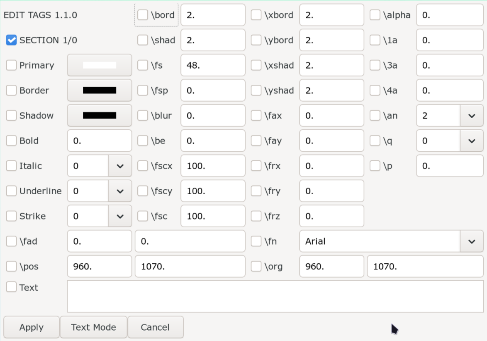
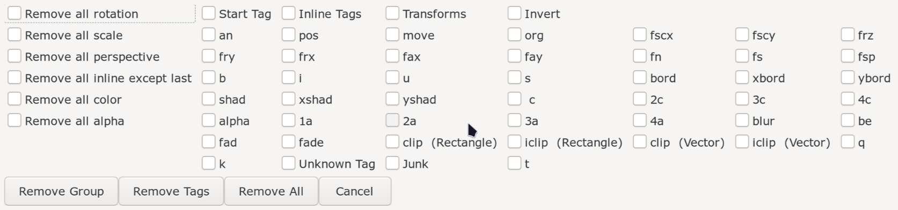

# Adding and Removing Tags

Now that we have learned what Aegisub scripts are, we will now be learning how
we use scripts to do various things. In this page, let's learn how to add and
remove tags. You didn't think we would type the tags manually, did you?

Typing tags by hand is a bad idea for three specific reasons:

1. They take a long time.
1. You will inevitably make typos.
1. Even a moderately complex typesetted line will have a lots of tags. Searching
   the exact tag you want to modify in `Edit Box` is pain in the ass.

That is why, except the tags where it makes sense to use tools provided by
Aegisub, we will be using script to add tags. Not only adding tags to line but
also modifying tags that are already in the line.

## Edit Tags

We will be using a script made by me called `Edit Tags` to add and modify the
tags in line.

!!! note

    There is another popular script made by unanimated called `HYDRA` that is
    also used for adding tags. If you want to use HYDRA instead, you can follow its
    [manual](https://unanimated.github.io/ts/scripts-manuals.htm#hydra).

<!-- There is a [full guide](https://phoscity.github.io/Aegisub-Scripts/Edit%20Tags/) -->
<!-- for this script so I highly suggest you read it. I will demonstrate its usage -->
<!-- while assuming you read that guide. -->

### Adding Tags on Empty Line

Let's say you open the script in an empty line. The script's GUI will look like
this.

There is a checkbox, tag's name and then another box that allows you to change
the tag's value. But some tags already have some value. You can tell from the
gui above that this text has border, shadow, white fill, alignment of 2, uses
Arial font and so on. Where did these value come from? They came from the style
of the line.

In order to add tags, you simply check the box, and change the tag value for all
the tags that you want. When you click `Apply` button, the changes you made will
be added to the line.

### Adding/Modifying Tags on Line

Now, let's take a line that already has some text and tags and open the script
on that line.

{\<b>pos</b><b>(902,509)</b>\<b>fscx</b><b>200</b>\<b>fscy</b><b>200</b>\<b>bord</b><b>5</b>\<b>1c</b><b>&H1718C3&</b>\<b>blur</b><b>1</b>}I am not amused

You will see that the tags that are already present in the line are ticked. Here
you can do three things:

1. Change the values of ticked tags to modify the values of these tags.
1. Tick the unticked tags to insert those tags in the line.
1. Untick the ticked tags to remove those tags from the line.

### Lines with multiple tag blocks

Now imagine you have the following line where you have two tag sections and two
text sections.

{\<b>bord</b><b>5</b>\<b>blur</b><b>0.8</b>}First Section{\<b>fn</b><b>Knorke</b>\<b>bord</b><b>2.72</b>\<b>c</b><b>&H69594D&</b>}Second Section

Then the GUI produced will be something like this:

It looks just like before but there are two major difference:

1. There is now a new drop-down in the bottom of the GUI that consists of all
   sections of the line.
1. There is a new button called `Switch` that didn't exist before.

You will also notice in the top-left of the GUI, `SECTION 1/2` indicates that first
section of the two is currently selected i.e. we are only working in this section:

{\<b>bord</b><b>5</b>\<b>blur</b><b>0.8</b>}First Section

The ticked tags in the GUI also reflects the first tag section. Any changes you
make in this GUI will also only apply to the first tag section.

In the drop-down at the bottom, you will notice that the next section is already
selected. If you press Switch button now, you will now switch to the next section.

The gui above represents only the second section i.e. {\<b>fn</b><b>Knorke</b>\<b>bord</b><b>2.72</b>\<b>c</b><b>&H69594D&</b>}Second Section

The changes you made to the tags in the first tag section is not lost on switch.
You can switch back and forth between sections, make changes to tags as you switch
and when you finally click Apply button, the changes you made to each sections will
apply to respective tag sections.

You can select any section in the drop-down to switch directly to that section. You
don't have to switch in chronological order. At this point, it should be clear to
you how you can make granular change to any section in your line.

## Adding/Modifying Tags to Multiple Line

When you select multiple lines and run the script, you cannot make the granular
changes like you could above (i.e. this  is similar to using the script HYDRA).
The gui looks like this:

You tick the tags, change the value and click Apply. It will modify or insert
those tags in all selected lines. There is really nothing more to this mode
other than this section:

{width="300"}

Here you can select which tag section, layer or style and the tags will only apply
to those selection only. By default, it will apply to start tag section (__first
tag block of the line__), all layers and all styles.

## Example
<!-- {\pos(1392,213.644)\fnFOT-Matisse Pro Toaru\fs67.5\c&HD66508&\blur0.75
\fad(0,436)}Confess -->

/// caption
[Kaguya-sama: Love is War](https://anilist.co/anime/101921/Kaguyasama-wa-Kokurasetai-Tensaitachi-no-Renai-Zunousen/) Episode 1: 0:00:00.52
///

<video width="2560" height="1554" controls>
    <source src="../assets/Adding and Removing Tags/use_edit_tags.mp4" type="video/mp4">
Your browser does not support the video tag.
</video>

As you can see above, I used Aegisub tools to add position and font since it is
easier to use them to add those tags but for any other tag like `\c`, `\blur`,
`\bord`, `\shad`, `fscx` and `fscy`, I used `Edit Tags` script to add all of
them at once. Result looks like this:

 

## Removing Tags

If you are working in a single line and you are adding/modifying tags anyway,
I suggest you use `Edit Tags` script because removing a tag is as easy as
unticking a tag.

However, if you're only trying to removing tags or are working in multiple
lines, I recommend you to use an script that is specifically made to remove
tags.

We will be using a script made by me called `Remove Tags` to do so. Install it
using Dependency Control and immediately bind it to a hotkey like you did with
`Edit Tags` script. I bind it to key `R` in `Subtitle Grid`.

!!! note

    There is another popular script made by unanimated called `Script Cleanup` that
    is also used for removing tags. If you want to use `Script Cleanup` instead,
    you can follow its
    [manual](https://unanimated.github.io/ts/scripts-manuals.htm#cleanup).

This script deals with all things related to removing tags from the line. When you
select the lines and run this script, GUI of this script is dynamically generated
i.e. only tags that are available in the selected lines are available for you to
remove. The GUI from the image above is not what you'll see when you run it.

### `Remove All` button

- If you simply click the `Remove All` button, it removes all the tags form the selected lines.
- If you check `Start Tags` in the top row and then press `Remove All` button, it removes all start tags from selected lines.
- Similarly, checking `Inline Tags` in top row removes all inline tags.

### `Remove Tags` button

- All the tags that you individually tick would be removed.
- If `Start tags` is checked, the selected tags will only be removed from start tags.
- If `Inline tags` is checked, the selected tags will only be removed from inline tags.
- If `Transform` is checked, the selected tags will only be removed from transforms.
- If `Inverse` is checked, all the tags except the selected ones will be deleted.

### `Remove Group` button

This button executes the things you select in the left column and is mostly used to delete groups of tags at once. Staying true to it's mission, the script also dynamically creates this section. Which means that if your selection does not contain any color tags for example, the option to remove color tags won't be available. You can also tick `Start Tag` or `Inline Tag` the top row and only remove the tag group from start tag block or inline tag block only. The groups available are:

- All color tags (c, 1c, 2c, 3c, 4c)
- All alpha tags (alpha, 1a, 2a, 3a, 4a)
- All rotation tags (frz, frx, fry)
- All scale tags (fs, fscx, fscy)
- All perspective tags (frz, frx, fry, fax, fay, org)
- All inline tags except last (useful for undoing gradient)

<!-- TODO (Maybe): An option to select and remove each individual transform tags. -->
