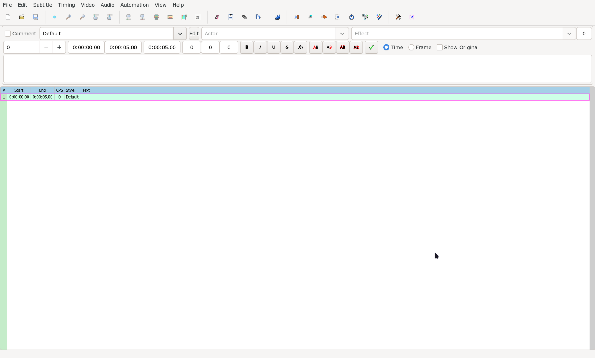

# Aegisub Basics

## First Look

When you open Aegisub for the first time, this is how it will look like.

You will be spending a lot of time looking at this window.
So let us familiarize with various parts of it.

## Opening Video

Follow the steps below to load a video in Aegisub.

1. In Aegisub, click on `Video` in the top toolbar and then `Open Videos…`
1. Navigate to the folder where the video is located. You can also change
   file types to `All files *.*` to be able to choose images as well.
1. Select the video and click the button `Open`.

## Opening Dummy Video

Since we are learning how to open videos, this might be a better time than any
to learn how to open dummy video. A dummy video is a fake video that we can use
to render the subtitles we make without loading an actual video.

Follow the steps below to load a dummy video in Aegisub.

1. In Aegisub, click on `Video` in the top toolbar and then `Use dummy video…`
1. A dialog box will open that will allow you to define various characteristics of
   the video. Select the options and click `OK`.

   {width="400"}

### Brief Description of the Dummy Video Dialog

| Option           | Description                                                                                                                                             |
| ---------------- | ------------------------------------------------------------------------------------------------------------------------------------------------------- |
| Video resolution | The resolution of the dummy video in pixels. There are a few pre-defined choices in the dropdown menu. You can also specify the size yourself below it. |
| Color            | The colour of the video surface. The color is solid by default. Tick the box `Checkerboard pattern` if you want some more variation.                    |
| Frame rate (fps) | Determines how long each frame is displayed by setting the number of frames per second (fps).                                                           |
| Duration         | The duration of the video in frames. Below this number is shown the resulting duration in hours/minutes/seconds.                                        |

=== "Dummy Video with Solid Color"

    {width="700"}

=== "Dummy Video with Checkered Background"

    {width="700"}

## Various parts of Aegisub

We will not go into detail of each part. Just remember the name of the parts for
now and what they mainly contain.

### Menu Bar

The topmost bar is called `Menu Bar`. This bar contains a row of tasks that you can
run. Each option in the menu bar opens a sub-menu that contains a list of tasks.

### Tool Bar

The row directly below the `Menu Bar` is the toolbar. This bar contains shortcuts
to myriad of tools that Aegisub offers. We will discuss item of this bar whenever
necessary.

### Audio Box

The audio box shows the audio spectrum or the waveform of the audio. It can be used
to time the subtitle to the audio. However, in typesetting, we time the lines to
video not audio. So this part of Aegisub is pretty much useless for typesetting.
This section will only appear when audio is loaded in Aegisub.

### Video Box

The video box allows you to see the video or the dummy video you loaded along with
the subtitle rendered over it. The video box will be explained in much more detail
later since it is one of the most important part of Aegisub for typesetting. This
section will only appear when video is loaded in Aegisub.

### Edit Box

The edit box is where you can edit the text and other properties of a subtitle line.
You can edit the actual text, add markup that modifies the look of the text, change
the time of the line and so on.

### Subtitles Grid

The grid shows all the subtitle lines in the file you're working with.
You can click a line to select it for editing. This is known as the active line.
The active line will appear in the edit box for you to edit.

### Status Bar

Status Bar is bottom most part of Aegisub. The left portion of status bar shows
the often shows the tooltips for current menu or sub-menus that is selected
whenever available and the right portion is used to show status messages to you.

## Your First Subtitle

Now that we know how to open videos and know how to identify various parts of Aegisub,
let us make our first subtitle.

1. Open a video or a dummy video.
1. Click on the edit box.
1. Type any thing you want.

<video width="2546" height="1586" controls>
  <source src="../assets/Aegisub Basics/first_subtitle.mp4" type="video/mp4">
Your browser does not support the video tag.
</video>

You will find that whatever you typed in the `Edit Box` will appear in the video
and the same line will also appear in the `Subtitle Grid`. That is how all subtitles
are made. But this is just a basic text. In the next part of the guide, we will begin
to learn what we can use to change its appearance.
