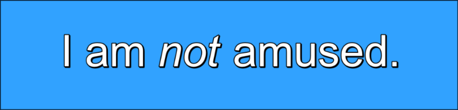
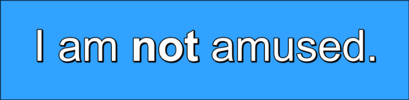
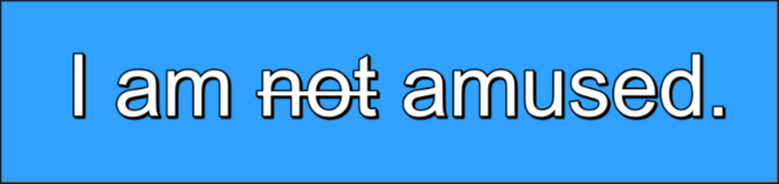
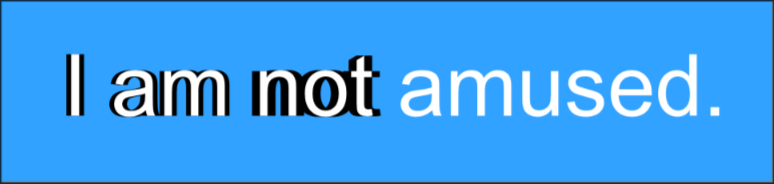
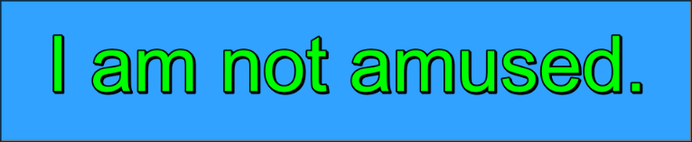

# Override Tags

Override tags are special markup that changes the position, animation, appearance
and behavior of the text. Since typesetting is all about changing how the text looks
and behaves, learning override tags is one of the most important skill for a typesetter.
In this page, we will only learn the few basic override tags. I don't want to overwhelm
you with all of them at once. There are much more to come and we will learn them
as we need them.

Until now, we have learned that we can put text in the edit box. In that text, a
tag block, enclosed within curly braces `{}`, is added at different point of the
text in order to change the behaviour of that line after the tag block. A tag block
can have multiple tags and each tag inside a tag block starts with a backslash `\`
followed by a name of the tag and then the parameter of the tag.

```
{\<tag_name><tag_parameter>}
```

!!! note

    A parameter for a tag can be omitted. In such case, the default value from
    the line's style is used.

There are two categories of tags: `Global tags` and `Local tags`. Global tags change
the property of the whole line. They should appear only once in a line in the first
tag block. Local tags modify all the text after the tag until the end of the line
or until the property is overridden or disabled.

They are also classified between `Transformable tags` and `Untransformable tags`
but we will discuss transforming tags later in the guide.

A tag block is classified between `Start tags` and `Inline tags`. Start tags
refer to the tag block that appear at the start of the line before any text
appears. The tag block that appears in the middle of the text is called inline
tags.

!!! warning

    Any unrecognized text inside the tag block is silently ignored. It is not
    recommended to mix comments and override tags in same tag block.

## Italics

!!! note ""

    Local / Untransformable Tag

Switches _italics_ on or off.

| Format | Description     |
| ------ | --------------- |
| `\i1`  | Enable Italics  |
| `\i0`  | Disable italics |

<h3>Example</h3>

```
I am {\i1}not{\i0} amused.
```



## Bold

!!! note ""

    Local / Untransformable Tag

Switch **boldface** text on or off or set a bold weight to specific value.

| Format       | Description               |
| ------------ | ------------------------- |
| `\b1`        | Enable bold face          |
| `\b0`        | Disable bold face         |
| `\b<weight>` | Specify weight explicitly |

Normally specifying weight explicitly is not necessary. Font weights are generally
multiple of 100.

| Weights | Name             |
| ------- | ---------------- |
| 100     | Thin             |
| 400     | Normal (Regular) |
| 700     | Bold             |
| 900     | Heavy            |

<h3>Example</h3>

```

I am {\b1}not{\b0} amused.

```

{:height 126, :width 480}

```

{\b400}How bold {\b700}can you {\b900}get?

```

{:height 96, :width 480}

## Underline

!!! note ""

    Local / Untransformable Tag

Switch underlined text on or off.

| Format | Description             |
| ------ | ----------------------- |
| `\u1`  | Enable underlined text  |
| `\u0`  | Disable underlined text |

<h3>Example</h3>

```

I am {\u1}not{\u0} amused.

```


## Strikeout

!!! note ""

    Local / Untransformable Tag

Switch strikeout on or off.

| Format | Description            |
| ------ | ---------------------- |
| `\s1`  | Enable strikeout text  |
| `\s0`  | Disable strikeout text |

<h3>Example</h3>

```

I am {\s1}not{\s0} amused.

```



## Border

!!! note ""

    Local / Transformable Tag

Set the width of the border. The value can be a positive integer, decimal but cannot
be negative.

| Format       | Description                       |
| ------------ | --------------------------------- |
| \\bord<size> | Set border width to `size` pixels |
| \\bord0      | Disable border                    |
| \\bord3.7    | Set border width to 3.7 pixels    |

<h3>Example</h3>

```

{\bord4}I am {\bord10}not {\bord0}amused.

```


## Border in X axis

!!! note ""

    Local / Transformable Tag

Set the width of the border in x direction only. The value can be a positive integer
or decimal but cannot be negative.

| Format        | Description                                      |
| ------------- | ------------------------------------------------ |
| \\xbord<size> | Set border width to `size` pixels in x direction |
| \\xbord0      | Disable border x direction                       |
| \\xbord3.7    | Set border width to 3.7 pixels in x direction    |

!!! note

    If `\bord` tag is used after `\xbord` tag, `\xbord` will be overridden by `\bord` tag's value.

<h3>Example</h3>

```

{\bord0\xbord6}I am {\xbord10}not {\xbord0}amused.

```



## Border in Y axis

!!! note ""

    Local / Transformable Tag

Set the width of the border in y direction only. The value can be a positive integer
or decimal but cannot be negative.

| Format        | Description                                      |
| ------------- | ------------------------------------------------ |
| \\ybord<size> | Set border width to `size` pixels in y direction |
| \\ybord0      | Disable border y direction                       |
| \\ybord3.7    | Set border width to 3.7 pixels in y direction    |

!!! note

    If `\bord` tag is used after `\ybord` tag, `\ybord` will be overridden by `\bord` tag's value.

<h3>Example</h3>

```

{\bord0\ybord6}I am {\ybord10}not {\ybord0}amused.

```


## Shadow

!!! note ""

    Local / Transformable Tag

Set the distance of the shadow from the text. The value can be a positive integer
or decimal but cannot be negative.

| Format       | Description                           |
| ------------ | ------------------------------------- |
| \\shad<size> | Set shadow`size` pixels from the text |
| \\shad0      | Disable shadow                        |
| \\shad3.7    | Set shadow 3.7 pixels from the text   |

<h3>Example</h3>

```

{\shad5}I am {\shad10}not {\shad0}amused.

```

{:height 158, :width 689}

## Shadow in X axis

!!! note ""

    Local / Transformable Tag

Set the distance of the shadow from the text only in x direction.

| Format        | Description                                          |
| ------------- | ---------------------------------------------------- |
| \\xshad<size> | Set shadow`size` pixels from the text in x direction |
| \\xshad0      | Disable shadow in x direction                        |
| \\xshad3.7    | Set shadow 3.7 pixels from the text in x direction   |

!!! note

    If `\shad` tag is used after `\xshad` tag, `\xshad` will be overridden by `\shad` tag's value.

<h3>Example</h3>

```

{\shad0\xshad8}I am {\xshad15}not {\xshad0}amused.

```


```

{\shad0\xshad-8}I am {\xshad-15}not {\xshad0}amused.

```


## Shadow in Y axis

!!! note ""

    Local / Transformable Tag

Set the distance of the shadow from the text only in x direction.

| Format        | Description                                          |
| ------------- | ---------------------------------------------------- |
| \\yshad<size> | Set shadow`size` pixels from the text in y direction |
| \\yshad0      | Disable shadow in y direction                        |
| \\yshad3.7    | Set shadow 3.7 pixels from the text in y direction   |

!!! note

    If `\shad` tag is used after `\yshad` tag, `\yshad` will be overridden by
    `\shad` tag's value.

<h3>Example</h3>

```

{\shad0\yshad8}I am {\yshad15}not {\yshad0}amused.

```


```

{\shad0\yshad-8}I am {\yshad-15}not {\yshad0}amused.

```


## Font Name

!!! note ""

    Local / Untransformable Tag

Set the font face to use for the text that follows the tag.

| Format     | Description                   |
| ---------- | ----------------------------- |
| \\fn&lt;name> | Set the font face to `<name>` |

<h3>Example</h3>

```

{\fnArial}I am {\fnTimes New Roman}not amused.

```


## Letter Spacing

!!! note ""

    Local / Transformable Tag

Changes the spacing between individual letters in the text. Spacing can be positive
to increase the spacing or negative to decrease the spacing.

| Format         | Description                                     |
| -------------- | ----------------------------------------------- |
| \\fsp&lt;spacing> | Change the letter spacting to value `<spacing>` |

<h3>Example</h3>

```

{\fsp5}I am {\fsp-5}not{\fsp0} amused.

```


## Color

!!! note ""

    Local / Transformable Tag

Set the color of the text after the tag. The color codes are given in hexadecimal
in order of blue, green and red.

!!! note

    You will be using color picker to select color. So you will not be typing the
    hexadecimal. We will discuss colors and color pickers later in the guide.

| Format                       | Description                                                            |
| ---------------------------- | ---------------------------------------------------------------------- |
| \\c&H&lt;bb>&lt;gg>&lt;rr>&  | Color the fill of the text                                             |
| \\1c&H&lt;bb>&lt;gg>&lt;rr>& | Color the fill of the text                                             |
| \\2c&H&lt;bb>&lt;gg>&lt;rr>& | Color the fill of the text for karaoke (Rarely useful for typesetting) |
| \\3c&H&lt;bb>&lt;gg>&lt;rr>& | Color the border of the text                                           |
| \\4c&H&lt;bb>&lt;gg>&lt;rr>& | Color the shadow of the text                                           |

<h3>Example</h3>

```

{\c&H00FF00&}I am not amused.

```



```

{\3c&HFF0000&}I am not amused.

```


```

{\4c&H0000FF&}I am not amused.

```


## Line Break

This is strictly not an override tag. This is used to insert a forced line break
in a line.

#<h3>Example</h3>

```
I am\Nnot amused.

```


There is more to discuss about line breaks. Like there is a soft line break too and
how alignment affects linebreaks but we will discuss them later. Just know for now
that `\N` causes line break.
