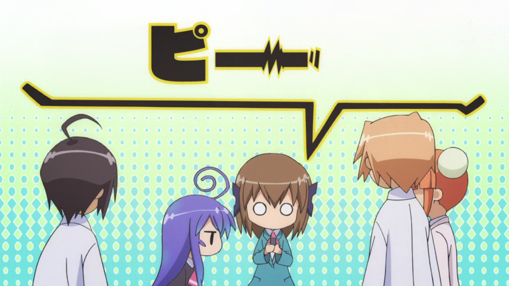
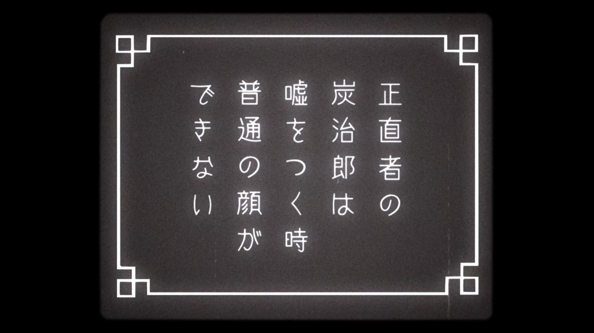

# Blur and Glow

We learned about the blur tag previously and how the border, shadow and fill of
the text interacts with the blur. We learned how we had to duplicate the line
into multiple layers to achieve full blur. In this page, let us learn how we
use that concept and apply the blur to the line.

Again, we shall be using an Aegisub script to do it. From Dependency Control,
download a script called `Blur and Glow` and immediately bind it to a hotkey. I
bind it to letter `B` in the subtitle grid.

!!! note

    If you are unable to find the difference between unblurred and subtly
    blurred text, don't worry? It's a learned skill. You will get used to it.

## Blur

At this point, I'd be repeating myself if I say how important blur is in
typesetting. Without blurring the text, your text will simply not blend in to
the video. Our job as a typesetter is to never let the audience know
that someone has put the text later. A text without blur will stand out like a sore
thumb.

### Lines Without Border

For lines without border, all you have to do is add the blur tag. Nothing fancy.

/// caption
[Kaguya-sama: Love is War](https://anilist.co/anime/101921/Kaguyasama-wa-Kokurasetai-Tensaitachi-no-Renai-Zunousen/) Episode 1: 0:00:00.52
///

Let's take the example above and see how it looks with and without blur:

=== "Without Blur"

     

=== "With Blur"

     

Do you notice how sharp the text looks without blur in contrast to the original text?

### Lines With Border

As soon as we have border, we need to duplicate it into multiple layers. I
already taught you how it works and how to do it manually. Hopefully, you did it
yourself like I suggested.

However, this gets tedious really fast to do it manually. So we use the script.

1. Prepare a line with proper fonts, colors, text size, fade, border and shadow
   size etc.
1. Run the script.
1. Towards the bottom right corner, change the blur value from default 0.6 to
   the one you like.
1. Click on `Blur / Layers` button.

!!! warning

    If your line already has a blur tag, the script will automatically use that
    blur value and not the one you choose in the dropdown.

/// caption
[Acchi Kocchi](https://anilist.co/anime/12291/Acchi-Kocchi/) Episode 4: 0:04:10
///

<video width="2560" height="1554" controls>
    <source src="../assets/Blur and Glow/single_border_result.mp4" type="video/mp4">
Your browser does not support the video tag.
</video>

=== "Without Blur"

    {width="600"}

=== "With Blur"

    {width="600"}

## Glow

### Outer Glow

/// caption
[Kimetsu no Yaiba: Yuukaku-hen](https://anilist.co/anime/142329/Kimetsu-no-Yaiba-Yuukakuhen/) Episode 02: 0:17:57
///

We get signs like this where the text glows outwards. Let me explain how we add
glow to the text manually so try to understand the logic behind it.

1. We obviously blur the text like we normally would. (Single layer for text
   without border and double layer for text with border)
1. After that, we make another layer that is lower than all the other layers.
1. In this new layer, we add a high blur (_At least higher blur than other
   layers_). The blur of the text extends outwards which will appear to be a
   glow enveloping the other layers. So we can use `\blur` tag to control the
   size of the glow. (_Higher the blur, bigger the glow size_)
1. The more opaque this layer is, higher is the intensity of the glow. So we can
   use `\alpha` tag to control intensity of glow.
1. We can also use the color of this layer to change the color of glow when
   needed. Most of the glow is the same color as that of text.
1. Kind of a hack, but you can also duplicate the top layer or glow layer to increase
   the intensity of glow at the expense of making the text look a bit bolder. Only
   use when needed and if results look better.

<video width="2546" height="1548" controls>
  <source src="../assets/Blur and Glow/glow_result.mp4" type="video/mp4">
Your browser does not support the video tag.
</video>

I duplicated the top layer and I thought it looked better so I kept it. If you want
to change the color of the glow, enable `glow c:` in the GUI and select the glow
color. The button `Blur + Glow` also does the work of `Blur / Layer` button btw
so if your sign has glow, it will layer and add glow at once.
<!--  -->

### Inner Glow

TODO

## Double Border

/// caption
[Acchi Kocchi](https://anilist.co/anime/12291/Acchi-Kocchi/) Episode 4: 0:04:26
///

Then there are signs like this. The text has white border but then has another
red border on top of that.

By this point, even if I didn't teach you anything, you should be able to figure
out how to do do this kind of sign - if you have learned the basics properly
that is.

1. As soon as you see the border, you'd obviously split this into two layers:
   top layer being red fill, bottom layer being white border.
1. Now to add the outermost red border, you'd make another layer beneath the
   other two layer and add bigger red border. That makes it three layers for
   this sign. The border of this layer should be bigger than the border of layer
   above it.
1. One border sign means two layers, two border sign means three layers and so
   on.

Now that we have dealt with manual approach, let's deal with Aegisub script
approach.

In `Blur and Glow` script

1. Enable `double border`.
1. Enable `2nd b. size` and enter the size of the second border beside it. Remember
   that whatever you enter here will be added to your current border i.e. if
   your current border is 5 and you enter 7 in the script, the size of second
   border will be 12.
1. Enable `2nd b. color` and select the color of the second border.
1. Click on `Blur / Layer` button.

<video width="2560" height="1554" controls>
    <source src="../assets/Blur and Glow/double_border_result.mp4" type="video/mp4">
Your browser does not support the video tag.
</video>
