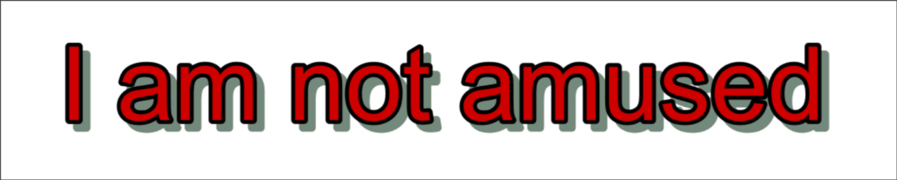

# Blur

You might not have realized it until now but the text we create is quite sharp.
This sharpness is at odds with most of the text that we see in video. In order
to blend our text to the video, we must blur our text as well.

This makes blur the most essential tag for typesetting because signs that do
not use blur do not blend in at all. Almost all the signs you typeset will
require blur.

## Blur Tag

!!! note ""

    Local / Transformable Tag

Applies blur to the text

| Format           | Description                     |
| ---------------- | ------------------------------- |
| \\blur&lt;strength> | Blur the text with `<strength>` |

### Examples

```

{\bord2\blur5}I am not amused.

```

{width="600"}

```

{\bord0\shad0\blur2}I am not amused.

```

{width="600"}

## Fill, Shadow and Border

{width="600"}

In the image above, you can probably already identify border and shadow. We
even learned the tags for it when we learned the basics ASS tags. So the
only thing left is the `fill`. As you might have guessed it, the red part,
the actual text is called fill. This term comes up frequently so it's important
to know. When you are talking to other typesetters, you
can't be the only one who raises their hand and say, "What the hell is the fill?"

| Color | Name |
| -------------- | --------------- |
| Red | Fill |
| Black | Border |
| Grey | Shadow|

## Border and Blur

The blur tag that we learned above works differently based on the border and
shadow you apply to the fill. The main difference lies in whether a text has
border or not. If you apply the blur to the text with following cases:

1. No border + No shadow: Fill will be blurred.
1. No border + Shadow: Both fill and shadow will be blurred.
1. Border + Shadow: Both border and shadow will be blurred but fill will not be
   blurred.

!!! info

    In short, if a text has border, everything that is border and outside will
    be blurred otherwise everything will be blurred.

### Example

Let us take the text with no border, shadow and blur as an example:


=== "No border or Shadow"

    `{\bord0\shad0\blur5}`
    

=== "No Shadow, With Border"

    `{\bord5\shad0\blur5}`
    

=== "With border & Shadow"

    `{\bord5\shad10\blur5}`
    

=== "No border, With Shadow"

    `{\bord0\shad10\blur5}`
    

I really want you to really observe above examples closely and learn what is happening.
As many times as you require.

You will observe that as long as you have `bord` tag in a line, the fill will
never be blurred. So what if we have a text that has a border? Can we not blend
such text with the video? The blurred border makes the fill even sharper. This
is where layers come in.

## We're Gonna Blur That Fill

Blurring fill, border and shadow all at once is definitely possible.
However, we must use two lines with one on top of another.


The line in the image above is made up of two lines with same position:

1. Lower layer: Has border and shadow with blur applied. The border color is
   same as fill color.
1. Upper layer: Has only fill with same blur applied.

!!! note

    Do you notice the logic in the layering above? The lower layer has border
    and shadow blurred but the fill is not blurred. The upper layer has no border
    or shadow and its fill is blurred and it is covering the unblurred fill below.
    Thus we have all fill, shadow and border blurred.

Just in case, my explanation is not clear, here's the same text as above but
side by side:


I will reiterate that the effect that having same fill color as the border is
really important. Can you even notice that the fill is unblurred in the lower
layer above?

## Try it yourself

Just reading won't do. Try to recreate the line yourself.

1. Type out a text in `Edit Box`.

1. Set its border to 0, shadow to 0, primary color to red and apply a blur.
   Set it's layer to 1.

1. Duplicate the line, set its border, shadow. Make both fill and border same
   color. Apply the same blur. Set it's layer to 0.

You should end up with the line similar to example above.
