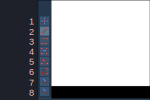

# Clips

There are many cases when we need to hide a certain portion of the text. Clips
are used to achieve it.

!!! warning

    The text that you clip as shown in this page will create hard edges. This
    will mostly affect the blurring of the clip since if the rest of the text is
    blurred but it's edges are sharp, it becomes extremely noticeable.

## Rectangular Clip

!!! note ""

    Global / Transformable Tag

Define a rectangular area to clip the line so that only a partial region of
the text is visible.

| Format           | Description                     |
| ---------------- | ------------------------------- |
| \\clip(&lt;x1>,&lt;y1>,&lt;x2>,&lt;y2>) | Define a rectangular region using the diagonal whose ends are at (x1, y1) and (x2, y2).  Any text outside this region will be clipped out and invisible. |
| \\iclip(&lt;x1>,&lt;y1>,&lt;x2>,&lt;y2>) | Inverse of above. Any text that is inside the rectangular region is clipped out and invisible.|

## Vectorial Clip

!!! note ""

    Global / Untransformable Tag

Define an area to clip the line using vector drawing so that only a partial
region of the text is visible.

| Format           | Description                     |
| ---------------- | ------------------------------- |
| \\clip(&lt;vector shape>) | Define a region using vector shape.  Any text outside this region will be clipped out and invisible. |
| \\iclip(&lt;vector shape>) | Inverse of above. Any text that is inside the region is clipped out and invisible.|

## Adding Rectangular Clip

Follow the steps below to add rectangular clip to the line:

1. Enable the rectangular clip tool (third from below).
1. Click and drag in the video. The first point you click and the last point you
   drag the point to will form a region to clip text with. The region that is
   hidden is shaded darker.
1. The rectangle will have circular handles in all four corners. You can click
   on any of these handles and drag them to change the size of the region.
1. If you already have a rectangular clip, you can just click in another point
   of the video to remake another region.

<video width="2232" height="1224" controls>
  <source src="../assets/Clips/rectangular_clip.mp4" type="video/mp4">
Your browser does not support the video tag.
</video>

## Adding Vectorial Clip

Right below the rectangular clip, there is a tool for drawing vectorial clip.
We do not directly use this tool. We instead use its subtool (Do you remember
what subtools are? We learned them in `Video Box` page)

{width="400"}

| Number| Item | Description |
|---| -------------- | --------------- |
|1| Drag|Allows you to drag a control point|
|2| Insert line|Allows you to insert a straight line from the last point to the current mouse position by clicking the point.|
|3| Insert bézier bicubic curve|The same as above, but it instead inserts a bicubic curve. You can then use the two control points to adjust the shape of the curve.|
|4| Convert between line and curve|Click on a line segment or bicubic curve to convert it to the other type.|
|5| Split curve|Click on a line segment or bicubic curve to split it in two, at the marked point.|
|6| Remove point|Click on a point to delete it.|
|7| Freehand shape|Click and drag with the mouse over the video and move the mouse to draw a freehand shape composed of line segments. This shape will automatically be closed, with the last point connecting to the first.|
|8| Freehand smooth shape|Same as above, but the shape will be smoothed with bicubic curves.|

### Drawing Lines

1. Activate tool number 2 from the image above.
1. Click anywhere in the video to place the first point of the line. As soon as
   you make the first point, you will notice the text will disappear completely.
1. Click in another point in the video to place the second point of the line.
1. You can continue doing this until you make all the points. The last point you
   make will automatically connect to the first point you made to form a region
   which will clip in or clip out the text.

<video width="1748" height="1162" controls>
  <source src="../assets/Clips/vectorial_clip_line.mp4" type="video/mp4">
Your browser does not support the video tag.
</video>

### Drawing Bézier Curves

You cannot draw smooth curves using straight lines only, can you? (You actually
can if you use short, multiple lines but that would be extremely tedious).
[Bézier Curve](https://en.wikipedia.org/wiki/B%C3%A9zier_curve)
is one of the ways to draw a smooth curve in vector graphics. Aegisub offers a
tool to convert a line to a cubic bézier curve. When you use the tool number 3
from the image above, a line you draw by clicking in two points will have two
handles. You can drag these handles to turn that line to a curve.

<video width="2560" height="1600" controls>
  <source src="../assets/Clips/bezier_curve.mp4" type="video/mp4">
Your browser does not support the video tag.
</video>

## Practice

In the video below, there are four shapes. I want you to download the video,
go to each frame and try to draw lines or curves while staying within the boundary.

<video width="1920" height="1080" controls>
  <source src="../assets/Clips/test.mp4" type="video/mp4">
Your browser does not support the video tag.
</video>

I'm pretty slow and clumsy with this tool myself but here's me drawing these
shapes:

=== "Example 1"

    <video width="2560" height="1600" controls>
        <source src="../assets/Clips/test_1.mp4" type="video/mp4">
    Your browser does not support the video tag.
    </video>

=== "Example 2"

    <video width="2560" height="1600" controls>
        <source src="../assets/Clips/test_2.mp4" type="video/mp4">
    Your browser does not support the video tag.
    </video>

=== "Example 3"

    <video width="2560" height="1600" controls>
        <source src="../assets/Clips/test_3.mp4" type="video/mp4">
    Your browser does not support the video tag.
    </video>

=== "Example 4"

    <video width="2560" height="1600" controls>
        <source src="../assets/Clips/test_4.mp4" type="video/mp4">
    Your browser does not support the video tag.
    </video>

Now it's your turn. As you can see in examples above, the video zoom and pan is
really useful in order to be accurate.

## Working with Multiple Control Points

You can select multiple control points and drag them all at once. This is an
effective way to move the shape quickly.

You can either press ++ctrl++ while clicking each control point or you can click
and drag on a blank spot to select multiple points. The selected control points
will turn orange from red. Once selected, you can click
any of them and drag to move all of the selected points at once. You can click
in any of the blank spot to deselect them.

<video width="2560" height="1600" controls>
    <source src="../assets/Clips/multiple_points.mp4" type="video/mp4">
Your browser does not support the video tag.
</video>
