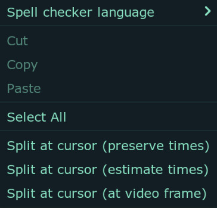
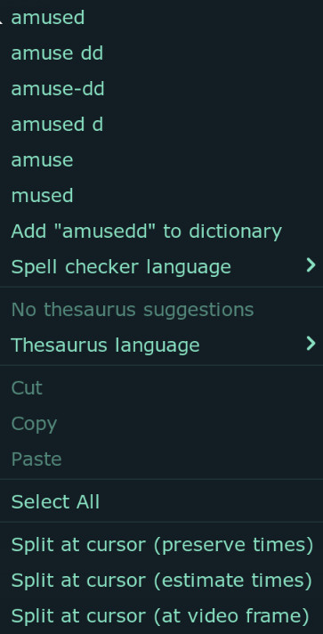

# Edit Box

If you have followed this guide in sequence, you now know which part of Aegisub
is an `Edit Box`. You have even used it to make your first subtitle but you just
made a boring text. We've done too much reading. In this page of guide, let us
actually change the appearance of the text using `Edit Box` so that we start
feeling like a typesetter.

## Parts of Edit Box

!!! warning

    If you are using Windows, it will look slightly different but I'm sure you
    will figure it out.

| Number | Description                                                                                                                                             |
| ------ | ------------------------------------------------------------------------------------------------------------------------------------------------------- |
| 1      | This is the box where the actual text is written. This is like a notepad where you can freely type the line.                                            |
| 2      | Flags the line as comment. Comment lines will not be displayed in the video                                                                             |
| 3      | Dropdown menu where you can select a style for active line. _Styles will be explained later in the guide_                                               |
| 4      | Actor menu has no effect on subtitle display. You can put any text here you like. Or not.                                                               |
| 5      | While there are pre-defined effect that will effect subtitle display, they are all useless. Treat it just like `Actor` field                            |
| 6      | The total number of characters on the active line                                                                                                       |
| 7      | Layer for the line _Layers will be explained later in this guide_                                                                                       |
| 8      | Start time / frame for this line                                                                                                                        |
| 9      | End time / frame for this line                                                                                                                          |
| 10     | Duration / Number of frames for this line                                                                                                               |
| 11     | Left Margin for this line. 0 means margin from style is used.                                                                                           |
| 12     | Right Margin for this line. 0 means margin from style is used.                                                                                          |
| 13     | Vertical Margin for this line. 0 means margin from style is used.                                                                                       |
| 14     | Inserts a bold override tag (\b1) at the cursor position. If the text is already bold, inserts a corresponding closing tag (\b0).                       |
| 15     | Inserts an italics override tag (\i1) at the cursor position. If the text is already italic, inserts a corresponding closing tag (\i0).                 |
| 16     | Inserts an underline override tag (\u1) at the cursor position. If the text is already italic, inserts a corresponding closing tag (\u0).               |
| 17     | Inserts an strikeout override tag (\s1) at the cursor position. If the text is already italic, inserts a corresponding closing tag (\s0).               |
| 18     | Brings up a font selection window and inserts a font face name tag (\fnFontName) with the given font name.                                              |
| 19     | Brings up the color picker and lets you choose a color; then inserts a primary color override tag (\c) with the chosen color at the cursor position.    |
| 20     | Brings up the color picker and lets you choose a color; then inserts a secondary color override tag (\2c) with the chosen color at the cursor position. |
| 21     | Brings up the color picker and lets you choose a color; then inserts an outline color override tag (\3c) with the chosen color at the cursor position.  |
| 22     | Brings up the color picker and lets you choose a color; then inserts a shadow color override tag (\4c) with the chosen color at the cursor position.    |
| 23     | Move to the next line, creating a new one at the end of the file if needed.                                                                             |
| 24     | Changes display between times and frames in 8, 9 and 10 number as shown in image                                                                        |

## Default Shortcuts of Edit Box

| Hotkey             | Description                                                    |
| ------------------ | -------------------------------------------------------------- |
| ++alt+1++          | Open color picker for primary color to be inserted at cursor   |
| ++alt+2++          | Open color picker for secondary color to be inserted at cursor |
| ++alt+3++          | Open color picker for outline color to be inserted at cursor   |
| ++alt+4++          | Open color picker for shadow color to be inserted at cursor    |
| ++enter++          | Move to the next subtitle line, creating a new one if needed   |
| ++shift+enter++    | Insert hard line break in the cursor                           |
| ++ctrl+delete++    | Delete current line                                            |
| ++ctrl+shift+"V"++ | Paste subtitles over current line                              |

## Inserting ibus Tags

`ibus` tags simply refers to italics, bold, underline and strikeout tags. They
are the simplest formatting you can give to a text.

1. In the edit box, select the text you want to apply formatting to.
1. Click on the button that does that formatting you want. In the image above,
   `14` for bold, `15` for italics, `16` for underline and `17` for strikeout.
1. Aegisub will add the start tag before the selection and end tag after the selection.

<video width="1864" height="1078" controls>
  <source src="../assets/Edit Box/ibus.mp4" type="video/mp4">
Your browser does not support the video tag.
</video>

## Changing Fonts

1. In the edit box, place the cursor at a point in the text. We will be
   inserting font tag at the cursor and all the text after it will have that font.
1. Click on the `Font` button i.e. `18` in image above.
1. A dialog will appear with a list of fonts. Select one of them and click `OK`

<video width="2070" height="1302" controls>
  <source src="../assets/Edit Box/font.mp4" type="video/mp4">
Your browser does not support the video tag.
</video>

## Changing Colors

1. In the edit box, place the cursor at a point in the text. We will be
   inserting color tags at the cursor and all the text after it will have that color.
1. Click on the color button i.e. `19` for primary color, `21` for border color
   and `22` for shadow color in image above.
1. Color picker will appear. Select the color and click `OK`

### Color Picker

As you can see in the image above, there are a lot of elements in the color
picker but let us focus on one thing only: `Pick from screen`.
You can see a dropper icon and a color square in this section. Click on dropper
icon and hover over the video. You will see that the color in the square is the
same as the part you hovered upon. If you click on any part of the video,
that color will be picked. You can refine the color by clicking over the color square
and if you click `OK`, that color will be added.

!!! warning

    If you are using Linux, color picker will not work. If you are on X11, go to
    `View -> Options -> Interface`. Enable `Resctrict Color Picker to Window`
    and click on `OK` button. If you are on Wayland, you are out of luck. Use a
    software that picks colors from screen. I personally use hyprpicker.

## Switching between Timestamp and Frames

You can switch between timestamp and frame to represent the start time, end time
and duration of the video. The advantage of being able to do this might not be
obvious right now but this is good to keep in the back of the mind.

Just know that you will most likely not be changing the time of the line by
changing time here most of the time.

<video width="1218" height="298" controls>
  <source src="../assets/Edit Box/time_frame.mp4" type="video/mp4">
Your browser does not support the video tag.
</video>

## Commenting Lines

Commented lines are those lines that are not rendered in the video. You can
comment lines to hide them.

<video width="1726" height="1050" controls>
  <source src="../assets/Edit Box/comment.mp4" type="video/mp4">
Your browser does not support the video tag.
</video>

## Edit Box Context Menu

If you right-click anywhere in the edit box, you get the following menu:

{width="300" align=left}

| Item | Description |
| -------------- | --------------- |
| Spell checker language | You can set which language it will use for checking from this menu |
| Select All | Select the full text in the edit box |
| Split at cursor (preserve times) | Split the line into two new lines at cursor position while keeping the old line's timing for both lines.|
| Split at cursor (estimate times) | Same as above but tries to guess whee the split is based on the length of the text on each side of the cursor. |
| Split at cursor (at video frame) | Same as above but makes the first line end on the previous video frame and second line starts on the current frame. |

{width="300" align=left}

If there is a word that is misspelled, it will have a red squiggly underline in
the edit box. If you right-click in that word, you will see all the alternative
suggestions.

You can click on `Add <misspelled word> to dictionary` to treat the word as
correct spelling.
