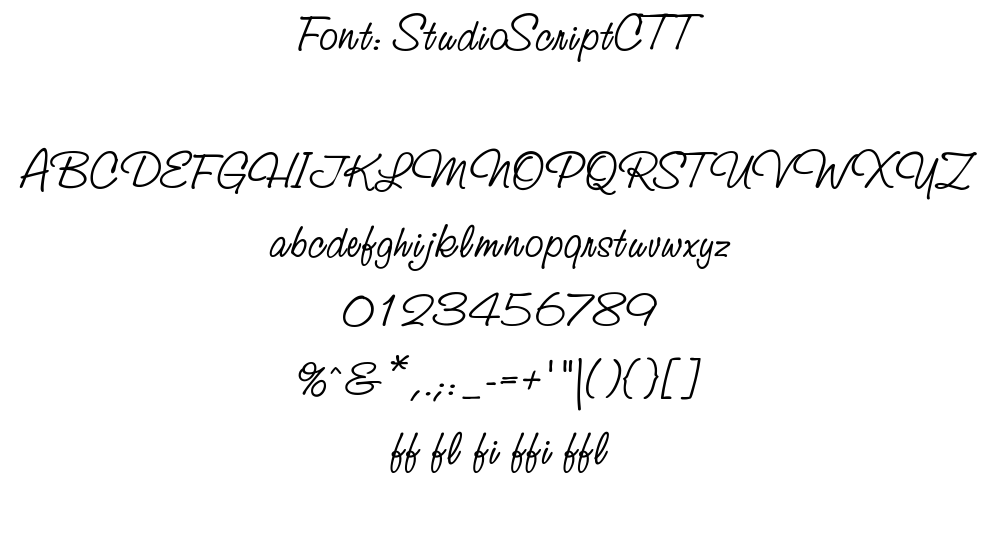
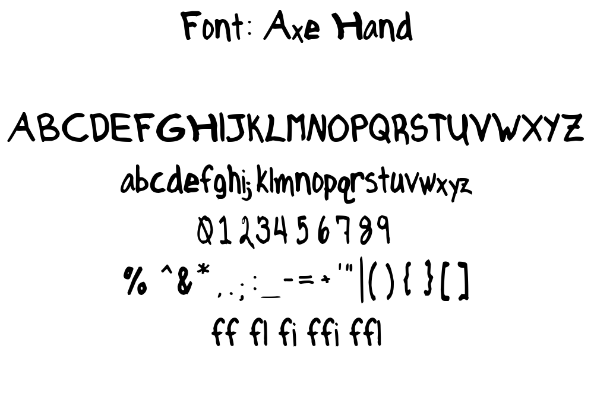
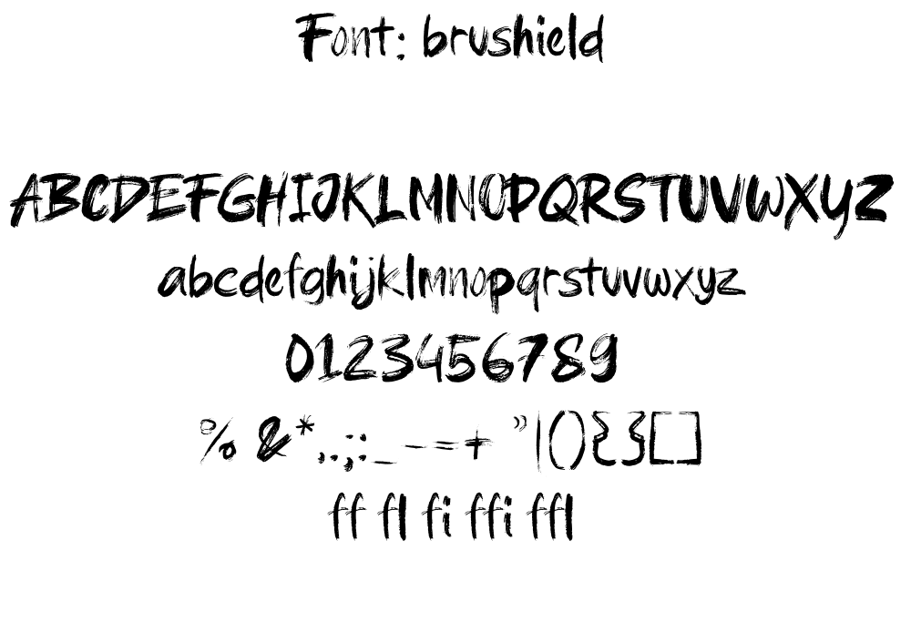
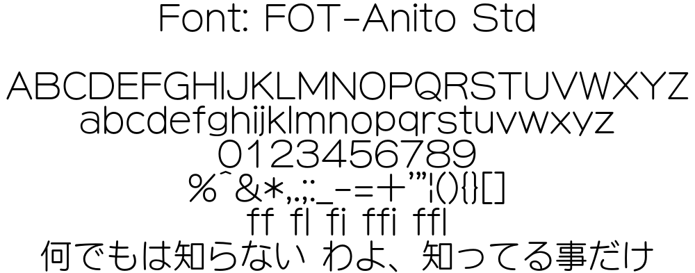
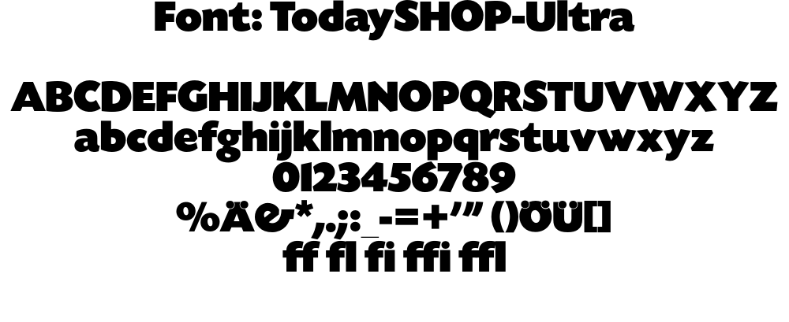
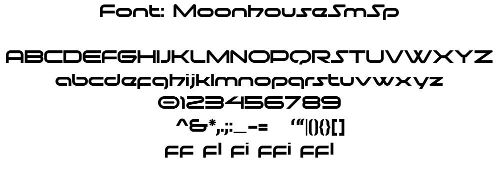
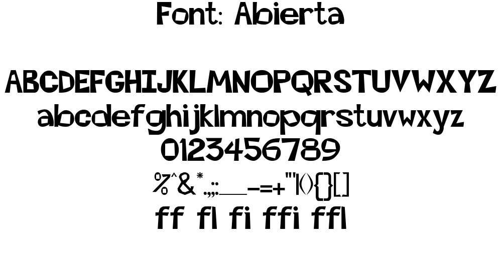
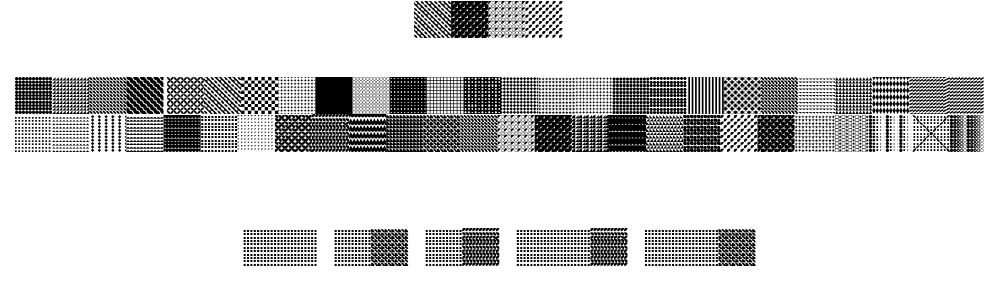
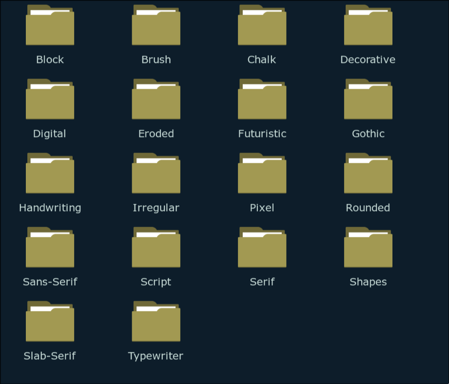

# Font

!!! info

    For the typography nerds, us typesetters say fonts even when we mean
    typefaces. We make no distinction.

Different fonts invoke different feelings. Would you use `Comic Sans` when you
write your résumé? Would you write a children book in `Times New Roman`? Why
does a cyberpunk movie not use `Gothic` font for its title? I think you get the
point. Because of this nature, using wrong font will fail to convey the emotion
that the original text intended to.

Fonts are one of the most important part of typesetting but also one of the most
difficult to get right. This stems from a couple of reasons:

1. You have too few fonts and thus have nothing to choose from.
1. You have too many fonts with no font management because you downloaded a huge
   font pack and thus have trouble choosing from all the fonts available to you.
1. You always try to find the actual Japanese font that the original text was
   written in to use its Latin characters.

## Building Your Font Collection

If you are just starting out, how do you ever build your font collection until
you have enough fonts to typeset? How many fonts is enough fonts? There is no
specific number but the more number of fonts you have, the easier it will be for
you to typeset. Some people hear this and  download huge font packs
that have tens of thousands of fonts and will never use 99% of the fonts there.

So how do you actually build your font collection? The best way, in my opinion,
is to get the fonts used by reputable fansubbing group because you are getting
the exact fonts that are useful for typesetting.

### How to Get Fonts from a Fansub Group

1. Go to [Anime Tosho](https://animetosho.org/)  website and in the search menu,
   type out the name of a good fansubbing group and an anime that they have
   subbed.
1. I am using `GJM` fansub group and `Kaguya-sama: Love is War` series
   as an example. This [episode](https://animetosho.org/view/gjm-kaguya-sama-love-war-s3-10-117d31e9-mkv.d506900rl)
   specifically. Choose a typeset heavy show. Click on a release that you want
   to extract fonts from.
1. You will see `Extractions` towards the bottom. In this section, click on
   `All Attachments` and download the zip file.
    
1. Extract this zip file and you will find a folder called `attachments`. Inside
   this folder, you will find all the fonts used in this episode.
1. In this episode, I found 48 fonts. Already so much progress to build the collection.

If you have already downloaded the episodes, you can use a software like
mkvcleaver to extract fonts from it.

So back to the question of how many fonts is enough. I hesitate to give you a
specific number but I'd say if you have about 500 fonts, you can comfortably
typeset most of the shows. If you have about 1000 fonts, I'd say you can typeset
99% of the shows provided that you have diverse enough fonts. _What are you
going to do with 40 fonts that all look the same? Make your collection diverse!_

## Font File Formats

There are three main font file formats that you need to consider: `ttf`, `otf` and
`ttc`. You are free to research what they exactly are if you want but it's
beyond the scope of this guide.

One thing you must know is that while ttf and otf are pretty similar, ttc fonts
combine multiple ttf fonts into a single file. If you want to use a font from
ttc fonts, you can extract the specific fonts from them and use it.

## Classification of Fonts

Just downloading all the fonts into a single folder will not get you anywhere.
Managing them is also very important and we manage them by classifying them
based on their types. Let's learn about what the types are.

!!! info

    The classification below is not what a designer would tell you because I've
    added some classification that makes sense for typesetting.

### Serif

Serifs are the small feet at the end of a stroke in a letter. They are generally
used in print like documents, books, identity cards.

### Sans-Serif

Sans comes from the French meaning `without` which means these fonts literally
mean without serifs. So these fonts are like Serif fonts but without any kind of
stroke at the end.

### Slab-Serif

These fonts are the Serif fonts where the serif is as thick as the stroke of
the text. They are heavier and thicker and have squared serifs.

### Script

These are based on the flow of cursive handwriting. They include connecting end
tails and exaggerated flourishes.

### Handwriting

This is arguably one of the most used types of fonts because handwritten text is
all over anime.

### Brush

Kanji written by brush is also all over anime as well. You need a lot of it and
of different kind.

### Rounded

Fonts that have rounded corners and curved edges.

### Chalk

These include handwritten fonts that are written by chalk instead. There are a
lot of school based anime and they all have chalk written all over the
blackboard so stock up on these.

### Digital

Fonts that looks digital are another popular category of fonts that you will
find scattered all over anime.

### Pixel

Pixilated fonts are another important fonts when it comes to digital texts.
Departure boards, retro games etc use these fonts.

### Block

These are fonts that are thicc.

### Gothic / Blackletter

These fonts are based on the medieval calligraphy. Whenever anime is based on
medieval Europe or its equivalent, these kind of fonts are used all over them.

### Futuristic

You might merge this with `Digital` folder if you want. When I sort fonts, I
always have trouble if I should add it to `Digital` folder or `Futuristic`
folder since they are similar in nature but I find value in distinguishing them.

### Typewriter

Typewriter fonts are well for typewriters. A lot of anime also use typewriter
style text for added effect so this is important.

### Eroded

These fonts have eroded or distorted body. Text that look worn out and rugged
use this font.

### Sketch

These fonts are sketchy. They may look like any other type of font but they look
like they are sketched by hand.

### Display / Decorative

They may look like anything. There are a lot of fancy texts in anime. Blood
splatter, wobbly texts, text that looks like cloud, graffiti, tattoo fonts -
anything goes.

This is the most diverse and largest group of fonts. You will
have the highest number of these kinds of fonts.

### Shapes

These fonts render various shapes when you type a character. These consists of
patterns, shapes, textures that are useful for masking.

### Irregular

These fonts are way out there with extremely irregular characters. You never know
when these come in handy.

## Font Management

It is absolutely important that you manage fonts. When you are typesetting a
sign, you don't want to scroll through all the fonts you have from top to bottom
until you find a suitable font. This is a huge time sink and doing this for all
the signs you typeset will take forever. So here's what we will do:

1. All of your fonts are in a single folder. Inside that folder, you will make a
   folder for each each font type: i.e. one folder for `Serif`, another for
   `Brush` and so on.
   {width="500"}
1. This is optional but I recommend it. Inside each of the folder above, create
   three sub folders: Thin, Regular and Thick.
1. When you download fonts from a fansub release like I taught above, you sort
   it out by saving these fonts into their respective folders.
1. I recommend you to use duplicate finder software like [czkawka](https://github.com/qarmin/czkawka)
   so you don't have to bother sorting duplicates.
1. Now, whenever you typeset a sign, all you need to do is determine the nature
   of the font. As soon as you find the type of the font the original text is,
   you do not have to look into other folders at all. You only look inside one
   folder to find a suitable font. _I cannot stress enough how much of a time
   saver it is._

If you think this is too much work, you just may have too much fonts. The time you will save later is definitely worth the labor you do by sorting beforehand.

## Font Manager

When I say you look inside one folder to find a suitable font, I don't mean you
look at the fonts in `File Explorer`. I mean you should use a font manager. We
have spent a lot of time sorting fonts in our File Explorer, now let's mirror
that same folder structure in our font manager.

A good font manager will:

1. Allow you to add fonts from folder in order to manage them (Along with
   installed fonts.)
1. Let's you preview a lot of fonts at once and compare them.
1. Activate fonts for use in Aegisub without installing them (And deactivate
   them when not in use).

The font manager I'm going to recommend is [FontBase](https://fontba.se/) but
you are free to use another if it meets above requirements. Fontbase is free and
available in all operating systems.

### Watched Folders

`Watched Folders` are the folders in your computer that FontBase is watching. The
good thing about `Watched Folders` is that when you ad new fonts to the folder,
they are automatically added to FontBase. Follow the steps below to add folders
to `Watched Folder`

1. In the bottom of the left panel, there is a `+` sign. Click on it and select
   the `Watched Folder`.
1. A file explorer will open. Navigate to the folder where you have all the
   fonts installed. To be clear, the is the fonts where you have all the
   folders like `Serif`, `Brush` etc
1. Select all the folders and click `Select`.

When you do this, all the folders will be added along with the sub folders.

<video width="2560" height="1548" controls>
    <source src="../assets/Fonts/watched_folder.mp4" type="video/mp4">
Your browser does not support the video tag.
</video>

If you click on the folder, all the fonts in that folder can be previewed in
main panel. You can click on the down arrow in the right of the folder name and go inside the sub-folders just like file explorer.

<video width="2560" height="1542" controls>
    <source src="../assets/Fonts/sub_folders.mp4" type="video/mp4">
Your browser does not support the video tag.
</video>

### Activating a Font

Activating a font allows you to use a font without installing it.
When you close the FontBase app, all the fonts are deactivated. When you launch
the software again, all the fonts that were active before gets re-activated
again.

In order to activate a font, click on the circular icon beside the font name.
Click on the same icon to deactivate the font.

<video width="1530" height="348" controls>
    <source src="../assets/Fonts/activate_font.mp4" type="video/mp4">
Your browser does not support the video tag.
</video>

You can also do the same thing in left panel and all the fonts inside that
folder including the sub-folders will be activated at once.

<video width="474" height="184" controls>
    <source src="../assets/Fonts/activate_font_2.mp4" type="video/mp4">
Your browser does not support the video tag.
</video>

### Collection

Collection is another way of forming a group of fonts without duplicating the
actual files.. Let's say you are working in five series. You'd make five
different collections so when you work on a series, you can activate all the
fonts for that series at once.

In order to make a new collection, simply click on `New Collection` in the left
panel and type the name of the collection. Then drag the font to that collection
from main panel over the collection name to add that font to the collection.

<video width="2560" height="1546" controls>
    <source src="../assets/Fonts/collection.mp4" type="video/mp4">
Your browser does not support the video tag.
</video>

You can also right click a collection and add sub-collection for each episode if
you want that kind of fidelity.

### Changing Font Preview

You can change the size, background color, text color, alignment and the preview
text. You should always change the preview text to the translation you have because
you should also check if the font you choose have to glyphs for those characters or
not.

<video width="2556" height="1540" controls>
    <source src="../assets/Fonts/font_preview.mp4" type="video/mp4">
Your browser does not support the video tag.
</video>

