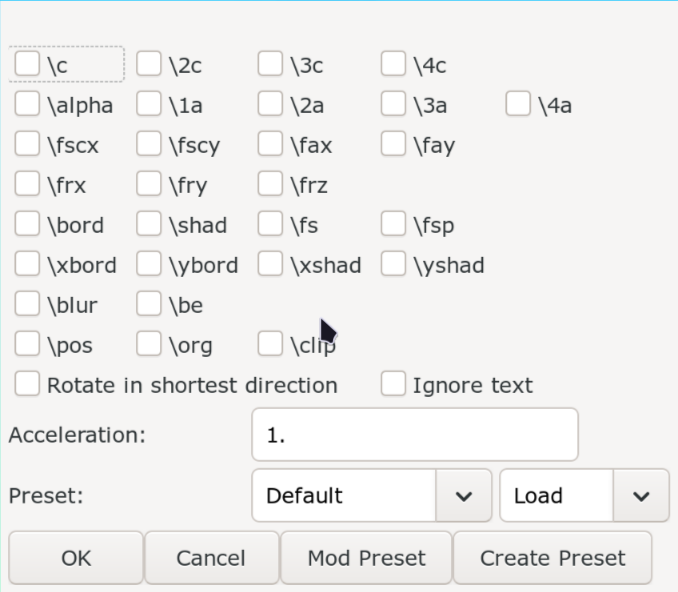

# Frame by Frame

Sometimes a sign appears where instead of working in a single line, you will
have to split the line into multiple lines where each line's duration is equal
to one frame of the video and work on the lines frame by frame (fbf).

## Splitting Lines by Frame

Splitting the lines into individual frames is easier said than done. For
example, if your line has fade in , the first few lines should go from
transparent to opaque. All the transforms (\t tags) should also be interpolated.
So of course we won't do it manually. So we use a script called `FBF-ier` by
arch1t3ct from Dependency Control to do this. There is another script called
`Line to FBF` by ILL team which can act as alternative.

The only thing you need to do to split line to individual frames (often called
line2fbf in conversation) is to select the line(s) you want to split and run the
script.

## Animated on 2s

Most of the video you will typeset will be 24 frames per second(fps)
(_24000/1001_) to be precise but drawing 24 frame for each second means that
animators will have to draw a large number of frames. That is why to save and
effort, animators will use the same frames consecutively. For example, if you
draw 12 frames and repeat each frame twice, you will have 24
frames per second.

If frame is only used once, we call it `animated on 1s`. If each frame is repeated
twice, we call it `animated on 2s` and so on. Most of the anime is animated on
2s for example. In scenes where they need extra smoothness, they can switch to
animated on 1s.

So this information is crucial to typesetters because when they are doing fbf
work, it means they can also save time and effort. To find if the scene you are
typesetting on is animated in 2s or not, just go to the video box and spam
++arrow-right++ and count how many frames are repeated.

Let's say the you find that the scene is in fact animated in 2s. How do you
split the lines in such a way that each line is exactly equal to 2 frames? We
use Aegisub script of course. The script we will be using is called `Split Timer`
by petzku. It is available in Dependency Control.

1. Select the line you want to split.
1. Go to `Automation -> Split Timer -> N frames...`
1. In the GUI that opens, enter 2 since the example is animated in 2s. Change
   this accordingly.
1. Enter `OK` button.

## Frame by Frame Transform

Now that you have split the lines into frames using either of the above two
methods, now we have to make changes. We will be using another script called
`Frame-by-Frame Transform` by Lyger. It is available in Dependency Control so
download from it.

1. Split the lines into frames.
1. Make changes in the first line that is correct in that frame. Make correct
   changes in the last line too. So in the first line and the last line, the
   tags have correct value.
1. Select all the lines from the first to last line.
1. Run the script by going to `Automation -> Frame-by-Frame Transform ->
   Frame-by-Frame Transform`. The GUI looks like this:

    {width="450"}

1. Tick the tags that you want to transform and click `OK` button.
1. Normally all the lines you select must have same text/shape since this is
   where fbf transform makes most sense but if you want to fbf transform in a
   selection of lines where text changes, click on `Ignore text` checkbox.

If you split the lines into frames, it does not mean you have the select the
first and last line of this split. When you run `FBF-ier`, let's say it splits
the line into 10 lines. Then you can change tags in line 1 and 3 and 7 and 10.
Then you can select lines 1 to 3, run fbf transform. Then select 3 to 7 and run
the script. Then 7 to 10 and run the script.

### Example

TODO: Add example
