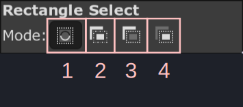

# Gimp

In Gimp, we have mostly two purposes for fansubbing: make quick selection to convert
it to clip or shape and clean up the sign to image trace it.

## Selection

Selection highlights a specific portion of the image. The selected region is
indicated by a marching ant lines.

If you want to delete a selection that has already been made, you can click
anywhere outside the selected region. You can also go to `Select -> None` to
delete the selection.

Every gimp selection tool has options and modes. Let's learn about modes first:

| Number | Meaning |
| -------------- | --------------- |
| 1 | Replace current selection i.e. everytime you draw a selection, the previous one disappers |
| 2 | Add to current selection i.e. when you draw a selection, it will be appended to previous selection |
| 3 | Subtract from current selection i.e. when you draw a selection, this new selection will be removed from the previous existing selection |
| 4 | Intersect with current selection i.e. when you draw a selection, only the region that overlaps with existing selection and new selelction will remain as selection |

### Operations on selection

When you have selection, there are few things you can do to it that will be
useful to us.

#### Remove Holes

When you make selection and there is hole in it, (_hole meaning there is an
unselected region within the selection_), it is sometimes useful to remove it.

In order to remove it, right click and go to `Select -> Remove Holes`.

<video width="2560" height="1546" controls>
    <source src="../assets/Gimp/remove_holes.mp4" type="video/mp4">
Your browser does not support the video tag.
</video>

#### Grow

All the tools I explain below make very tight selections. If you just use it as
it is, it will create gaps. Just increasing this selection by a few pixels will
close that gap.

In order to change selection size, right click and go to `Select -> Grow`. In
the GUI, enter the number of pixels you want to _grow_ the selection size by.
Positive value will increase the selection and negative value will decrease the
selection.

<video width="2560" height="1546" controls>
    <source src="../assets/Gimp/grow.mp4" type="video/mp4">
Your browser does not support the video tag.
</video>

#### To Path

Selection is well just selection, it's selecting a region in the image. Like
I said in the beginning, the goal of selection is to convert it to clip or shape.
In order to do that we need to first convert it to path.

In order to convert selection to path, right click and go to `Select -> To
Path`. You won't see any change in the image. However, if you go to the panels
of layers, you can see all the paths too.

<video width="2560" height="1546" controls>
    <source src="../assets/Gimp/to_path.mp4" type="video/mp4">
Your browser does not support the video tag.
</video>

### Rectangle Select

One of the simplest selection tool. Select the tool, click anywhere in the image
and drag to create a rectangular region. Until you press ++enter++, the selection
has not been made. You can change the size, length, width of the rectangle using
the controls you will see when you hover over it. You can even drag it to new
location. Finally, when you are ready, press ++enter++ to finalize the selection.

Press ++shift++ after you make the first click while using this tool to generate
a square instead of rectangle. If you press ++ctrl++ after the first click,
the point of your first click becomes center of the rectangle.

<video width="2560" height="1546" controls>
    <source src="../assets/Gimp/rectangle_tool.mp4" type="video/mp4">
Your browser does not support the video tag.
</video>

### Ellipse Select

Just like rectangle selection tool, click anywhere in the image and drag to
create an elliptical region. In the default UI, the rectangle and ellipse tool
are overlapped. Right click the rectangle tool and you can now select the
ellipse tool.

Press +=shift++ after you make the first click while using this tool to generate
a circle instead of ellipse. If you press ++ctrl++ after the first click, the
point of your first click becomes center of the ellipse.

<video width="2560" height="1546" controls>
    <source src="../assets/Gimp/ellipse_tool.mp4" type="video/mp4">
Your browser does not support the video tag.
</video>

### Fuzzy Select

Probably my favorite selection tool. When you have this enabled, and you click
on a point in image, it will select adjacent region of similar color.

{width="300" align=left}

One of the options of this tool is called `Threshold`.

Threshold refers to the maximum color difference between the reference pixel
and adjacent pixels to select. If you have high threshold, Gimp will be less
strict about which colors to select and vice versa.

Normally, you would just click at a pixel and Gimp will select the surrounding
region of similar color but if you click and drag the cursor down, it will
automatically increase the threshold on the fly and allow you to select bigger
region than you could with single click. Dragging it up will decrease the
threshold.

<video width="2560" height="1546" controls>
    <source src="../assets/Gimp/fuzzy_tool.mp4" type="video/mp4">
Your browser does not support the video tag.
</video>

### Select by Color

Another one of my frequently used tool. This is also overlapped with `Fuzzy
Selct` tool, so if you right click that tool, `Select by Color` tool can be
enabled. This is similar to `Fuzzy Select` tool but instead of choosing similar
color in adjacent region, it will select all the pixels in the image that have
similar colors. This also has `Threshold` option just like `Fuzzy Select` tool.

Normally this would not be that useful, because if you use this in a sign, it
will also select the pixels outside the sign but if you remove the region
outside the sign first (not crop), then this suddenly becomes extremely useful.

<video width="2560" height="1546" controls>
    <source src="../assets/Gimp/select_by_color_tool.mp4" type="video/mp4">
Your browser does not support the video tag.
</video>

### Quick Mask

Finally, we move to a bit more advanced way of making even a complex selection
really fast.

1. Enable `Quick Mask` tool by pressing ++shift+"q"++ or go to `Select -> Toggle
   Quick Mask`. You whole image will be overlayed with a red tint where the red
   tine represents the unselected region. If you already had selection prior to
   activating quick mask, that selected portion won't have red tint.
1. The goal of quick mask is to use paint brush to paint the region that you
   want to select with white color and the region that you don't want to select
   with black color.
1. So enable the paintbrush tool by pressing ++"p"++ key. Reset the foreground
   and background color pressing the small square icon below the color square.
   Remember you can switch between the foreground and background color by pressing
   ++"x"++. So if you are painting white but you accidentally overshoot and
    painted the region that should not be selected white, press ++"x"++, paint the
    region black to unselect, press ++"x"++ again and continue your selection.
1. Your left square bracket makes brush size smaller and right square bracket
   makes brush size bigger. Also don't feather your brush and set your brush
   hardness to 100.
1. When you are done painting, press ++shift+"q"++ again and the region will be
   selected. Sometimes the UI doesn't update and show the marching ant lines but
   just I click on the image layer and it should work.
1. If you are unsatisfied with your current selection, you can activate quick
   mask again and your progress will not be lost. You can continue from where
   you left off last time.

Here's a rough example:

<video width="2560" height="1546" controls>
    <source src="../assets/Gimp/quick_mask_example.mp4" type="video/mp4">
Your browser does not support the video tag.
</video>

Now here's a bit more realistic example of how you'd use it in a sign:

<video width="2560" height="1546" controls>
    <source src="../assets/Gimp/quick_mask.mp4" type="video/mp4">
Your browser does not support the video tag.
</video>

<!-- ### Foreground Selection -->

## svgtoass

### Converting Path to SVG

We learned above how to convert the selection to path. Now we learn how to
convert that path to svg and then convert that svg to clip or shape.

1. Right click in the path, click on `Export Path.`
1. A file picker will open. Navigate to the folder you want to save SVG to.
1. Write the name of the SVG and click on `Save` button.

### Convert SVG to ASS

#### Config

Let's set up the config of the script. This is a one time set up.

1. First [download and install python](https://www.python.org/downloads/). When you
    install python, make sure you tick `Add to system path` checkbox.
1. Open the command prompt or Windows Terminal and install inkex using the
   command `pip install inkex`.
1. Download [the python file](https://github.com/PhosCity/Aegisub-Scripts/blob/main/misc/phos.ink2ass.py)
   and save it to some location.
1. Download `svg2ass` script from Dependency Control.
1. Open the config of `svg2ass` by going to `Automation -> svg2ass -> Config`. A
   file picker will open. Navigate to the python file you downloaded above,
select it and click `Open` button.

### Run

Above steps is a one time only. Once you have set up the config, whenever you
you want to convert an svg to ass, follow these steps:

1. Run the script using `Automation -> svg2ass -> Run`. The GUI will open
    {width="400"}
1. Select `drawing`, `clip` or `iclip` in the dropdown depending on what you
   want.
1. Click on `Import` button.

TODO: Add example

## Resynthesizer

TODO
