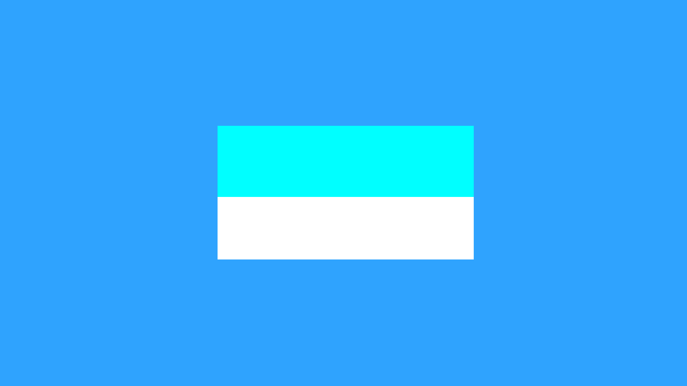
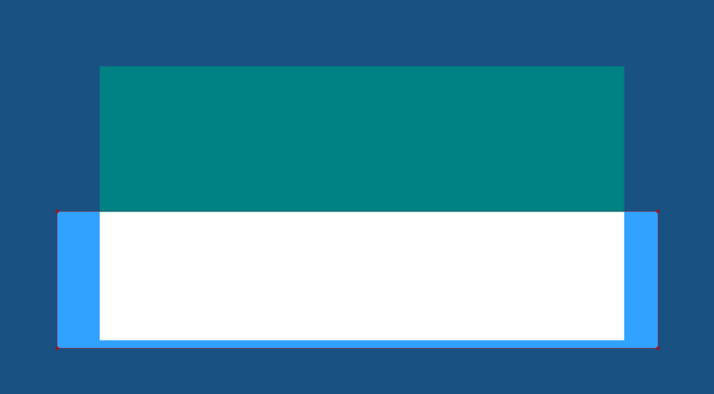
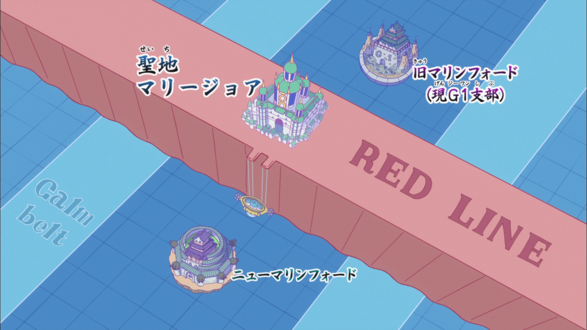

# Gradient

In typesetting, a gradient refers to a gradual change of a tag value from one
point to another in text.

## Rectangular Clip Gradient

I have a rectangular shape.
I duplicate it once add blue color to one and keep the other white. Then I clip
out the bottom half of blue box and I clip out top half of white box. This is what
I get.

To be extra clear here are the clips:

=== "Bottom half clipped off"

    Rectangular clip removes the bottom half of blue box.

    

=== "Top half clipped off"

    Rectangular clip removes the top half of white box.

    

Let's duplicate it more and increase the number of clips and change the color in
each one of them.

=== "3 colors"

     

=== "5 colors"

     

=== "17 colors"

     

=== "77 colors"

     

In the images above, the finer the strips are, the smoother the gradient
becomes. So the way we use rectangular clips to make gradient is we duplicate
it a bunch of times, change the value of tag gradually and we have a smooth
gradient. But of course doing it manually would be insane. So we use a script
named `Gradient Everything`. Download it from Dependency Control and immediately
bind it to a hotkey. I bind it to letter `G` in subtitle grid.

This is how the GUI of `Gradient Everything` looks like:

{width="450"}

1. Create the first line and add tags that you want to gradient. (_You can see
   in the GUI above which tags can be gradiented_). You can
   gradient multiple tags at once. This will be our first control line.
1. Duplicate this line and change the value of the tag. This will be another
   control line.
1. Select both of them and open the script.
1. In pixels per strip, enter the width of the rectangular clip in pixels.
   Lesser the value, more the number of resulting lines, the smoother the
   gradient is. If you are looking for smooth gradient, always put 1 here.
1. In the dropdown in the top right, select horizontal if the gradient is in the
   horizontal direction and vertical if the gradient is in the vertical
   direction.
1. Select all the tags that you want to gradient by enabling the checkbox beside
   their name.
1. It is possible to use `Acceleration` to determine the speed in which the
   gradient will converge between control lines. This is just like `accel` of
   transform. 1 means no acceleration, greater than 1 means starts slow but ends
   fast and less than 1 means starts fast but ends slow.
1. Press the `OK` button.

When the script gradients from one tag value to another, it is possible that
consecutive strips have same value of tags. We don't want that since all it does
is increase the number of lines. That is why we use another script called
`Combine Gradient Lines` by petzku which as the name suggests will combine
consecutive gradient strips into one if they have same tag values (if there are
any of course). To use this, just select all the lines `Gradient Everything` produces
and run this script.

### Example 1

///caption
[Maria†Holic Alive](https://anilist.co/anime/9712/MariaHolic-Alive/) Episode 6: 0:07:10
///

This is a typical sign that needs gradient. You can see the color changes from
light purple to dark purple. Since there are two colors, we need two control lines.
This sign has double border but the color gradient is
only in the fill. Since we separate the fill and border in separate layers
anyway, you should only run `Gradient Everything` in the fill layer. So we will
have two border layers (one black and another white), and multiple fill layers with
their own clips and colors.

<video width="2048" height="1234" controls>
    <source src="../assets/Gradient/maria_holic_alive_result.mp4" type="video/mp4">
Your browser does not support the video tag.
</video>

### Example 2

///caption
[One Pace](https://onepace.net) Reverie 02: 0:03:18
///

<video width="2048" height="1234" controls>
    <source src="../assets/Gradient/one_pace_result.mp4" type="video/mp4">
Your browser does not support the video tag.
</video>

In the video above, you will see that I made three control lines for the fill
because I want the top and bottom of the gradient be green but I want middle of
the gradient to be black. All other steps are the same.

## Gradient by Character

///caption
[One Piece](https://anilist.co/anime/21/One-Piece) Episode 865: 0:06:55
///

Gradient by character is another type of gradient where instead of duplicating
the lines and using clip, we can use inline tags before each letter and create a
horizontal gradient. This cannot be used to make a vertical gradient.

The script we will use is called `Gradient by character` by Lyger. So install it
using Dependency Control and immediately bind it to a hotkey. Letter ++"g"++ is
already taken by `Gradient Everything` script so you could bind it to something
like ++alt+"g"++ in the subtitle grid.

1. Add local tags at any point of the text. You can add one in the beginning, or
   end or in the middle. This is our control point.
1. Run the script `Gradient by character`.
1. The script will insert tags after each character from one control point to
   another such that there is a smooth transition between them.

<video width="2048" height="1234" controls>
    <source src="../assets/Gradient/one_piece_result.mp4" type="video/mp4">
Your browser does not support the video tag.
</video>

A couple of things to note in this video:

1. I first added two control points: fill color in the beginning and fill color
   at the end. When I ran the script, the result was not satisfactory. Then I
   added multiple control points in the middle of the text and then the result was
   better.
1. Notice that for the control point in the beginning of the text, I did not
   sample the colors from the beginning of the Japanese text. Same for the end
   control point. I sampled the color that was directly above it so that color
   of gradient could match.

## Vector Gradient

TODO

## Rotated Gradient

TODO
