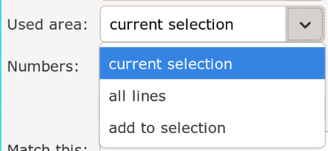

# Handling Lines

You will soon realize that typesetting signs will create a lot of lines. Moving
around in the subtitle file, navigating to exact lines as well as making
specific selections will become harder and harder. In this page, let's go about
how to do these.

## Fold

Folding is a quite recent feature added to this fork of Aegisub to visually group
and collapse lines in the subtitle grid called folds. When you have a lot of lines
in your file, being able to group lines
makes it easier to navigate and work on a specific sign. Not only you can group a
single sign in a single fold but you can have sub-folds. For a specific sign,
you can have a sub-fold for its mask and another sub-fold for its text for
example.

I already explained when we learned about subtitle grid, that there is context
menu for creating and clearing folds for a selection of lines in subtitle grid.

<video width="2560" height="1546" controls>
    <source src="../assets/Handling Lines/fold_context_menu.mp4" type="video/mp4">
Your browser does not support the video tag.
</video>

If creating and removing fold like above is enough for you, then there is no need
to read further about folds.
In this page, we will learn about a script called `Fold Operation` made by me
which allows you to create, remove and perform various operations on the folds.
It is available in Dependency Control so install it from there.

!!! note

    Fold is currently not in the most robust state since it uses extradata to
    save folds. So either use the script for all fold related work or just use
    context menu. Don't mix them or they may lead to invalid fold states.

Before I explain the usage of this script, there are two popular ways I've noticed
people use folds. One is to simply select all the lines and create folds and another
is to add commented lines at the start and end of lines where the first line has
name for the fold. These names are descriptive of the sign and since we only see
the first line of a fold, this makes navigating and finding signs easier.

=== "Fold with comments"

    

=== "Same fold without comments"

    

I prefer to use comments around my fold since it is cleaner and instantly allows
me to recognize the signs among the list of folds. The script has an operation
that will allow you to easily create named folds with comments.

You can open the GUI of the script by going to `Automation -> Fold Operations -> GUI`

{width="450"}

!!! warning

    If you use comments around the lines as fold markers, enable `Comments
    around fold` in the GUI before you do anything. Any operation you do using
    the script will then ignore the first and last line of the fold.

All the items of the GUI is also available in the sub-menu itself.

### `Create a New Named Fold Around Selected Lines`

If select lines, enable `Create a new named fold around selected lines` in the GUI
and press `OK` button, a GUI will open where you will enter a name for the fold.
Make sure that this name describes the sign uniquely so that you can recognize
it later. The script will then insert commented lines with name and create a fold
with selected lines.

{width=300}

The folder marker is optional. You can change it to any character you want or
untick to disable it. If you have folds inside fold, it will show how deep the
fold is nested before fold names.

<video width="2560" height="1546" controls>
  <source src="../assets/Handling Lines/fold_operation_create_fold.mp4" type="video/mp4">
Your browser does not support the video tag.
</video>

### `Select Fold`

This selects all the lines in fold. Then you can do whatever you do with
selected lines. The best thing about this is that you don't have to open the
fold to select all the lines in the fold. Even if you are already inside the
fold, running this will select all the lines in the fold.

<video width="2560" height="1546" controls>
  <source src="../assets/Handling Lines/fold_operation_select_fold.mp4" type="video/mp4">
Your browser does not support the video tag.
</video>

In the video above, without opening fold, I select all the lines in the fold and
add blur to it.

### Commenting Fold

Commenting and uncommenting all the lines in a fold can be done easily.

| Operation | Description |
| -------------- | --------------- |
| Comment | Comments all the lines in fold. If a line was already commented before running this, the script remembers it. |
| Uncomment | Uncomments all lines in a fold If the script remembers that a line was commented before running `Comment`, those lines remain commented. |
| Comment or Uncomment Fold | Comment the lines of fold if it contains any uncommented lines, otherwise uncomment it all. |
| Toggle Comments | This toggles the comments inside the current fold. Any commented lines will become uncommented, and vice versa.  If the fold was commented using `Comment Fold`, the state of the already commented folds is respected. |

### Removing Fold

| Operation | Description |
| -------------- | --------------- |
| Delete | This deletes all the lines of fold along with the commented lines around it. |
| Clear | This removes the fold without removing the lines itself. If you use comments around the fold, it will remove that as well. |

### Cut, Copy and Paste Fold

| Operation | Description |
| -------------- | --------------- |
| Copy fold | Copies all the lines in fold along with it's fold state and styles to system clipboard. |
| Cut fold | Copies all the lines in fold along with it's fold state and styles to system clipboard and deletes the fold. |
| Paste fold | Pastes all the lines in that was copied or cut using this script. The fold copied from one Aegisub window can be pasted in the same or different Aegisub window. |

When you paste fold, if the file in another Aegisub window does not have styles
of copied lines, those styles will also be added to new file.

<video width="960" height="540" controls>
<source src="../assets/Handling Lines/fold-copy-paste.mp4" type="video/mp4">
Your browser does not support the video tag.
</video>

## Jump To

Another way of handling lot of lines is to quickly jump over large number of
lines. The script used for this is called `Jump To Next` by unanimated. When you
install it from Dependency Control, it will create two entries inside
`Automation`: `Jump To Next` and `Jump To Previous`. Both of these have
sub-menus:

1. Actor
1. Commented Lines
1. Effect
1. Layer
1. Style
1. Text

It means you can jump over lines that have same comment state, actor, effect, layer,
style and text all at once and go above them or after them. If you find yourself
using one of these more often, make sure to bind it to hotkey in subtitle grid.
I use the text one a lot, allows me to jump over a sign easily since a single sign
will have same text which is why I have bound the key ++"j"++ to `Automation -> Jump
to Next -> Text` and the key ++alt+"j"++ to `Automation -> Jump to Previous ->
Text`.

There is also GUI in `Automation -> Jump to Next -> _GUI` if you want to use
that instead but binding the ones you use often to hotkey will always be faster
and more efficient.

## Seletrix

TODO

<!-- Another thing that becomes difficult when you have a lot of lines is making -->
<!-- accurate selection. Aegisub does come with its own selection feature in -->
<!-- `Subtitle -> Select Lines` but I prefer using the script `Seletrix` by -->
<!-- unanimated. It is available in Dependency Control as well. -->
<!---->
<!-- {width="500"} -->
<!---->
<!-- Let's say you have a lot of lines. They have different layers, text, actor, -->
<!-- effects. In the GUI, select an option from the `Used area` if you want to select -->
<!-- from your currently selected lines or all lines in the file. -->
<!---->
<!-- {width="300"} -->
<!---->
<!-- Then in `Select/sort`, choose if you want to select lines based on text, style, -->
<!-- actor or effect. -->
<!---->
<!-- {width="300"} -->
<!---->
<!-- Then select if you want to select line that matches or does not match the -->
<!-- condition. Then in `Match this`, put the text, actor, effect or layer that you -->
<!-- want to match. -->
