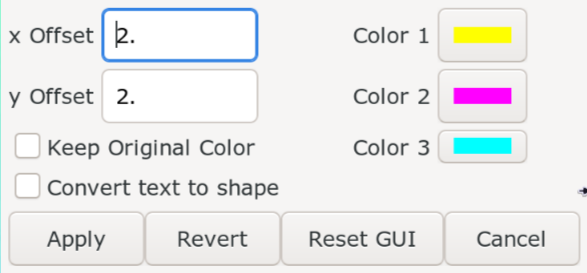
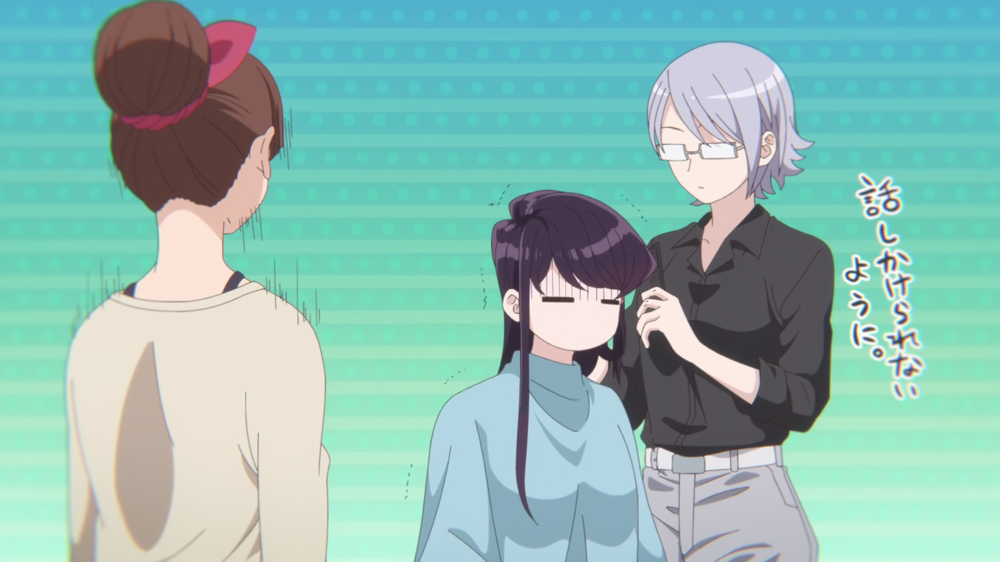
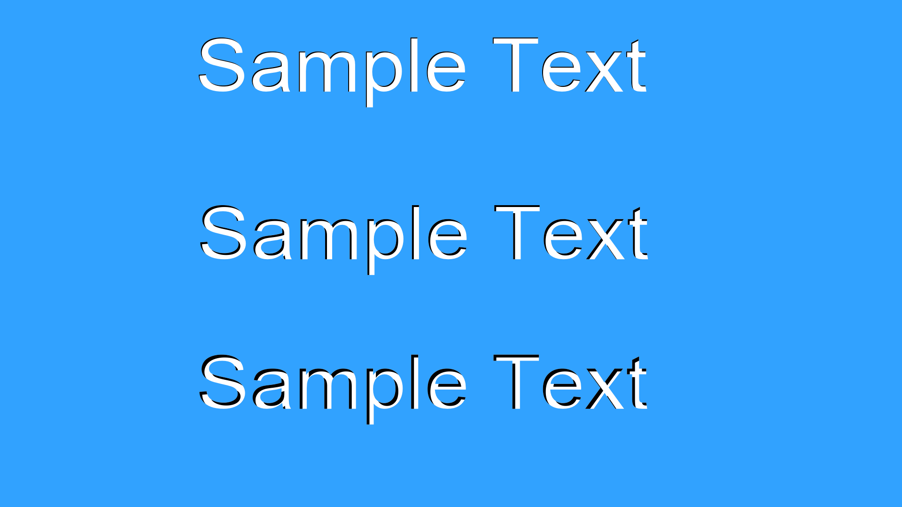

## Chromatic Aberration

Chromatic Aberration is a stylistic effect that mimics the failure of a lens to properly
focus all colors. You should at this point be able to use `Shapery` script's boolean
operations to create this effect. However, there is a script called `Chromatic Aberration`
by me that allows you to emulate this effect in your sign. It is available in
Dependency Control so grab it from there. The script looks like this:

{width="400"}

`x Offset` and `y Offset` allows you to increase the size of the effect. You can
set one of these to 0 to limit effect in only one direction.

If you tick the checkbox `Keep Original Color`, the script will apply the effect
but will not change the base color. If this is unticked, the base color will be
whatever is the result of subtractive color mixing from the three colors in the right.

The three colors will allow user to change the colors of the effect. There is no
need to change it most of the time since this is the default colors of chromatic
aberration but if the user wants to change it, they can.

`Convert text to shape` can be enabled if you have are applying the effect to
text but want to convert it to shape instead. _Converting text to shape looks
better in most cases since it would use clip otherwise._

///caption
[Komi-san wa, Komyushou desu.](https://anilist.co/anime/133965/Komisan-wa-Komyushou-desu/) Episode 6: 0:11:52
///

Let's take this sign.

<video width="2560" height="1546" controls>
    <source src="../assets/Inner Shadow and Chromatic Abberation/ca_example_1_result.mp4" type="video/mp4">
Your browser does not support the video tag.
</video>

The only odd thing that I did in the video above is setting `x Offset` and `y
Offset` to negative. When you use the script, it will set a color is specific
order but in this sign, they have been reversed. So using negative offset will
reverse the colors. Here's comparison:

=== "Positive Offset"

     

=== "Negative Offset"

     

A couple of things about the script because I've seen people keep failing to use
it.

1. Don't use it in a text with border. If a text has border, split it into layers
   (maybe by using `Blur and Glow` script) and then use this in the fill or you
    might get a fail like this:

    <video width="2560" height="1546" controls>
        <source src="../assets/Inner Shadow and Chromatic Abberation/ca_fail_1.mp4" type="video/mp4">
    Your browser does not support the video tag.
    </video>
1. If you have to apply the effect to the border of the text, first convert the
   border of the text to shape or offset the fill outward using `Shapery` and
   then apply the effect to that shape.

///caption
[Komi-san wa, Komyushou desu.](https://anilist.co/anime/133965/Komisan-wa-Komyushou-desu/) Episode 5: 0:12:39
///

Here we have a slightly different effect. This proves that you cannot rely
solely in the script must have the ability to improvise. The CA effect is
in both the border and the fill and the effect is only in one direction. Here's
the result:

1. I first duplicated the fill, converted it to shape and offsetted it outward
   to create the white border.
1. Then, I applied the script in the fill. As you can see above, it generates
   the CA colors in both upper left and lower right but the original sign only
   has the CA in lower right. So I took the lines that had upper left colors and
   united it with fill. So now we now have fill and lower right lines.
1. Now onto the border, I ran the script again with negative offset. Since the
   border only has the CA colors in left, I united the white border with CA
   colors of the right.
1. The result is as shown above. It took a lot of tinkering even after the
   script did a lot of heavy work.

## Inner Shadow

We will get signs where we have depth in the text. So we will have to
emulate this depth in the flat text. Again, given what I've taught you before,
you should be able to use pathfinder options in  `Shapery` to get this effect
pretty easily. However, `Shapery` already provides an option to create inner
shadow.

1. Go to `Automation -> Shapery -> Utilities`.
1. In the left dropdown, choose `Inner Shadow`.
1. Click on `Shadow` button.

<video width="2560" height="1546" controls>
    <source src="../assets/Inner Shadow and Chromatic Abberation/inner_shadow_shapery.mp4" type="video/mp4">
Your browser does not support the video tag.
</video>

As you can see above, the higher the value of shadow in the sign prior to using
the script, the deeper the shadow will be.

///caption
[Soredemo Machi wa Mawatteiru](https://anilist.co/anime/8726/Soredemo-Machi-wa-Mawatteiru/) Episode 2: 00:00:08
///

Using Shapery, you should be able to do most of the signs that have inner
shadow. For the sign above, you use perspective tool to align the text, add
shadow to the text, use `Shapery` to apply inner shadow. Apply horizontal gradient
to both the fill and the shadow separately. There is also the white highlight in
the bottom.
