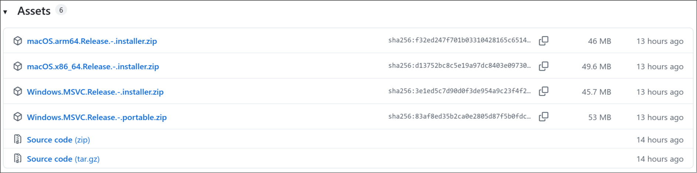

# Typesetting Software

Even though [official Aegisub has resumed development](https://aegisub.org/downloads/),
it is still recommended to use a
[fork of Aegisub by arch1t3ct](https://github.com/arch1t3cht/Aegisub)
as it has many features that a typesetter would want but is still not available
in the official fork. When they get added to the official fork, I'll remove the link
to arch1t3ct's fork.

In order to install Aegisub, follow the steps below:

1. Go to the [releases page of the repo](https://github.com/arch1t3cht/Aegisub/releases/tag/migration01-01).
1. Scroll down to the `Assets` section.
   
1. Here you will find a lot of binaries. Pick the one that is suitable for you
   and install.

## Windows

Installation in Windows is relatively simple. It's just a matter of downloading
and pressing `Next` in installation windows but here is a video that goes through
the installation process.

!!! note

    The video below is slightly outdated but the process remains the same.

<video width="2560" height="1600" controls>
  <source src="../assets/Installation/installation_windows.mp4" type="video/mp4">
Your browser does not support the video tag.
</video>

## Linux

If you use Linux and your distro packages this fork of Aegisub, install from your
package manager. The is also an Appimage in the release page. I have not tried it
myself but you can give it a try.

### Arch Linux

If you use Arch Linux, you can use
[AUR](https://aur.archlinux.org/packages/aegisub-arch1t3cht-git) to install it.
