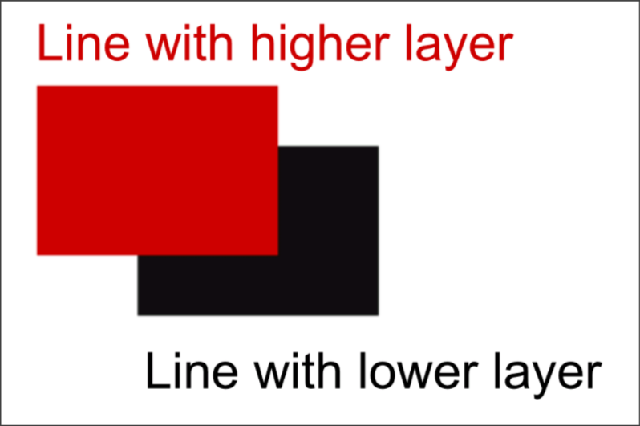
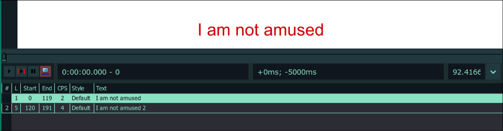

# Layers

If you have ever used any image editing, vector editing or drawing program, you
must understand the concept of layers. Layers in typesetting is the same thing.
A line that has higher layer is rendered on top of lines that have lower
layer. That's it. There is nothing more to be said to explain the concept of
layers. And yet, there is a dedicated page for it in this guide. The reason for
it is because the moment you move away from basic typesetting (colors, size,
font etc) to a more advanced typesetting, layers become absolutely necessary.

{width="400"}

## How to Set Layers

If you remember our lesson on `Edit Box`, you will know that 7th item on the
image above is for layers. Clicking on the plus sign on this increases the layer
of the current line. Conversely, clicking on the minus sign decreases the layer.

!!! note

    A line cannot have negative layer. So the minimum layer a line can have is 0.

If you want to increase or decrease layers for multiple lines at once, select
them in subtitle grid and change the layer for the active line in `Edit Box`.
Only the layer will change for all selected lines. When you do this all lines
will have same layer as the active line.

## Representation of Layers in Subtitle Grid

As soon as you add layers to a line, you will see the layers for each line in a
separate column. Observe in the image below, the layer of the line is in the
column `L` in the subtitle grid.

## Automatic Layer Based on Subtitle Grid

If you have two lines that appear at the screen at once, but both of them have
same layer or neither of them have any layer set, then which line do you think
is rendered on top.

In such case, it depends on its position in the subtitle gird. The line that is
lower in the subtitle grid is considered to have a higher layer.

!!! note

    If lines do not have position or origin tag, the lines will not be stacked
    on top of each other.
