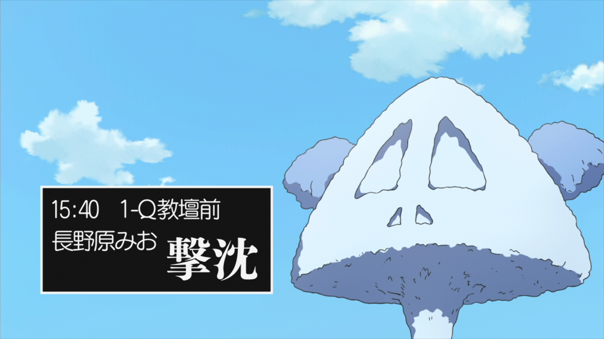
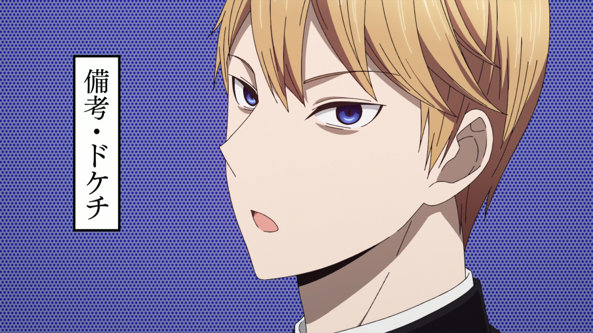
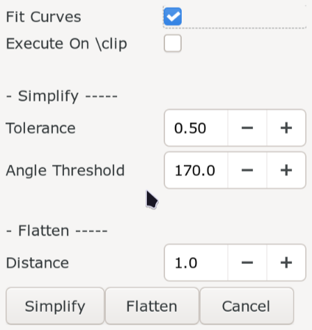

# Masking

You have already learned about what shape or mask is in previous lesson. We even
learned the relationship between clips and shapes. In this page, we learn about
how to use an automation script to create mask.

## Shapery

{align=right width="200"}
The script we use is called `Shapery` so download it from Dependency Control.
Shapery is an script for all things related to Shapes. Shapery has a lot of sub-menus.
We will run out of keys if we bind them all to hotkey so we will use it from the
`Automation` menu itself but if you find yourself using a sub-menu a lot, you can
bind it to hotkey.

When you install Shapery, it will make two entries in the `Automation` menu:
`: Shapery Macros :` and `Shapery`. Both of these have sub-menus and we will
talk about the sub-menus that I find the most useful.

## Shapery Macros

### Clip to Shape

/// caption
[Nichijou](https://anilist.co/anime/10165/Nichijou/) Episode 5: 0:21:10
///

Signs like this is where we apply mask. We can cover the box with a black mask
and put the text over it. Follow the steps below to convert clip to shape:

1. Draw a clip (rectangular or vectorial).
1. Go to `Automation -> : Shapery Macros : -> Clip to Shape`.
1. Open `Edit Tags` and make necessary changes (color, border, opacity etc)
1. Put text over it.

<video width="2560" height="1554" controls>
    <source src="../assets/Masking/clip_to_shape_1.mp4" type="video/mp4">
Your browser does not support the video tag.
</video>

/// caption
[Kaguya-sama: Love is War](https://anilist.co/anime/101921/Kaguyasama-wa-Kokurasetai-Tensaitachi-no-Renai-Zunousen/) Episode 1: 0:06:50
///

The Japanese text here is unfortunately vertical. While kanji may be read vertically,
English text is not meant to be read vertically. This is why we will not mask over
the original text. We can instead put the mask above the box.

<video width="2560" height="1554" controls>
    <source src="../assets/Masking/clip_to_shape_2.mp4" type="video/mp4">
Your browser does not support the video tag.
</video>

### Shape to Clip

Since we can convert a clip to shape, we can do the reverse as well.
The main reason why we would want to do this is to convert the shape
to clip and change the coordinates of the clip using Aegisub tool and
reconvert it back to shape.

Another reason would be to convert the shape to clip and use this clip in other
lines. This way other lines will be clipped inside the shape.

Although the name says `Shape to Clip`, if you have a text and run this the text
will directly be converted to clip.

<video width="2560" height="1546" controls>
    <source src="../assets/Masking/shape_to_clip_result.mp4" type="video/mp4">
Your browser does not support the video tag.
</video>

### Shape Clipper

If a shape has clip, then this menu removes the portion of the shape that the
clip tag removed which means the clip tag is no longer used but its appearance
remains unchanged.

So what is the use of this menu if it removes already
invisible portion of shape? If you remember past lesson, clip creates hard edges
that even the blur tag does not fix. Removing clips this way is one of the ways
of solving this problem.

If you run this in the line with text, the shape is first converted to shape and
then that shape is clipped.

<video width="2560" height="1546" controls>
    <source src="../assets/Masking/shape_clipper.mp4" type="video/mp4">
Your browser does not support the video tag.
</video>

### Shape Expand

Shape Expand bakes in as much tag as it can like scale, perspective etc into
the shape itself. Think of it like the shape uses the least amount of tags but
keeps the original appearance of the shape.

If you run this in a line with text, it just converts it to shape. This is the
recommended way to convert text to shape.

### Shape Merge

You can select the multiple lines with shapes and running this menu will merge
all these shapes into one line.

!!! warning

    This method is just taking the drawing commands and appending it to a single
    line. If you want to merge all the shapes into a single shape, there is
    another method below.

### Shape to 0,0

This will keep the appearance of the shape but change the position of the shape
to `(0,0)`.

### Shape to Center

This will keep the appearance of the shape but change the position of the shape
to the center of the bounding box of the shape.

### Shape to Origin

This will keep the appearance of the shape but change the position of the shape
to the origin of the shape.

### Shape trim

If you select multiple lines and run this menu, it will remove all the portion
of the lower shape that has been covered by shape above it. It does not seem to
respect the layers. It will trim with respect to the last line in selection.

<video width="2560" height="1546" controls>
    <source src="../assets/Masking/shape_trim.mp4" type="video/mp4">
Your browser does not support the video tag.
</video>

## Shapery Sub-Menus

### Manipulate

{width="300" align=left}

There are two things you can do in `Manipulate`: simplify the drawing command or
flattening the drawing command. Both of these are used to clean up the drawing
commands.

Flattening means converting a complex path which is made up of numerous bézier
curves into a series of small straight line segments.

Simplifying means reducing the number of points or segments in the drawing
command while keeping the original appearance of the shape.

The variables of simplify:

| Variable | Meaning |
| -------------- | --------------- |
| Tolerance | How far the simplified shape is allowed to deviate from the original shape  If deviation of a point is more than tolerance, point is not simplified |
| Angle Threshold | How much can a curve be simplified to a straight line |

So higher the value of the variables, the more the shape changes due to
simplification. The lower the tolerance, the less simplification occurs.

The variables of flatten:

| Variable | Meaning |
| -------------- | --------------- |
| Distance | Maximum distance between curve and the approximated straight segments |

So higher the distance, the coarser the approximation is but has lesser line
segments. The lower the distance, more detailed the approximation is but also
has more line segments.

In the GUI, if `Fit Curves` is enabled, the script will try to approximate the
curve for it while simplifying else it will use line segments.

If `Execute On \clip` is enabled, the simplification or flattening will be
executed on the clip of the line not the shape.

### Offsetting

Offsetting is used to expand or contract the shape.

1. Go to `Automation -> Shapery -> Offsetting`.
1. In the GUI, set the stroke weight to a positive value to expand and negative
   value to contract the shape.
1. In the corners style, select how sharp the corner is after offsetting:

    | Corner Sytle | Meaning |
    | -------------- | --------------- |
    | Miter | Sharp, pointy and angled corner |
    | Round | Curved corner |
    | Square | Flat and squared corner |

1. `Stroke` here refers to border. Align stroke tells the script where the
   border should be placed relative to shape.

    | Align Stroke | Meaning |
    | -------------- | --------------- |
    | Center | Border is centerd on path i.e. half of border covers shape, half is outside the shape |
    | Outside | Border is completely outside the shape |
    | Inside | Border is completely inside the shape |

1. [`Miter Limit`](https://developer.mozilla.org/en-US/docs/Web/SVG/Reference/Attribute/stroke-miterlimit)
   determines the maximum allowed sharpness before switching to a flat bevel corner
1. `Arc Precision` determines how accurately offsetted curves are approximated
   with straight lines. (_Higher precision means use more line segments means
   smoother curve_)

<video width="2560" height="1554" controls>
    <source src="../assets/Masking/offsetting.mp4" type="video/mp4">
Your browser does not support the video tag.
</video>

### Pathfinder

{align=left}

This menu provides a way to perform boolean operation on shapes. You either add
clip to a line and operate between the drawing command of clip and drawing command
of shape.

Or you select multiple lines, click on `Multiline` and operate on the drawing
commands of all the lines.

In the dropdown, you will find four options:

#### Unite

Combining all shapes into one shape.

| Mode | Operation |
| -------------- | --------------- |
| Single Line Mode | Combines the shape with its clip |
| Multi Line Mode | Shapes of all lines is combined into one |

This is the alternative to shape merge as mentioned above.

<video width="2560" height="1546" controls>
    <source src="../assets/Masking/unite.mp4" type="video/mp4">
Your browser does not support the video tag.
</video>

#### Intersect

Keeping region shared by all shapes.

| Mode | Operation |
| -------------- | --------------- |
| Single Line Mode | Keeps the region overlapping between shape of a line and clip |
| Multi Line Mode | Keeps the region overlapping between shapes of all lines |

<video width="2560" height="1546" controls>
    <source src="../assets/Masking/intersect.mp4" type="video/mp4">
Your browser does not support the video tag.
</video>

#### Difference

Think of carving out a piece from a shape.

| Mode | Operation |
| -------------- | --------------- |
| Single Line Mode | Removes the region that is covered by clip |
| Multi Line Mode | Removes the region in the first shape that overlaps with all the other shapes  Does not seem to respect the layers|
<video width="2560" height="1546" controls>
    <source src="../assets/Masking/difference.mp4" type="video/mp4">
Your browser does not support the video tag.
</video>

#### Exclude

This is inverse of `Intersect` i.e. removing region shared by all shapes.

| Mode | Operation |
| -------------- | --------------- |
| Single Line Mode | Removes the region overlapping between shape of a line and clip |
| Multi Line Mode |Removes the region overlapping between shapes of all lines |

<video width="2560" height="1546" controls>
    <source src="../assets/Masking/exclude.mp4" type="video/mp4">
Your browser does not support the video tag.
</video>

## Masks with fades

Signs that have fades is difficult to mask because during the fade, the original
text underneath will be visible. So how do we deal with such signs?

### Don't use mask

One thing you could do is of course not to use mask. Put the text outside the sign
somewhere and fade it like usual.

TODO: Add example

### Just use fade

Add the fade like normal and see if it looks bad or not. In cases when the fade
is short, the problem of original text being visible might not even exist.

TODO: Add example

### Shorten the fade

You could also shorten the duration of fade. Do this and check if the shortened
fade looks off or not.

TODO: Add example

### Extend the duration of the sign

You could make the sign start earlier and add fade in or make the sign end later
and add fade out such that the fade in and fade out occurs when original sign
does not even exist in the background while the sign is opaque during the
original fade.

TODO: Add example

### Animate the color

Keep the mask fully opaque and animate the color instead. This works well for signs
that fade to or from a color, or signs that appear over a background that's largely
a single color.

TODO: Add example

### Recreate the background

This is of course not always easy and the results are not always satisfactory.
Not to mention, it takes long time.

I had to work in this sign:

<figure>
    <video width="1920" height="1080" controls>
        <source src="../assets/Masking/fade_mask_example.mp4" type="video/mp4">
    Your browser does not support the video tag.
    </video>
    <figcaption><a href="onepace.net">One Pace</a> - Wano 35: 0:26:56 </figcaption>
</figure>

I chose to recreate the background for this sign since the fade is quite short.
The background also moves so this added another layer of complexity. So I chose
to recreate a big background, clip it and then use `\move` tag to move the
background since the movement was linear. Then I created the white mask over it.

=== "Background only"

    I added  the background but only during the duration of fade.

    <video width="1920" height="1080" controls>
        <source src="../assets/Masking/fade_mask_background_only.mp4" type="video/mp4">
    Your browser does not support the video tag.
    </video>

=== "Background and Mask"

    Then I added the white mask throughout the duration of the line.

    <video width="1920" height="1080" controls>
        <source src="../assets/Masking/fade_mask_background_and_mask.mp4" type="video/mp4">
    Your browser does not support the video tag.
    </video>
=== "Background, Mask and Text"

    Then I finally added a text with fade.

    <video width="1920" height="1080" controls>
        <source src="../assets/Masking/fade_mask_background_mask_and_text.mp4" type="video/mp4">
    Your browser does not support the video tag.
    </video>
