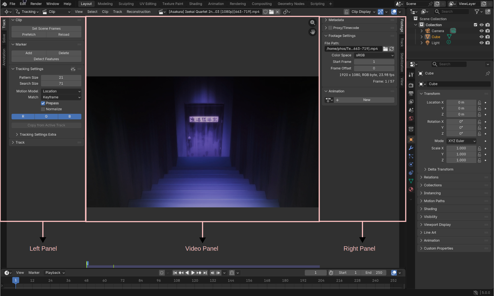
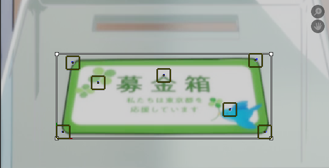
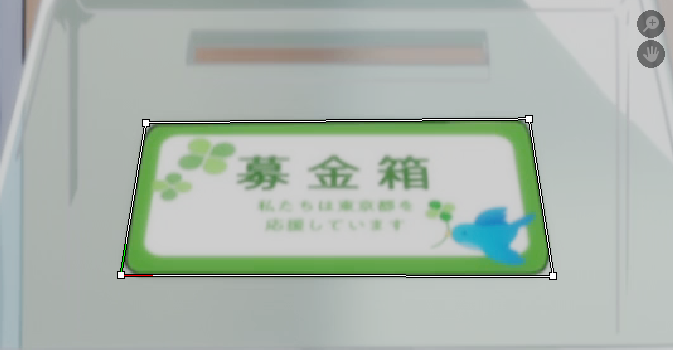
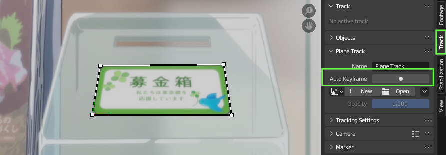

# Motion Tracking Using Blender

Blender is a free and open source 3D graphics program and among the many things
Blender can do, motion tracking is one of them. Blender is a point tracker which
means that it only tracks a single point in a video relative to its surrounding.
In contrast, Mocha Pro, another program used for motion tracking, is a planar
tracker. Blender and Mocha Pro thus being different in how they track motion will
perform variably in different situations. One may track a scene much better while
the other fails.

## Installation

Before we begin, make sure that you have Blender installed from
[its website](https://www.blender.org/) if you are on Windows and your package
manager elsewhere.

### Installation of Blender Plugin

1. Go to Akatsumekua's Blender Plugin [github repository.](https://github.com/Akatmks/Akatsumekusa-Aegisub-Scripts?tab=readme-ov-file#aae-export)
1. Select the plugin for your operating system in the repository's README and
   download it.
1. In Blender, go to `Edit -> Preferences` and click on `Addons`.
1. In the top right, click on the down arrow and select `Install from Disk`
1. A file picker will open. Navigate to the file you just downloaded, select it
    and click on `Install from Disk` button.
1. The `Addons` window will now show `AAE Export` with the checkbox ticked before
   its name. This shows that plugin is now installed and activated.

TODO: Add Video

## Tracking in Blender

### Opening Movie Clip Editor

When you open Blender, you will see the default 3D viewport. All of our motion
tracking will be done in another viewport called `Movie Clip Editor`. There are
two methods to get to this view. First, click in the icon below `File`` in the top
left and click on `Movie Clip Editor`.

TODO: Add Video

The second method is to use a keyboard shortcut. As soon as you open Blender, press
++shift+f2++ in your keyboard to directly go to the `Movie Clip Editor` view at once.

### Open video or image sequence

In order to load your video (made by x264) or image sequence (made by ffmpeg),
click on `Open` in the top middle portion of the window. Then navigate to
the folder where you have your video or image sequence. Select the file
and click `Open Clip`.

When you open the video, you will notice that there is left panel, video panel
and right panel. The left panel, video panel and the right panel. The left panel
has three tabs: `Track`, `Solve` and `Annotation`. `Track` panel is selected by
default.

As soon as you open a clip, you should make a habit of always doing two things.
First click on `Set Scene Frames` to ensure your start frame and end frame for
tracking is the same as that of your clip. Second, click on `Prefetch` to cache
your clip into memory for faster playback and tracking. Both of them are in the
left panel.

### Tracking Settings

The left panel has a menu called `Tracking Settings`
where you can change settings that will affect your tracking.

{align=left}

| Item | Desciption |
| -------------- | --------------- |
| Pattern Size | Size of your pattern area. Pattern area is the region of the video that Blender uses as a reference for tracking. |
| Search Size | Size of your search area. Search area is the region around the pattern area where Blender searches to find the marker in the next or previous frame. |
| Motion Model | Defines what type of motion the sign has. _Explained in more detail below._ |
| Match | Defines the video frame that blender will reference for tracking. _Explained in more detail below._ |
| Normalize | Ticking `Normalize` will make blender not lose sight of the marker during slight light changes in the video. Use when there is light changes like light flashes in a sign.|
| RGB | This can be used if there is a specific color channel that you want to track or avoid tracking For example, if the sign is in the green background, then you don't want to track green background. So all you have to do is disable `G` button here to stop blender from tracking green channel. |
| Correlation | Inside the `Tracking Settings Extra`, you will find correlation.  By default, it is 0.75 which means blender will consider the tracking successful if it is 75% sure that the marker has been properly tracked. I personally set this to 0.9 and only reduce it when necessary. |

#### Motion Model

This defines what type of motion the sign has. Properly setting this will be
the key to a good motion track.

|Model |Meaning |
|---|---|
|Location |If the sign only has horizontal or vertical movement |
|Location & Rotation |If the sign has movement as well as rotation |
|Location & Scale |If the sign has movement as well as change in scale. |
|Location, Rotation & Scale |If the sign has movement, rotation and change in scale |
|Affine |If the sign has all movement, rotation and scale as well as stretch and skew |
|Perspective |If the sign has change in perspective |

Let’s say that the sign only has horizontal and vertical movement. You might
think, I’ll use **Affine** since it is designed to track movement among other things.
Not only is this more computationally expensive, this might even introduce more
error in terms of scale or rotation when there wasn’t any in the sign. So choosing
one carefully is important.

#### Match

This defines the frame that blender will reference for tracking.

|Match | Meaning|
|---|---|
|Keyframe |The frame in which you added the marker will remain the frame of reference |
|Previous Keyframe |The frame of reference is always updated to the last frame blender tracked |

Previous frame is useful when the frame of reference changes due to skew or stretch
however it must be used with caution as it can lead to bad track sometimes. If there
is an error while tracking a frame, this error will now become the new frame of
reference and thus the error will compound with each new mistake in tracking.

### Adding a marker

A marker marks the location in the video to track. To add a marker at a target,
press ++ctrl++ in your keyboard and left click anywhere in the clip to place a marker
in that location.

A rectangle must have appeared at that point. That rectangle is called pattern area
which is the region of the clip that Blender uses as a reference for tracking.

There is a hidden box around the selected marker that can be activated by pressing
++alt+"s"++ in your keyboard. A new box bigger than the pattern area will appear.
This is called search area. You can make it bigger to search bigger area at expense
of some performance if the target moves large distance each frame.

You can move the marker to another location by pressing ++"g"++ and dragging
it to new location. You can increase or decrease the size of the marker by pressing
++"s"++ and using mouse to scale. You can also left-click on each corner of the marker
to change them individually. You can similarly rotate the marker by pressing ++"r"++.

TODO: Add video

!!! note

    Unless you are doing plane tracking in blender (plane tracking is explained
    below), you must only use one marker because each marker will result in new
    tracking data and we only need one.

It is paramount to understand that when you add a marker, it inherits all the
tracking settings you choose. Once you add a marker, you cannot change the
tracking settings again to make changes to the marker. I suggest that
you remove that marker, change the tracking settings and add a new marker.
However, if you must change the settings of a marker that has already been added,
you must use the **Track** settings in the right panel. In this panel you’ll find
the same settings you found in the left **Track** panel, but this one will modify
the setting for currently selected marker. Additionally, the **Track** panel in
the right also has the picture of the target with a small cross-hair that can be
used to fine tune the position of the marker.

<!--Add image-->

### Tracking

{align=left}

After you set the tracking settings and add a marker, you can now begin tracking.
You can start from any frame but if you start tracking from a middle frame, you
will have to track both backwards and forwards from that frame. Normally it is
easier to start in the first frame or the last frame if the target is clearly
visible in that frame. The keyboard shortcut to go to the first frame and the last
frame is ++shift+arrow-left++ and ++shift+arrow-right++ respectively. You can start
tracking either by clicking on buttons or by using keyboard shortcuts.

|Action |Button number as shown in image | Keyboard Shortcuts |
| --- | --- | --- |
|Track forward 1 frame |4 |++alt+arrow-right++ |
|Track all frames forward |3 |++ctrl+"t"++ |
|Track backward 1 frame |1 |++alt+arrow-left++ |
|Track backward all frames |2 |++shift+ctrl+"t"++ |

If at any point, the tracking fails, blender will stop immediately. In that case,
you will have to try with a new tracker preferably in a different location or
different tracking settings.

!!! warning 

    If you have seen tutorials of blender tracking somewhere
    else, you might have been told that changing size of the marker mid-tracking is not
    a problem. That is true when you are motion tracking for blender but for fansubbing purposes, you
    cannot change the size of the pattern area mid-tracking as that will lead to change
    in size of resultant tracking data. You can however change the search area at any
    point without any problem.

## Exporting the tracking data

{align=left width="300"}

1. After you successfully track all the frames, go to `Solve` tab in the left
   panel. Scroll down to the `AAE Export` section.
1. You will find two `Copy` buttons. If you have selected a marker, the `Copy`
   button under `Selected track` will be active while the other `Copy` button
    will be inactive and greyed out.
1. Clicking on the active `Copy` button will copy the tracking data from 
   the selected marker to clipboard.
1. If `Auto Export` is turned on in the `Export Options`, then the button
   will also export the tracking data to a file in the folder where clip you loaded
   is present in.

## Example

### Example 1: Simple translation

<figure>
    <video width="2560" height="1556" controls>
        <source src="../assets/Motion Tracking Using Blender/blender_tracking_example2.mp4" type="video/mp4">
    Your browser does not support the video tag.
    </video>
    <figcaption><a href="https://anilist.co/anime/110178/Isekai-Quartet-2/">Isekai Quartet 2</a> - Episode 11: 0:00:43 </figcaption>
</figure>

The sign simply moves up. You might think since the sign has slight perspective,
I'll use perspective tracking but since the perspective of the sign does not
change throughout its duration, we can use simple tracking.

<video width="2560" height="1554" controls>
    <source src="../assets/Motion Tracking Using Blender/blender_tracking_result2.mp4" type="video/mp4">
Your browser does not support the video tag.
</video>

### Example 2: Zoom

<figure>
    <video width="2560" height="1556" controls>
        <source src="../assets/Motion Tracking Using Blender/blender_tracking_example.mp4" type="video/mp4">
    Your browser does not support the video tag.
    </video>
    <figcaption><a href="https://anilist.co/anime/110178/Isekai-Quartet-2/">Isekai Quartet 2</a> - Episode 08: 0:06:33 </figcaption>
</figure>

A pretty simple example with just zoom.

<video width="2560" height="1554" controls>
    <source src="../assets/Motion Tracking Using Blender/blender_example.mp4" type="video/mp4">
Your browser does not support the video tag.
</video>

## Plane Tracking

Whenever your footage has a planar feature like a wall, floor, billboard etc. you
can track the motion as well as the perspective of such flat surfaces using blender.

### Open video or image sequence

Planar Tracking is also done in `Movie Clip Editor` so import your footage in the
same way you did for non-planar tracking.

### Add Tracking Markers

To begin planar tracking in Blender, you first need to identify a flat planar surface
in your footage that you want to track. Adjust the tracking settings as needed, then
add multiple markers within that surface. In order to perform planar tracking, you'll
need at least four markers that are successfully tracked.

Once you've added four or more markers within the flat surface of your video, you
can select all of the markers at once by pressing the ++"a"++ key on your
keyboard, and then track them all simultaneously. Keep in mind that you may need
to re-track markers if at least four of them were not successfully tracked during
the initial pass.

TODO: Explain Detect Features with Annotation

### Creating the Plane

1. When you are satisfied with tracking, you can select all markers by pressing
   ++"a"++ or manually select four or more successfully tracked markers.
1. Click on `Solve` tab in the left panel and then click on `Create Plane Track`.
    
1. This will generate a rectangular box on the screen, which represents the plane
   that Blender has created using the tracking data from all the markers you selected.
   When you play the video, you'll notice that the plane track moves along with
   the flat surface you tracked, accurately reproducing its motion and perspective
   in three-dimensional space.
    

### Adjusting the Plane

!!! note

    If perspective is applied in the Aegisub itself using the perspecitve tool,
    this step of adjusting the plane in blender can be skipped. In fact, this is
    recommended if accuracy in perspective is higher priority.

Once you've created a plane track in Blender, the next step is to adjust the
perspective of the plane so that it matches the flat surface you tracked. If
the surface you tracked has no perspective distortion, you can skip this step.

To adjust the plane's perspective, click and drag each corner of the plane
individually, making sure that the plane matches the shape and angle of the flat
surface you tracked. When you've properly adjusted the plane, it should align
perfectly with the surface, sticking to it as if it were the border of that surface.

 

While adjusting the plane track in Blender, you may find that the markers used to
create the track get in the way. To temporarily hide the markers, simply select the
plane track and press ++shift+"h"++. This will hide all the markers, making
it easier to see the plane and adjust its perspective. If you want to bring the hidden
markers back into view, press ++alt+"H"++.

### Fixing error in tracking

If you notice that the plane track doesn't stick closely enough to the surface you're
tracking, you may need to make some fine adjustments to correct any errors. To do
this, you can use Blender's keyframe feature to lock in changes to the plane track
on specific frames.

1. First, locate the frame where the plane is no longer conforming to the surface
   as closely as you'd like. In the left panel of the Motion Tracking workspace,
   click on the "Track" tab. Then click on "Plane Track" to select it.
1. Next, click on the small box with a dot next to "Auto Keyframe". This will tell
   Blender to treat any changes you make to the plane in this frame as new keyframes,
   allowing you to fine-tune the tracking as needed.
    

1. Finally, make the necessary adjustments to the plane track by dragging its corners
   until it conforms more closely to the surface. As you make these changes, Blender
   will readjust the plane so that it conforms surface accurately around the current
   frame.

### Exporting

You will export the tracking data in the same way you did for normal tracking but
while keeping the plane selected. Once you export, the power-pin data should be
in your clipboard. Use it in Aegisub-Perspective-Motion script like we learned
in the `Motion Tracking` page.

## Plane Tracking Example

TODO

## Offset Tracking

When you are tracking a marker in Blender, there may be situations where the object
you are trying to track is no longer visible on the screen, either because it is
blocked by an obstruction or it moves out of the frame. In such cases, you have two
options: you can either choose a different location to track that is not obstructed
or you can use offset tracking.

The fundamental idea behind offset tracking is that if the object you are tracking
is not visible anymore, you can track a different location and apply the tracking
data to the original marker.

As offset tracking involves assigning tracking data of a different location to the
original marker, the resulting tracking data may not be as accurate as actual tracking.
Therefore, it is recommended to use this method with caution and only when necessary.

1. Place a marker in your target and track as much as you can.
1. When the target is no longer visible, return to the last accurately tracked frame
   and press ++"gg"++ to move the marker to a new location that is visible and trackable.
   It is important to choose a position as close to the original marker as possible
   and with similar motion, particularly during rotations or skewing, as different
   parts of the video may move at different speeds.
1. Continue tracking the new position.
1. In case the new position also gets obstructed, press ++"gg"++ again and move the
   marker to a new position and track again.
1. If at any point the original target becomes visible again, to reset the marker
   to its original position, you can follow these steps. First, click on the **Track**
   tab located in the right panel. Next, click on **Marker** drop-down and locate
   the **Offset** parameter. You will see two values, "X" and "Y". Set both of these
   parameters to zero. By doing this, the marker will be returned to its original
   position and continue to be tracked from that point onwards.

### Offset Tracking Example

Let's take this sign

<figure>
    <video width="2560" height="1556" controls>
        <source src="../assets/Motion Tracking Using Blender/blender_offset_tracking_example.mp4" type="video/mp4">
    Your browser does not support the video tag.
    </video>
    <figcaption><a href="https://anilist.co/anime/19221/Ore-no-Nounai-Sentakushi-ga-Gakuen-Love-Comedy-wo-Zenryoku-de-Jama-Shiteiru/">Ore no Nounai Sentakushi ga, Gakuen Love Comedy wo Zenryoku de Jama Shiteiru </a> - Episode 08: 0:15:39 </figcaption>
</figure>

The text in the board pans across with portions of text going off-screen and coming
back letter. When you place a marker in a place, that marker will not be visible
in the screen for the whole duration of track. These kind of signs require offset
tracking.

<video width="2560" height="1556" controls>
    <source src="../assets/Motion Tracking Using Blender/blender_offset_tracking.mp4" type="video/mp4">
Your browser does not support the video tag.
</video>

## Smoothing

Blender, being a point tracker, relies on the tracking data of multiple points to
track an object. However, for the purpose of fansubbing, we can only use one tracking
point. This will understandably lead to imperfect tracking. These imperfections will
cause a lot of jitter in tracking data. Therefore, we may need to smooth out the
tracking data using Akatsumekua's blender plugin in some cases.

### Activating Smoothing Panel

1. In Blender, go to `Edit -> Preferences` and click on **Addons**.
1. In the search bar, type **aae** and **AAE Export** should appear.
   Click on **Install dependencies for Smoothing (Optional)**. This should install
   all the required dependencies.
1. In a system like Arch Linux where pip cannot install dependencies, you can
   install them manually. The dependencies are numpy, scikit-learn, matplotlib
   and Pillow.

### Perform Smoothing

{align=left}

1. Tick on **Enable** beside **Smoothing**.
1. Similar to how we chose position, scale and rotation while tracking, we can also
   enable or disable position, scale and rotation with an addition of power-pin for
   smoothing. (For regular track, position and power_pin is directly copied from
   the centre and the corners of the marker, after which scale and rotation is calculated
   from power_pin. For plane track, only power_pin is directly copied from the four
   corners of the plane track, while position, scale and rotation is calculated from
   power_pin.)
1. In the input box, user can input degree. The plugin smooths out the tracking data
   using the input degree. The task of smoothing is to keep on increasing the degree
   which will be used to fit the tracking data to regression models to produce smoothed
   tracking data.
1. It is extremely easy to increase the degree to much to overfit the data so each
   increment must be checked.
1. If smoothing is enabled and **Copy** button is clicked, the smoothed data will
   be copied to the clipboard.

<!-- ### Plotting the tracking data -->
<!---->
<!-- There is a button called **Plot** that will plot the smoothed tracking data. This -->
<!-- will help in understanding the nature of the tracking data. While this is generally -->
<!-- used for observing the smoothed tracking data, it can also be used to observe the -->
<!-- raw tracking data by disabling all smoothing parameters like position, scale and -->
<!-- rotation. -->
<!---->
<!--Add image-->
<!-- The generated plot is massive and there seems to be a lot of things in the first -->
<!-- glance. However, each row is a graph for one parameter so only one row can be focused -->
<!-- at any point of time. -->
<!---->
<!-- There are two types of graphs: -->
<!---->
<!-- 1. Prediction-Observation Graph -->
<!-- 1. Residual Graph -->
<!---->
<!-- #### Prediction-Observation Graph -->
<!---->
<!-- [[File:BlenderPlotPredictionObservation.png|center]] -->
<!---->
<!-- Prediction-Observation Graph shows actual blender tracking data as dots while it -->
<!-- shows the smoothed curve as a line. We want to observe that the graph shows a -->
<!-- balanced fit instead of underfit or overfit. -->
<!---->
<!-- If the smoothed curve consistently deviates from original tracking points and fails -->
<!-- to capture the underlying patterns of the data, it may indicate underfitting of data. -->
<!---->
<!-- If the smoothed curve matches the data way too closely while failing to capture -->
<!-- the underlying patter of the data, it may indicate overfitting of data. This happens -->
<!-- because it considers the fluctuations in data as part of the data itself rather than -->
<!-- a target of smoothing. -->
<!---->
<!-- A balanced fit creates the smooth curve that does not deviate from original tracking -->
<!-- points while fixing fluctuations in the data. -->
<!---->
<!-- #### Residual Graph -->
<!-- [[File:BlenderPlotResidual.png|center]] -->
<!---->
<!-- A residual graph represents outliers in the data. If smoothing has done anything -->
<!-- meaningful, then there will be outliers and they are represented as points that -->
<!-- vary from the mean line represented in blue. -->
<!---->
<!-- The residual graph joins such outliers, thus forming a series of crests and troughs. -->
<!-- A residual graph shows a proper smoothing when there are equal spikes on both sides. -->
<!-- A large spike is an indicator of either a bad tracking or underfitting of data. -->
<!---->
<!-- As a general rule of thumb, if the height of the spike is less than 1e-5, then the -->
<!-- residual graph indicates good tracking and smoothing. -->
