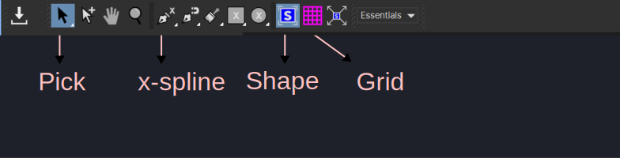
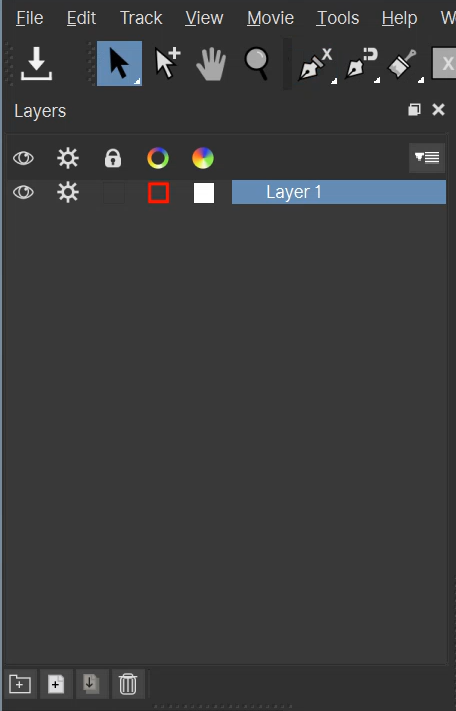
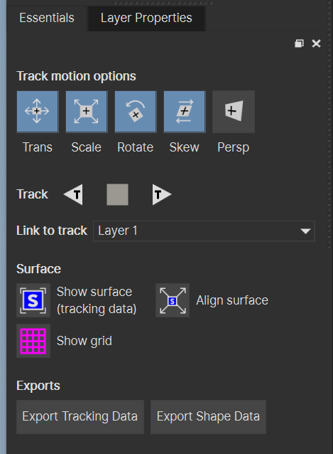
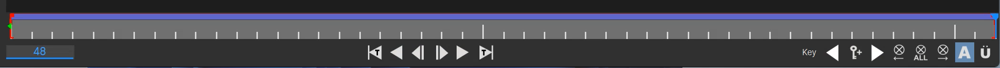
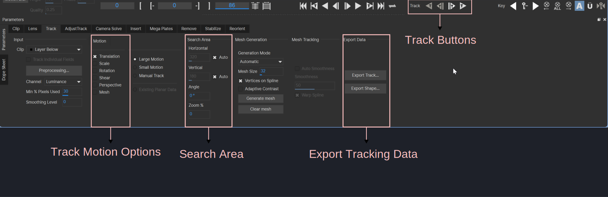

# Motion Tracking Using Mocha

Mocha Pro is a software and plugin for planar motion tracking, 3D tracking,
rotoscoping and more. This is available as plugin for Adobe After Effects and
also as a standalone software. I will be using standalone version.

Mocha Pro is a planar tracker which means that you are tracking the motion of a
flat plane. A screen, wall, billboard etc are perfect things to track. A finger
for example would not be a good target because it can curl inward and move in
ways a flat plane could not. Recognizing a correct target to track will lead to
better results.

## Creating a Project

A project refers to a video (made by x264) or an image sequence (made by ffmpeg)
that is imported into Mocha Pro and tracked. When you import a video, you can
select that video of course but when you import an image sequence, you don't
have to select all the images in that sequence. You can just select the first
image and all the images of that sequence will be imported.

1. Click on `File -> New Project`.
1. A window will pop up. Under `Import Clip`, click on `Choose` button.
1. A file picker will open. You can navigate to the folder where your trimmed
   video or image sequence is and select them and click `Open` button.
1. You don't have to change anything else in this window and just press `OK`
   button. However, if something does not look right (like aspect ratio of video),
   you can see if it looks correct in under the `Frame Properties`.

<video width="2546" height="1586" controls>
    <source src="../assets/Motion Tracking Using Mocha/opening_project.mp4" type="video/mp4">
Your browser does not support the video tag.
</video>

## Essential versus Classic Workspace

As soon as you import the clip, the workspace that you operate on can be
changed. By default the workspace that will be opened is called `Essential`
workspace. Most of the old typesetters will be used to another workspace called
`Classic` workspace. It's called classic workspace because this used to be the
default workspace for Mocha Pro.

You can do most of the work in `Essential` workspace. It is less cluttered and
has everything you need for most of the sign. When it fails, you can switch to
`Classic` workspace.

=== "Essential Workspace"

     

=== "Classic Workspace"

     

## Menu Bar

=== "Essential Workspace"

     

=== "Classic Workspace"

     

There is obviously a lot of things in the menu bar (even more in classic workspace)
but I've  only highlighted the tools we will be using.

| Item | Description |
| -------------- | --------------- |
| Pick | We will be using this most of the time To click on stuff in Mocha Pro |
| x-spline | This is what we use to draw a region in the video to track |
| Shape | Draws a quad in the screen This quad is attached to tracking data so it moves using the tracking data We _sometimes_ apply this to check if the track went okay or not |
| Grid | Draws a grid of vertical lines in the screen This grid is also attached to tracking data so it moves using the tracking data We _sometimes_ apply this to check if the track went okay or not  |

!!! note

    It is extremely important for you to know that although we create a region
    using x-spline and track it, the actual tracking data is not linked
    to the spline in any way. You can therefore modify the spline at any point
    in tracking without affecting the tracking data. You can also create
    multiple splines add attach them to the same tracking data.

## Shortcuts in Video Box

If you have selected the video, here are some shortcuts that may be useful:

| Shortcuts | Meaning |
| -------------- | --------------- |
| Press scrollbar and drag | Pan the video |
| Scroll down | Zoom out the video |
| Scroll up | Zoom in the video |
| Space | Play the video |

## Creating Splines

Drawing splines means defining the region that Mocha Pro has to track. Since it
is a planar tracker, you have to create a spline that defines a flat plane in
the video. There are multiple ways to create a region but we will be using
x-splines.

1. Click on the x-spline tool in the toolbar.
1. Click on any where in the video to place the first point of the spline.
1. Continue clicking to create region, right click to close the loop and create
   a region.
1. You don't have to be strict. The spline can extend beyond the region a little
   bit.

<video width="2546" height="1586" controls>
    <source src="../assets/Motion Tracking Using Mocha/create_x_spline.mp4" type="video/mp4">
Your browser does not support the video tag.
</video>

You can create splines at any frame of the clip. If you create spline at first
frame, you will only have to track the spline forward. If you create it at last
frame, you will only have to track it backward. However, if you create it at any
other frame, you will have to track it both forward and backward from that
frame.

{width="300" align=left}

As soon as you create a region using x-spline, you will notice that a layer gets
added.

If you select the x-spline again and create another region in the video, another
layer gets added. You would like to create multiple layers when there are
multiple things that you want to track separately. Each layer represents different
tracking data and when you export tracking data, you can change which layer the data
is extracted from.

However, there are cases where you will want to connect the tracking data from
multiple splines to the same layer. If you press the x-spline tool and hold for
a few seconds, you will see more tools in the dropdown. Among them, you will see
something that has `X+`.

If you click on it and draw a spline, it will be added to the currently selected
layer instead of creating another layer. Normally, one spline should be enough but
when the region goes in and out of the frame, connecting multiple splines to same
layer allows you to continue tracking even when one spline gets off-screen.

## Tracking Sign in Mocha

{width="400" align=left}

Let's understand the track motion options first:

| Option | Meaning |
| -------------- | --------------- |
| Trans | Enable it when you sign only moves left and right |
| Scale | Enable it when your sign changes in size |
| Rotate | Enable it when your sign rotates |
| Skew | Enable it when your sign skews in either direction |
|Perspective | Enable it when your sign has change in perspective |

These track options are hierarchical in nature i.e. if you enable an option, all
the options left to it will be automatically enabled. You cannot have `Rotate`
without `Scale` and `Trans`.

Directly below that you have track backward, stop track and track forward
button. These are self explanatory. You press this key to track in the direction
you want and stop the tracking if you want.

So tracking in mocha is drawing spline, choosing the track motion options
depending on how the sign moves and clicking these buttons to track all the
frames.

### Video Timeline

Directly below the video, you will see this timeline. You see that green flag in
the left of the timeline? That green flag appears in each frame where you have
either manually added a spline or modified the spline manually. The red color in
the timeline also means that this spline has not been tracked.

Once you have tracked the spline, the timeline will look blue for each frame you
have tracked.

The buttons below the timeline will help you play the video or step through
frames of the video.

### Tracking in Classic Workspace

As always, there is a lot of stuff in classic workspace but when things don't
track properly in `Essential` workspace, you have to change workspace to
`Classic`.

 

Track Motion Options is same as explained above.

Search area defines how far and wide Mocha is going to search the region in next
or previous frame. The horizontal and vertical are set to auto but if that does
not work, disable the `Auto` and increase the number. You can click and drag
mouse clockwise to increase and anti-clockwise to decrease. You can also enter
the number manually. If the sign suddenly changes in size, use zoom. I can't
tell you exact value for these. Increase and experiment but be warned that too
high value will cause track to be slower.

Export tracking data and track buttons section are same like `Essential` mode.
You just need to know where they are.

## Exporting Motion Tracking Data

After you have tracked all the frames, you can click on `Export Traacking Data`
button. A GUI will pop up. In the dropdown menu besides `Format`, make sure you
choose `After Effects Transform Data` if you are doing normal tracking, `After
Effects Power Pin` if you are doing perspective tracking.

Then click on `Copy to Clipboard` button to copy the selected data to clipboard
or `Save` button to save it to a text file.

## Example

### Example 1: Simple Translation

<figure>
    <video width="2560" height="1556" controls>
        <source src="../assets/Motion Tracking Using Blender/blender_tracking_example2.mp4" type="video/mp4">
    Your browser does not support the video tag.
    </video>
    <figcaption><a href="https://anilist.co/anime/110178/Isekai-Quartet-2/">Isekai Quartet 2</a> - Episode 11: 0:00:43 </figcaption>
</figure>

The sign simply moves up. You might think since the sign has slight perspective,
I'll use perspective tracking but since the perspective of the sign does not
change throughout its duration, we can use simple tracking.

<video width="2546" height="1586" controls>
    <source src="../assets/Motion Tracking Using Mocha/translation_example.mp4" type="video/mp4">
Your browser does not support the video tag.
</video>

### Example 2: Zoom

<figure>
    <video width="2560" height="1556" controls>
        <source src="../assets/Motion Tracking Using Blender/blender_tracking_example.mp4" type="video/mp4">
    Your browser does not support the video tag.
    </video>
    <figcaption><a href="https://anilist.co/anime/110178/Isekai-Quartet-2/">Isekai Quartet 2</a> - Episode 08: 0:06:33 </figcaption>
</figure>

A pretty simple example with just zoom.

<video width="2546" height="1586" controls>
    <source src="../assets/Motion Tracking Using Mocha/zoom_example.mp4" type="video/mp4">
Your browser does not support the video tag.
</video>

### Example 3: Multiple X splines

<figure>
    <video width="2560" height="1556" controls>
        <source src="../assets/Motion Tracking Using Blender/blender_offset_tracking_example.mp4" type="video/mp4">
    Your browser does not support the video tag.
    </video>
    <figcaption><a href="https://anilist.co/anime/19221/Ore-no-Nounai-Sentakushi-ga-Gakuen-Love-Comedy-wo-Zenryoku-de-Jama-Shiteiru/">Ore no Nounai Sentakushi ga, Gakuen Love Comedy wo Zenryoku de Jama Shiteiru </a> - Episode 08: 0:15:39 </figcaption>
</figure>

The text in the board pans across with portions of text going off-screen and coming
back letter. When you create a region, that region will not be visible
in the screen for the whole duration of clip.

<video width="2546" height="1586" controls>
    <source src="../assets/Motion Tracking Using Mocha/link_splines.mp4" type="video/mp4">
Your browser does not support the video tag.
</video>

## Matte

There are some cases where the region you are tracking is obstructed by
something which causes your spline to go haywire during tracking. We can use
another layer to inform Mocha Pro to ignore a particular region inside the
spline and only track remaining region.

What we will do is create a spline the regular way for the sign. Then we will
create another layer for the obstruction. You can either track the obstruction
layer or just do it manually. The obstruction layer does not need to be
accurate. It just needs to cover the obstruction in the frames where it covers
the sign.

The obstruction layer must be above the sign layer for it to work.

<video width="2546" height="1586" controls>
    <source src="../assets/Motion Tracking Using Mocha/matte_tracking.mp4" type="video/mp4">
Your browser does not support the video tag.
</video>

I tried to track the hand off-screen but it simply was not tracking. So I
manually dragged the spline in the frames where I thought it'd interrupt the
sign layer.

Adding color to the matte is purely for demonstration purpose. Observe how
whenever the region of both layers overlap, the obstruction layer is creating a
region that removes a portion from the sign layer. You don't have to
color matte yourself.

## Miscellaneous Stuff

### Limiting the frames for tracking

<video width="2546" height="1586" controls>
    <source src="../assets/Motion Tracking Using Mocha/limit_tracking_frames.mp4" type="video/mp4">
Your browser does not support the video tag.
</video>

The greyed region means tracking won't happen in those frames.

### Deleting Spline

<video width="2546" height="1586" controls>
    <source src="../assets/Motion Tracking Using Mocha/deleting_spline.mp4" type="video/mp4">
Your browser does not support the video tag.
</video>

You can also select a layer and click on the trash icon under the layers section.

### Deleting Tracking Data

If you ever need to delete tracking data for a specific frames, go to dope sheet
in classic workspace, select the green dots and press ++delete++.

<video width="2546" height="1586" controls>
    <source src="../assets/Motion Tracking Using Mocha/deleting_tracking_data.mp4" type="video/mp4">
Your browser does not support the video tag.
</video>
