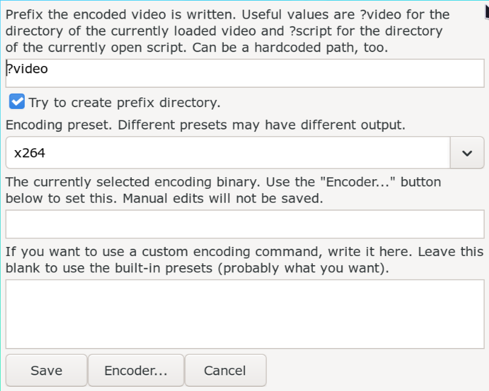
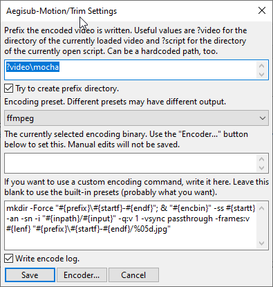
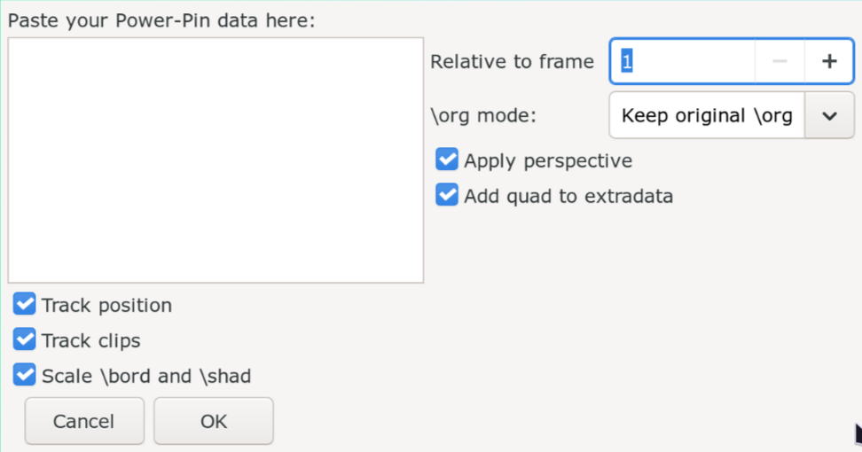

# Motion Tracking

Motion tracking in typesetting refers to applying motion tracking data from
softwares like [Blender](http://www.blender.org/)  or
[Mocha Pro](https://borisfx.com/products/mocha-pro/) to match the motion of the
lines to an element of a video.

## Installation

1. You need a software like [Blender](http://www.blender.org/)  or
   [Mocha Pro](https://borisfx.com/products/mocha-pro/) to generate the motion
   tracking data. See the comparison between them below.
1. You need a way to trim the video. You can either use the latest
   [x264](https://artifacts.videolan.org/x264/) or [ffmpeg](https://ffmpeg.org/)
   to trim the video. See the comparison between them below.
1. You also need an Aegisub script called `Aegisub Motion` (shortened to a-mo in
   conversation) from Dependency Control.

## Mocha Pro versus Blender

I'll only highlight the differences here.

| Subject | Mocha Pro | Blender |
| --------------- | --------------- | --------------- |
| Cost | Paid | Free and Open Source |
| Tracking Method | Planar tracking i.e. tracks flat plane region across the video  | Point tracking i.e. tracks a specific point in the video using the features around that point. |
| Output | Tracking data output is already available | External plugin is required to extract tracking data |
| Tracking Quality | Extremely robust (it is essentially industry standard) | The point tracking data has been repurposed for fansubbing purposes so it can sometimes produce jittery results (solved through smoothing of data) but surprisingly performs better in cases where mocha fails. |

I personally use both because why not. Many people will find Mocha Pro easier in
the first glance. I tend to prefer Blender and fall back to Mocha Pro when
Blender fails. If you are still unsure, I'd suggest to learn Mocha Pro first
and then later learn Blender.

## x265 versus ffmpeg


| Subject | Mocha Pro | Blender |
| --------------- | --------------- | --------------- |
| Output | Single Video | One image for one frame of the video |
| Accuracy | Generally robust but in rare cases can lead to corrupted first or last frame in the video | Extremely robust |
| Availability | You have to use the x264 that can encode the video format you are working on | Works almost every time |

I always use ffmpeg. The output of multiple images kind of makes folder messy
but I will teach you a way to make a clean output folder using ffmpeg later on
if you decide to use it.

## Configuring Aegisub Motion

Let's configure Aegisub Motion so we can tell how to trim videos. Install the
script Aegisub-Motion if you have not already. Once the script is loaded,
Go to `Automation -> Aegisub-Motion -> Trim Settings`. The following GUI will
pop up:

{width="500"}

1. In the first box, you can select where the trimmed video will be saved in.
Default is fine as `?video` will save the trimmed video in the same location as
the video currently loaded in Aegisub. Change it to `?script` if you want the
trimmed video to be saved in the folder where the currently loaded subtitle file
is located at.

1. The checkbox below it that says `Try to create prefix directory` will create any
folders that need to be made in order to save the video. Keep it checked.

1. Then below that you have a dropdown where you can either select `x264` or
`ffmpeg`. Select what you prefer.

1. If you are using Windows, press the `Encoder...` button. A file picker will be opened
where you must navigate to the executable file. Select `x264.exe` or `ffmpeg.exe`
file wherever you have chosen to keep it.

    If you are a non Windows user, type `which ffmpeg` or `which x264`. Once you
know which folder, it is stored in, press the `Encoder...` button and navigate
to that folder and select `ffmpeg` or `x264` binary.

1. Then press `OK` button to save the settings.

## Clean Folders Using ffmpeg

If you chose ffmpeg but don't want hundreds of images dumped in the same folder
as the main video, follow these steps to get clean folders.

1. Open the config for Aegisub-Motion by going to `Automation -> Aegisub-Motion
-> Trim Settings`.
1. In the first box, type `?video\mocha` if you want to save the trimmed images
   in the same folder as the video loaded in Aegisub or `?script\mocha` if you
   want to save them in the same folder as the subtitle loaded in Aegisub.
1. Keep the `Try to create prefix directory` checked.
1. Select `ffmpeg` in the dropdown.
1. In the bottom most box,
    If you are a Windows user, copy and paste the following:

    ```powershell
    mkdir -Force "#{prefix}\#{startf}-#{endf}"; & "#{encbin}" -ss #{startt} -an -sn -i "#{inpath}/#{input}" -q:v 1 -vsync passthrough -frames:v #{lenf} "#{prefix}\#{startf}-#{endf}/%05d.jpg"
    ```

    If you are a non-Windows user, copy and paste the following:

    ```sh
    mkdir -p "#{prefix}/#{startf}-#{endf}" && "#{encbin}" -ss #{startt} -an -sn -i "#{inpath}/#{input}" -q:v 1 -vsync passthrough -frames:v #{lenf} "#{prefix}/#{startf}-#{endf}/%05d.jpg"

    ```
1. Click `OK` button to save the settings.

What this will do is create a folder called mocha in your video or subtitle folder
and for each trim, it'll create a new sub folder with all the images for that sign
there.

!!! note

    It's not necessary but if you are interseted in how I made the command above,
    you can follow the guide in
    [this page](https://github.com/TypesettingTools/Aegisub-Motion/wiki/Trim-Configuration).



## Trimming a Video

In order to facilitate the process of importing small, manageable sections of video
into your motion tracking software of choice, Aegisub-Motion provides a way to
automatically trim and encode the video that is currently loaded in Aegisub.

The script Aegisub-Motion ships with two separate trimming macros. They are called
`Trim` and `Trim Each`. I personally never use `Trim Each`. I bind `Automation
-> Aegisub-Motion -> Trim` to a hotkey and whenever I want to trim, I select a
line(s) and press that hotkey.

### `Trim` vs `Trim Each`

The difference between `Trim` and `Trim Each` lies in how they calculate where to
trim the video.

`Trim` looks at all of the selected lines and trims the video with
the start time as the start of the earliest line among selected lines and with
the end time as the end of the latest line among selected lines.

`Trim Each` looks at each individual line in the selection and creates a trim for
each line separately. It's like selecting those lines one by one and running
`Trim`.

## Generating Motion Tracking Data

If you have followed the steps above correctly, you now have Aegisub-Motion set
up correctly and now can trim a video. Once you have a trimmed video, you will
now have to load that trimmed video into either Mocha Pro or Blender to generate
motion tracking data.

Guides to using Mocha Pro and Blender will make this page too long so I have
separated them into their own pages. The next two pages in this guide will teach
you how to use Mocha Pro and Blender to generate motion tracking data
respectively.

So head on there and once you have a tracking data, come back to this page and
continue below on how to apply that motion tracking data to subtitles.

## Applying Motion Tracking Data

So I'm going to assume you learned using the following two pages how to generate
motion tracking data. Once we have it, we need to apply the motion tracking data
to the subtitle.

### Matching the Length of Data with Lines

First select all the lines where you need to apply the tracking data. The number
of frames in the selected line must be equal to the number of frames in the
tracking data. If you trim a video using a line and then apply the tracking data
to the same line, it will always match but if you try to apply the same tracking
data to another line, make sure that they have same length.

!!! note

    It does not mean that each line you select should be the same as the length
    of tracking data. It means that the frame from the start of the earliest line
    to the end of the latest line should match with the tracking data. Commented
    lines are not counted in this.

### Aegisub-Motion Apply GUI

In order to apply the tracking data to lines, we can use `Automation ->
Aegisub-Motion -> Apply`. The following GUI will appear.

{width="500"}

Let's understand this GUI first and then we shall see an example of its
application.

| Element | Meaning |
| -------------- | --------------- |
| Data Box | |
| x | If enabled, horizontal movement from the motion tracking data is used to change `\pos` tag |
| y | If enabled, vertical movement from the motion tracking data is used to change `\pos` tag  |
| Origin | If enabled and `\org` tag exists in line, the `x` and `y` checkbox also changes `\org` the same way `\pos` is changed<br>Rotation from tracking data is not properly calculated so rotation and perspective may not be accurate when this is ticked. |
| Scale | If enabled, scale from the motion tracking data is used to change `\fscx` and `\fscy` tags. |
| Border | If enabled, the border of line is scaled along with scale of line<br>i.e. if line gets bigger, border also gets bigger and vice versa<br>Needs `Scale` to be enabled for it to work |
| Shadow | If enabled, the shadow of line is scaled along with scale of line<br>i.e. if line gets bigger, shadow also gets bigger and vice versa<br>Needs `Scale` to be enabled for it to work |
| Rotation | If enabled, rotation from the motion tracking data is used to change `\frz` tag. |
| Blur | If enabled, the blur of the line is scaled along with scale of line<br>i.e. if line gets bigger, blur also increases and vice bersa<br>Needs `Scale` to be enabled for it to work<br>Since blur does not scale linearly like border and shadow does, the box beside blur checkbox allows you to enter a factor to amplify the blur but I never use it. I'd rather use Frame-by-Frame transform if blur does not look correct after applying the data |
| Rect Clip | If enabled, the tracking data will also be applied to any rectangular clip if the clip exists in line |
| Vect Cliip | If enabled, the tracking data will also be applied to any vectorial clip if the clip exists in line  |
| Rect -> Vect | If enabled, rectangular clips present in the line will be converted to vectorial clip<br>Don't enable this since vectorial clip is more computationally expensive than rectangular clip |
| Interpolate transforms | If enabled, the values from the transform tags will be calculated for each frame and added to line<br>If disabled, an attempt to recalculate the transform time for each line is made<br>Any tags that motion tracking data will affect will not be transformed |
| Linear | If enabled, makes an attempt to apply the whole motion tracking data in a single line using transforms and move tags instead of splitting it frame by frame<br>It will succeed if the motion is actually linear but if it is not, this will fail spectacularly |
| Relative | Explained in more detail below |
| Clip Only | Only apply the tracking data to the rectangular or vectorial clip present in the line and nothing else |
| Absolute | This takes position in the tracking data and applies it to lines<br>I never use it and you don't have to either. Just give position to line in Aegisub and use that |

#### Relative

I wanted to explain this separately because this is kind of important. Before
you apply the motion tracking data, you will obviously have a line that will
have a certain position, scale, border and so on. Aegisub-Motion has to take
these tag values as reference and then apply motion tracking data to it. So
Aegisub-Motion will either reduce or add values in reference to these tag
values.

Most of the time, we will set these reference tags in the first frame of the
line. However, you will find situations where this is not possible. So you can
then press ++arrow-right++ until you reach a frame where you can add reference
tags. But then you will have to tell Aegisub-Motion to consider this when
applying the motion tracking data.

This is where `Relative` comes in. In the GUI above, you will see checkbox named
`Relative` with a box beside it. The number in this box is the reference frame.
If the box has 1, it means the tags in the selected line looks ok for the frame
1 but for any other frame, we will have to apply motion tracking data for it to
look ok.

But let's say that the you can't style the tags in first frame and you instead
typesetted a line in 120th frame after the start. You could type the number 120
manually in the box of course but if you are already in that frame in `Video
Box`, you can open the `Apply` GUI and it will automatically fill it for you.

## Example

<figure>
    <video width="2560" height="1556" controls>
        <source src="../assets/Motion Tracking Using Blender/blender_tracking_example.mp4" type="video/mp4">
    Your browser does not support the video tag.
    </video>
    <figcaption><a href="https://anilist.co/anime/110178/Isekai-Quartet-2/">Isekai Quartet 2</a> - Episode 08: 0:06:33 </figcaption>
</figure>

A pretty simple example with just zoom.

<video width="2560" height="1554" controls>
    <source src="../assets/Motion Tracking/applying_data.mp4" type="video/mp4">
Your browser does not support the video tag.
</video>

## Track Clip Separately

TODO

## Fixing the Clipboard Issue in Linux

If you have motion tracking data in clipboard and you open the `Apply` GUI,
the data box will automatically be filled from your clipboard but not if you are
in Linux. This is outrageous. It's unfair. So let's fix it.

Go to the folder where Aegisub scripts are located in. Find the file
`a-mo.Aegisub-Motion.moon` and open it in any text editor of your choice.
In [line 160](https://github.com/TypesettingTools/Aegisub-Motion/blob/9719ce019a33b2a27a0e874d944e2d476738a63f/Aegisub-Motion.moon#L160C2-L160C53), change

```moon
dataString = (jit.os != "Linux") and clipboard.get!
```

to

```moon
dataString = clipboard.get!
```

Now it should also work in Linux. This is because arch1t3ct fixed the clipboard
issue in his fork.

## Deriving Motion Tracking Data

There are cases where you have a motion tracked lines in Aegisub but no longer
have the motion tracking data that created those lines. If you need the tracking
data again (perhaps to apply it to another line), you could motion track the
sign in Mocha Pro or Blender again but there is a better way. You can derive the
motion tracking data from the lines in Aegisub.

You can do that using an Aegisub script called `Derive Track` by The0x539. It is
not in Dependency Control so you will have to install using manual method by
downloading the script from the [github repo](https://github.com/The0x539/Aegisub-Scripts/blob/trunk/src/0x.DeriveTrack.moon)
If you forgot how to install Aegisub scripts manually, refer back to the guide
again.

To use this, select the lines which was created by applying motion tracking
data, go to `Automation -> Aegisub-Motion -> Derive`. A text box with motion
tracking data will appear. Just copy it and use it like a normal motion tracking
data.

Essentially, the selected lines
must be greater than two in number, must have same text, must be
consecutive in time, have same layer and should either all be commented or
all be uncommented for you to be able to use this script to derive motion
tracking data.

If you made changes after applying motion tracking data to line
like applying `Blur and Tag` script, you cannot run this. You'd have to select
all the lines that have same layer for this to work.

You can also use the lines made by Frame by Frame transform to derive motion
tracking data from it.

## Perspective Tracking

This is Aegisub-Motion but for handling cases where the perspective of the sign
changes. For Aegisub-Motion, you would use `After Effects Transform Data` from
Mocha Pro or Blender but this script requires you to export `After Effects Power
Pin` data from those programs.

The script we will use is called `Aegisub-Perscptive Motion` (shortened to
pers-mo in conversation) by arch1t3ct. It is available in Dependency Control for
you to install. The GUI of that script looks like this:

{width="650"}

Let's talk about few elements of the GUI:

| Item | Description |
| -------------- | --------------- |
| Apply Perspective | Enable it if you have not added perspective to the lines using perspective tool in Aegisub.<br>When this is enabled, appropriate perspective transformation is derived from the power-pin data.<br>If the script finds perspective tags on the line, it will uncheck this automatically |
| Relative to frame | Just like relative to frame of Aegisub-Motion as explained above |
| \org mode | The dropdown consists of the same options that perspective tool has<br>Refer back to that page to find out what they mean |
| Add quad to extradata | If enabled, adds the quad data to each line's extradata just like the perspective tool adds when you use it |
| Track Position | If enabled, the position of the line will be updated using the power-pin data |
| Track Clips | Just like above but for clips |
| Scale \bord and \shad | Scale border and shadow up or down based on the scale of the line |


### Using Aegisub-Perspective Motion

1. If the power-pin data is in clipboard when you open this script, it should be
    auto-filled in GUI of Aegisub-Perspective-Motion.
1. If the power-pin data is in some file, it can be manually copied and pasted in
   the textbox of the GUI.
1. If the user manually uses Aegisub to apply perspective to the line (which is
   recommended), Aegisub-Perspective-Motion will untick the `Apply Perspective`
   checkbox automatically. If `Apply Perspective` is ticked, then
   Aegisub-Perspective-Motion will attempt to apply the perspective using the
   power-pin data.
1. Click `Ok` button to apply.

TODO: Add example

## Derive Perspective Tracking Data

Just like motion tracking data for Aegisub-Motion could be derived, the
power-pin data for the Aegisub-Perspective Motion can also be derived. We do
this using a script called `Derive Perspective Track` by arch1t3ct. Install it
from Dependency Control. It's usage is similar to the `Derive Track` script as
explained above.
