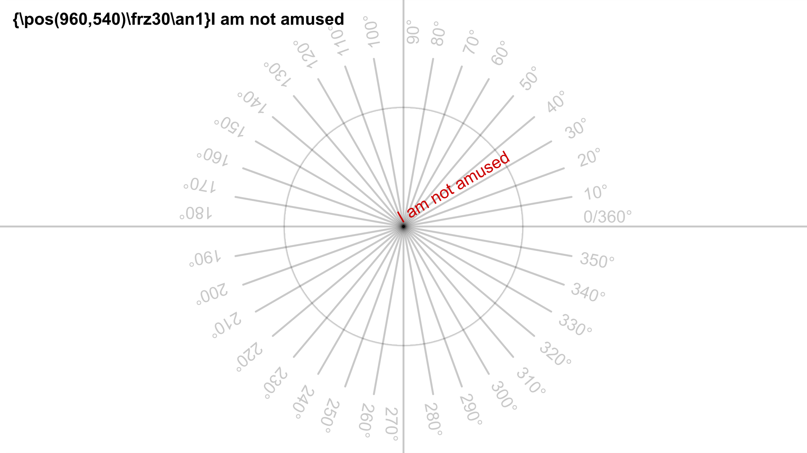
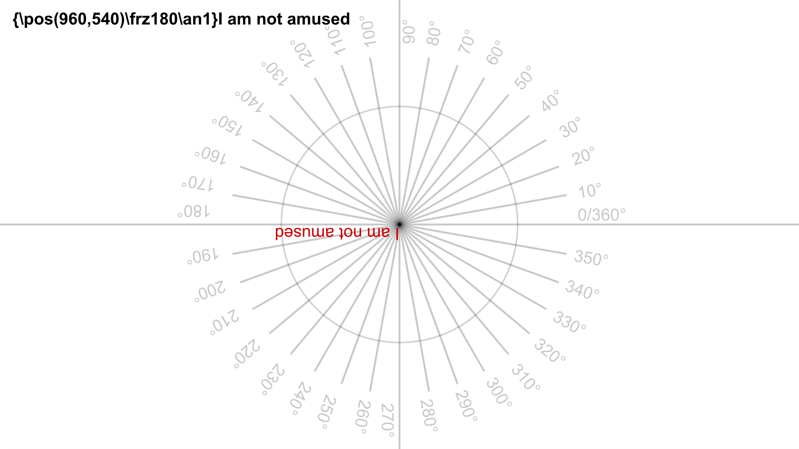
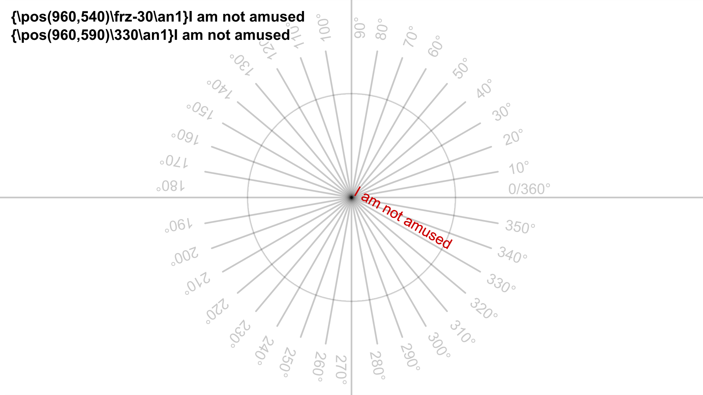
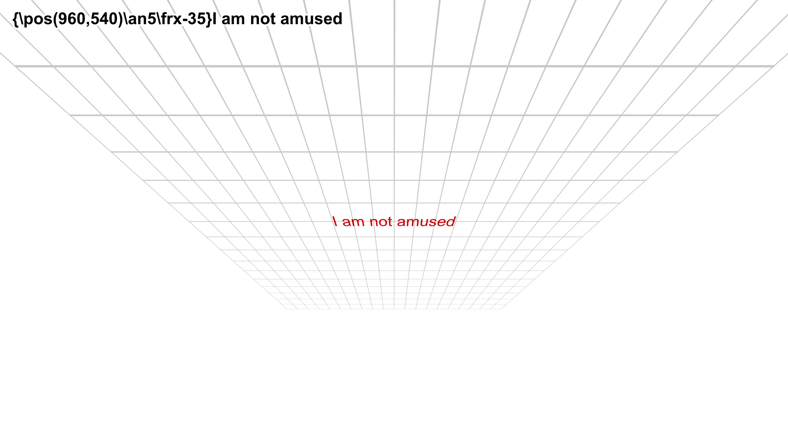

# Rotating Subtitles

## Origin Tag

!!! note ""

    Global / Untransformable Tag

Set the coordinate for the pivot point used for rotation.

| Format               | Description                              |
| -------------------- | ---------------------------------------- |
| \\org(&lt;x>,&lt;y>) | Set the origin point at coordinate `x,y` |

When there is no origin tag in a line, the pivot point for rotation is same as
the position coordinate of the line.

3D rotations of line will produce correct perspective if rotation origin is
placed in vanishing point in a 3D scene.

There can be at most one `\org` tag in a single line, if you put more than one
in a single line, only the first is used.

## Rotate on Z axis

!!! note ""

    Local / Transformable Tag

Rotating on z-axis with positive value causes the text to rotate in 2D
counterclockwise. The rotation is performed around the origin point as
described by `\org` tag.

| Format           | Description                                       |
| ---------------- | ------------------------------------------------- |
| \\frz&lt;amount> | Rotate text about pivot point by &lt;amount> degress |
| \frz0            | Disable rotation about z-axis                     |

!!! note

    It is legal to specify rotation amount more than 360 degrees.
    It is also legal to specify negative rotation.

<h3>Example</h3>

## Rotate on X axis

!!! note ""

    Local / Transformable Tag

Rotating on x-axis with positive value causes an effect where the top of the
text moves farther "into" the screen while bottom moves "out" of the screen.

| Format           | Description                                       |
| ---------------- | ------------------------------------------------- |
| \\frx&lt;amount> | Rotate text about pivot point by &lt;amount> degress |
| \frx0            | Disable rotation about x-axis                     |

<h3>Example</h3>

## Rotate on Y axis

!!! note ""

    Local / Transformable Tag

Rotating on y-axis with positive values causes the text to rotate so that the
left moves "outside" the screen while the right moves "into" the screen.

| Format           | Description                                       |
| ---------------- | ------------------------------------------------- |
| \\fry&lt;amount> | Rotate text about pivot point by &lt;amount> degress |
| \fry0            | Disable rotation about y-axis                     |

<h3>Example</h3>

!!! note

    Now that you know about tags that rotate about all three axes,
    I hope it's abundantly clear that we can use these three tags in combination
    to rotate text in 3D space.

## Rotate Visual Tool

Enough talking about tags. Let's actually do some rotating.

1. Enable the `Rotate on Z axis` tool (third from the top). You will see the
following circular shape appear near the text.

    {width="350"}

1. You will notice that there is a line, a circle and six arcs around the circle.
   None of that matters. Just focus on the triangle at the center of the circle
   and when you move the cursor, you will notice a line connecting the center and
   cursor.
1. The triangle represents the position in video where the coordinates of the
   `org` tag is located. You can click and drag the triangle to change the
   coordinate of the `org` tag. If a line does not have `org` tag, it gets added.
1. The line connected to cursor acts as a handle to rotate the text. Click
   anywhere on the screen and drag it around the center. The text will rotate
   following this line.
1. While you are rotating, you can press ++ctrl++ key to limit the rotation to
   increments of 30 degrees.
1. If the origin is far from the center of the line, the third line enters the
   scene. This is just a helper line that indicates the center of the text as
   you rotate it. It's just a visual guide and not too important.
   {width="350"}

<video width="2126" height="1350" controls>
  <source src="../assets/Rotating Subtitles/rotate_z_tool.mp4" type="video/mp4">
Your browser does not support the video tag.
</video>

## Rotate on XY Plane

I don't know how to use this tool. If you know, good for you but I have never
managed to use it to rotate the text the way I want it too. I cannot teach you
what I don't know so I will skip it.

But if you don't learn how to use it, how are you going to rotate the text in 3D
space. Being able to do it sounds pretty important. For that, we will use
`Perspective` tool. There is a separate page for perspective so we shall discuss
it here.

## Adding and changing origin tag

### Adding origin tag

Remember the triangle in the `Rotate` tool? Just like square represented the
position of the text in `Drag` tool, the triangle here represents the origin.
Dragging that triangle will add the `org` tag.

<video width="2082" height="1284" controls>
  <source src="../assets/Rotating Subtitles/add_origin_tag.mp4" type="video/mp4">
Your browser does not support the video tag.
</video>

### Changing origin tag

Just like you dragged the square to change coordinates in `pos` tag,
dragging the triangle will change the coordinate in `org` tag.

But you can also change the origin in `Drag` tool as well because if your line
has `org` tag, the triangle can also be seen when you enable `Drag` tool.

{width="500"}

!!! info
    
    In short, you can only add `org` tag using `Rotate` tool but you can change
    it in both `Rotate` and `Drag` tool.

## Rotating multiple lines

Remember, you could press ++ctrl++ while clicking on the red squares in `Drag`
tool to select all of them to change all of their position. You cannot do that
in `Rotate` tool.

However, you can select multiple lines in `Subtitle Grid` and if you enable the
`Rotate` tool, it will only show for the active line. If you rotate the active
line, all the selected lines will rotate the same way even if the line is not
visible in current frame.

<video width="1802" height="1252" controls>
  <source src="../assets/Rotating Subtitles/rotate_multiple.mp4" type="video/mp4">
Your browser does not support the video tag.
</video>

