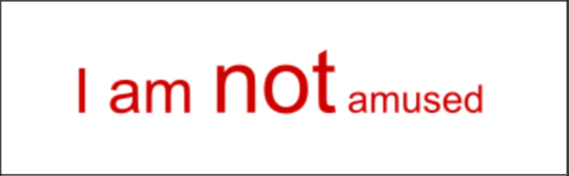
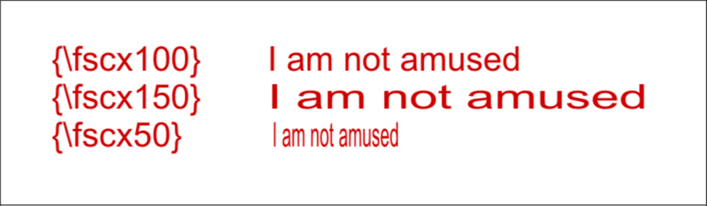

# Scale

## Font Size

!!! note ""

    Local / Transformable Tag

Set the size of the font. You should only specify integer font sizes.

<h3>Example</h3>

```

{\fs48}I am {\fs70}not{\fs30} amused

```



## Scale in X direction

!!! note ""

    Local / Transformable Tag

Adjust the size of the text in x direction only. The scale is in percentage
i.e. value of 100 means original size.

<h3>Example</h3>

{:height 209, :width 688}

`\fscx100` means original size as defined by font size.

`\fscx150` means the text is 50% wider in x direction.

`\fscx50` means the text is 50% narrower in x direction.

## Scale in Y direction

!!! note ""

    Local / Transformable Tag

Adjust the size of the text in y direction. The scale is in percentage
i.e. value of 100 means original size.

<h3>Example</h3>


`\fscy100` means original size as defined by font size.

`\fscy150` means the text is 50% taller.

`\fscy50` means the text is 50% shorter.

## Scale Tool

There is no visual tool that inserts and changes `fs` tag. However, we do have a
tool that uses `fscx` and `fscy` tag.

1) Enable the `Scale tool` (sixth from the top). You will see two bars, one for
   each axis. This rectangular bar represents the original size of the text.

  {width="400"}

1. To use this tool, click anywhere in the screen and drag the mouse up and down
   (to scale on the Y axis) or left and right (to scale on the X axis).

1. You can hold the ++shift++ key before you click and drag to limit the scaling
   to the axis where the cursor movement is highest.

1. You can hold the ++alt++ key before you click and drag to make equal change
   in both X and Y axis.

<video width="1282" height="1128" controls>
  <source src="../assets/Scale/scale.mp4" type="video/mp4">
Your browser does not support the video tag.
</video>

