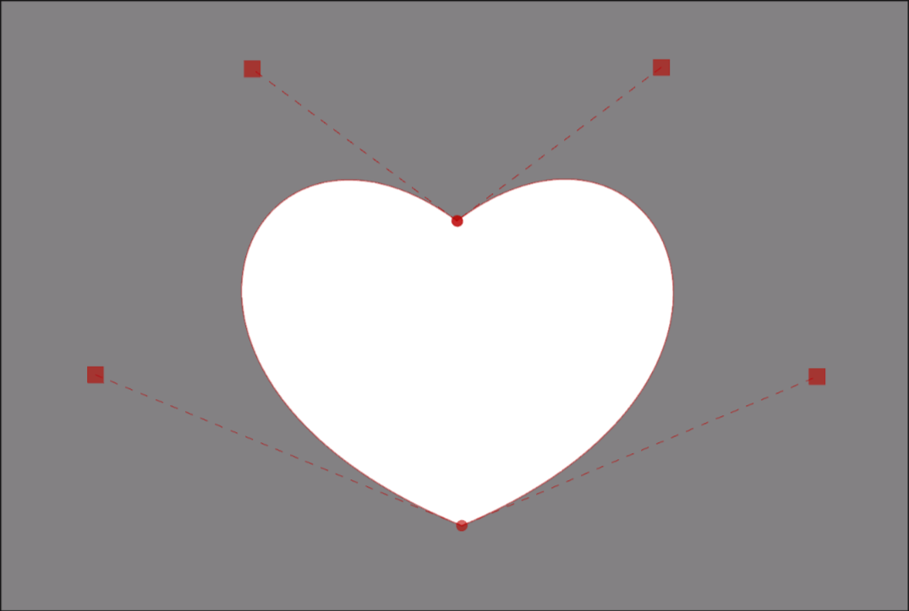

# Masks

Masks or shapes or drawing is simply a vector drawing that is used to cover some
area with a solid color. The purpose is generally to cover the original text so
that we can put our own text over it. Mask can be treated like a text for almost
all intents and purposes. You can color it, blur it, apply opacity to it and so on.

We will almost always use an automation script to generate a mask. We have not
even introduced what automation scripts are or how to use them. The purpose of
discussing masks here is to learn what masks actually are. It is important to
know what the automation scripts are doing, is it not?

So what you learn in this page is for reference to what masks are. We will not
learn how we make masks.

## How We Make Masks

I lied. Remember, we learned how to create clips in the page just before this.

Let's take this vectorial clip (_There's a reason why I took vectorial clip and
not rectangular clip but that is beyond today's lesson_) and look at how it looks
in the `Edit Box`.

{\<b>clip</b>(m <b>1301.45</b> <b>590.6</b> b <b>1601.09</b> <b>339.9</b> <b>1829.45</b> <b>845.26</b> <u>1308.45</u> <u>1089</u> <b>771.08</b> <b>842.38</b> <b>1001.15</b> <b>342.59</b> <u>1302.21</u> <u>591.48</u>)}

Notice that inside the parenthesis, you will find a bunch of numbers and
letters. Let's do something together:

1. Copy everything that is inside the parenthesis.
1. In a completely new line, add a tag block `{\an7\pos(0,0)\p1}`.
1. After the tag block, paste what you copied.

<video width="2560" height="1546" controls>
  <source src="../assets/Masks/clip_to_shape.mp4" type="video/mp4">
Your browser does not support the video tag.
</video>

{\<b>an</b><b>7</b>\<b>pos</b><b>(0,0)</b>\<b>p</b><b>1</b>}m <b>1301.5</b> <b>570.625</b> b <b>1601.125</b> <b>328.375</b> <b>1829.5</b> <b>816.75</b> <u>1308.5</u> <u>1052.25</u> <b>771.125</b> <b>814</b> <b>1001.125</b> <b>331</b> <u>1302.25</u> <u>571.5</u>

Here, I have demonstrated a relationship between clip and shape i.e. the region
that the clip covered can be converted into shape and vice versa. This is exactly
what automation scripts do when they convert clips to mask. That is all you need
to know for now.

## Drawing Tag

!!! note ""

    Local / Untransformable Tag

A bit late since we already used `\p` tag above. This tag is what enables
drawing mode and the text after this tag block will then be interpreted as
drawing instructions and not as visible text.

| Format    | Description                                    |
| --------- | ---------------------------------------------- |
| \\p1 | Enable drawing mode|
| \\p0      | Disable drawing mode _Text after this will be treated as normal visible text_|

!!! warning

    Drawing tag does not only take 0 and 1. It can take any other positive
    integer but you will not be needing that so I'll not be explaining that.

## Coordinate of the ASS

I've tried to avoid talking about this till now but there's no avoiding it since
the numbers you see in the drawings are coordinates. We've also used coordinates
in `\pos` tag and `\org` tag but we never had to truly understand it for them but
if you want to understand the drawing commands, you need to understand coordinate
system we are using.

Let us take a video of resolution `1920x1080`. The origin is always at top left
of the video. Both the right and down direction from the origin is positive. So
this is like fourth quadrant but `y` axis is positive.

So when you have a coordinate `(x, y)` anywhere in the video, it means it is `x` pixels right from the
origin and `y` pixels down from the origin.

Coordinates can be negative. `x` coordinate being negative means it is left of
the origin. Similarly, `y` coordinate being negative means it is above the origin.

## Drawing Commands

These commands appear either inside vectorial clip or after `\p1` tag. Each
drawing command is started using a letter followed by coordinate(s). We shall
think of this like you have a pen in your hand and are ready to draw.

| Command | Numer of coordinate | Description |
| -------------- | --------------- | --- |
| m &lt;x> &lt;y> | 1 | Moves the pen to coordinate `x, y` touches the pen to paper.|
| l &lt;x> &lt;y>| 1 | Draw a line from where pen has touched the paper to coordinate `x, y`   Keeps the pen touched to paper.  You can repeat coordinates after this as many times as you want. If you have _n_ number of coordinates after command `l`, it means you continuously drew _n_ number of lines.|
| b &lt;x1> &lt;y1> &lt;x2> &lt;y2> &lt;x3> &lt;y3>| 3 | Draw a cubic bézier curve from where pen has touched the paper to coordinate `x3, y3` . `x1, y1` and `x2, y2` are the control points of the curve.  Keeps the pen touched to paper. You can repeat coordinates after this as many times as you want. Every 3 set of coordinates after command `b` forms one bézier curve.|

Can you now scroll up, look at the drawing commands above and then decipher
what they did to form a heart shape?
