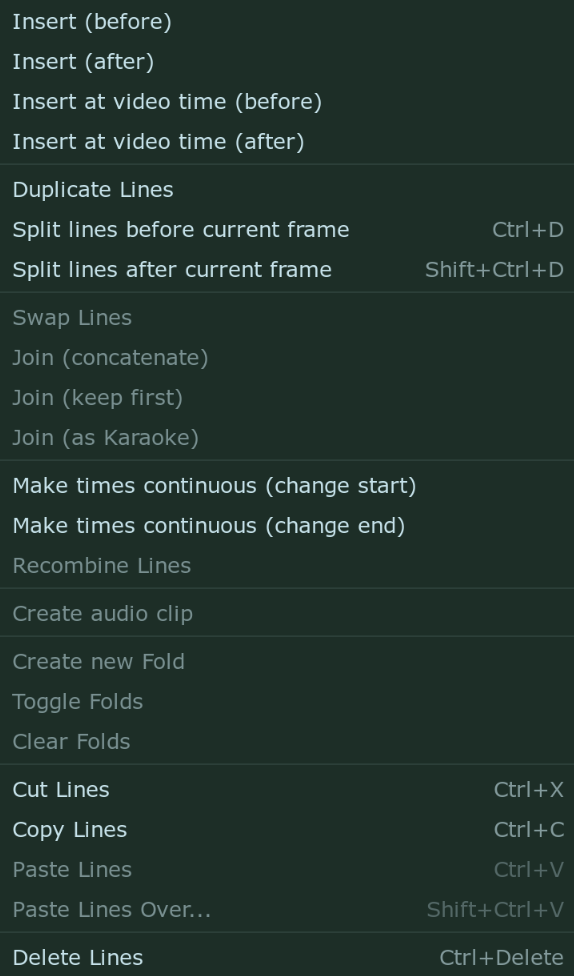
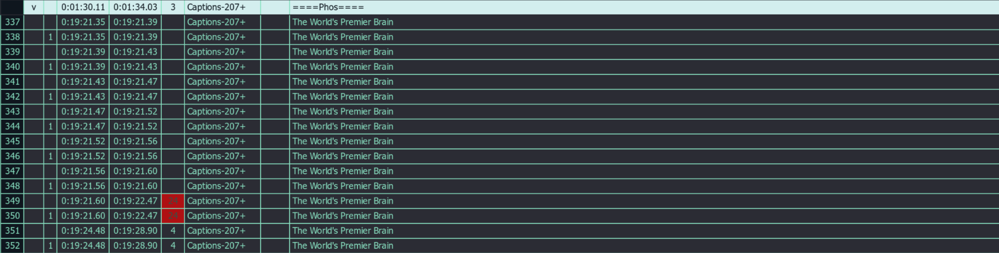
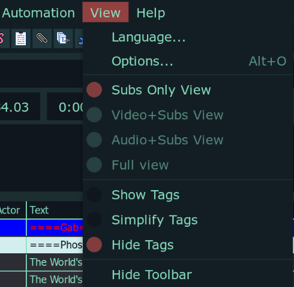

# Subtitle Grid

The grid shows all the subtitle lines in the file you're working with.
You can click a line to select it for editing. This is known as the active line.
The active line will appear in the edit box for you to edit.
<!-- TODO: Image -->

!!! tip

    Act out what the guide is talking about. If it talks about a menu, click on
    it. If it talks about a hotkey, press it. Learn by practice and not reading.
    Otherwise it is going to be a long boring read.

## Selecting Multiple Lines

You can select multiple lines my pressing ++ctrl++ and clicking the lines you
want to select. If you want to select a range of lines, click on the first line
then press ++shift++ while clicking on the last line. All the lines from the
first to last line will be selected. When you select multiple lines, the last
line you select will be the active line.

!!! info

    If multiple lines are selected, the changes made in the edit box will modify
    all lines in the same way.

## Color of Lines in Subtitle Grid

Lines in subtitle grid will have different background or foreground depending on
the properties of the line. These colors can all be changed in the settings.
By default, selected lines have green background. Commented lines have blue
background. Lines with red text overlap in time with active line.

## Default Shortcuts

| Hotkey                | Description                                                  |
| --------------------- | ------------------------------------------------------------ |
| ++enter++             | Move to the next subtitle line, creating a new one if needed |
| ++arrow-up++          | Move to the previous line                                    |
| ++arrow-down++        | Move to the next line                                        |
| ++ctrl+"A"++          | Select all dialogue lines                                    |
| ++arrow-right++       | Seek to next frame in video                                  |
| ++ctrl+arrow-right++  | Seek to the end frame of current line                        |
| ++shift+arrow-right++ | Seek to next keyframe                                        |
| ++arrow-left++        | Seek to previous frame in video                              |
| ++ctrl+arrow-left++   | Seek to the start frame of current line                      |
| ++shift+arrow-left++  | Seek to previous keyframe                                    |
| ++alt+arrow-down++    | Move the selected line(s) down one row                       |
| ++alt+arrow-up++      | Move the selected line(s) up one row                         |
| ++ctrl+shift+"V"++    | Paste subtitles over others                                  |

## Subtitle Grid Context Menu

Right clicking in the subtitle grid will produce a context menu.

{width="350"}

| Item                                 | Description                                                                                                                                                                                                                                                                                                                                                                                                                                                                                                                                                                                                                                                                                                                                                                                                                                                                                                                                                                                                                                                                                                                                            |
| ------------------------------------ | ------------------------------------------------------------------------------------------------------------------------------------------------------------------------------------------------------------------------------------------------------------------------------------------------------------------------------------------------------------------------------------------------------------------------------------------------------------------------------------------------------------------------------------------------------------------------------------------------------------------------------------------------------------------------------------------------------------------------------------------------------------------------------------------------------------------------------------------------------------------------------------------------------------------------------------------------------------------------------------------------------------------------------------------------------------------------------------------------------------------------------------------------------ |
| Insert (before)                      | Inserts a new empty line before the active line. The new line will be timed before the start time of active line                                                                                                                                                                                                                                                                                                                                                                                                                                                                                                                                                                                                                                                                                                                                                                                                                                                                                                                                                                                                                                       |
| Insert (after)                       | Inserts a new empty line after the active line. The new line will be timed after the end time of active line                                                                                                                                                                                                                                                                                                                                                                                                                                                                                                                                                                                                                                                                                                                                                                                                                                                                                                                                                                                                                                           |
| Insert at video time (before)        | Inserts a new empty line before the active line. The new line will be timed at the start of current video frame. _Enabled only when video is loaded_                                                                                                                                                                                                                                                                                                                                                                                                                                                                                                                                                                                                                                                                                                                                                                                                                                                                                                                                                                                                   |
| Insert at video time (after)         | Inserts a new empty line after the active line. The new line will be timed at the start of current video frame. _Enabled only when video is loaded_                                                                                                                                                                                                                                                                                                                                                                                                                                                                                                                                                                                                                                                                                                                                                                                                                                                                                                                                                                                                    |
| Duplicate Lines                      | Duplicates the selected line(s).                                                                                                                                                                                                                                                                                                                                                                                                                                                                                                                                                                                                                                                                                                                                                                                                                                                                                                                                                                                                                                                                                                                       |
| Split lines before current frame     | - Duplicate the selected line(s), - Set the end time of the original line to the frame before the current video frame,  - Set the start time of the copy to the current video frame.   Useful for frame-by-frame (fbf) typesetting and for splitting a line at a scene change to let it move down if it collided with a no-longer-visible line. _Enabled only when video is loaded_                                                                                                                                                                                                                                                                                                                                                                                                                                                                                                                                                                                                                                                                                                                                                        |
| Split lines after current frame      | As above, but it splits off the portion of the line after the current frame rather than the portion before the current frame, for when doing frame-by-frame typesetting from the last to the first frame of a line.                                                                                                                                                                                                                                                                                                                                                                                                                                                                                                                                                                                                                                                                                                                                                                                                                                                                                                                                    |
| Swap                                 | Swaps the places (in the grid) of two selected lines.  _Enabled when exactly two lines are selected in grid_                                                                                                                                                                                                                                                                                                                                                                                                                                                                                                                                                                                                                                                                                                                                                                                                                                                                                                                                                                                                                                        |
| Join (concatenate)                   | Joins two or more lines, but concatenates the text of all selected lines instead. A space is inserted between the texts of each source line.  _Only enabled if you have more than one line selected._                                                                                                                                                                                                                                                                                                                                                                                                                                                                                                                                                                                                                                                                                                                                                                                                                                                                                                                                               |
| Join (keep first)                    | - Joins two or more lines, discarding the text of all but the first. - The new line will be timed to start at the first line’s start time and end at the last line’s end time.  _Only enabled if you have more than one line selected._                                                                                                                                                                                                                                                                                                                                                                                                                                                                                                                                                                                                                                                                                                                                                                                                                                                                                                          |
| Join (as karaoke)                    | Does the same as `Join (concatenate)` but inserts \k tags with the timing of each source line in the joined line.                                                                                                                                                                                                                                                                                                                                                                                                                                                                                                                                                                                                                                                                                                                                                                                                                                                                                                                                                                                                                                      |
| Make times continuous (change start) | - Modifies the timing of the selected lines so that the end time of each line is the same as the start time of the next line.  - Changes the start time of each line. _Only enabled when you have more than one line selected._                                                                                                                                                                                                                                                                                                                                                                                                                                                                                                                                                                                                                                                                                                                                                                                                                                                                                                                  |
| Make times continuous (change end)   | Same as above but changes the end of each line                                                                                                                                                                                                                                                                                                                                                                                                                                                                                                                                                                                                                                                                                                                                                                                                                                                                                                                                                                                                                                                                                                         |
| Recombine lines                      | Given two or more lines with the same text being partially present in all of them, creates one line per text fragment instead. |
| Create audio clip                    | Saves a segment of the loaded audio corresponding to the timing of the selected lines (starting at the earliest start time and ending at the latest end time) as an uncompressed WAV file. _Only enabled if you have audio loaded._                                                                                                                                                                                                                                                                                                                                                                                                                                                                                                                                                                                                                                                                                                                                                                                                                                                                                                                 |
| Create new Fold                      | _Folds are explained in much more detail later in the guide_ Create a fold from the selected lines Enabled when multiple lines are selected                                                                                                                                                                                                                                                                                                                                                                                                                                                                                                                                                                                                                                                                                                                                                                                                                                                                                                                                                                                                      |
| Toggle Folds                         | Open/Close a fold if it is closed/openend _Enabled when line inside fold is selected_                                                                                                                                                                                                                                                                                                                                                                                                                                                                                                                                                                                                                                                                                                                                                                                                                                                                                                                                                                                                                                                               |
| Clear Folds                          | Remove fold from the selected lines _Enabled when line inside fold is selected_                                                                                                                                                                                                                                                                                                                                                                                                                                                                                                                                                                                                                                                                                                                                                                                                                                                                                                                                                                                                                                                                     |
| Cut/Copy/Paste                       | Cuts/copies/pastes entire lines. Note that the lines are copied as plain text and can be copied and pasted freely between text editors, chat programs, web browsers, other instances of Aegisub etc.                                                                                                                                                                                                                                                                                                                                                                                                                                                                                                                                                                                                                                                                                                                                                                                                                                                                                                                                                   |
| Paste Lines Over…                    | Open the Paste Over dialog. {width="300"} The paste over tool is a “smart” variant of the good old Ctrl+C & Ctrl+V combo. It allows you to paste any given field(s) of one or more lines to the corresponding fields of other lines, without affecting the other fields.   To use it, first copy one or more lines with the familiar copy function (right-click -> copy, or Ctrl+C). Then select the line(s) you want to paste to, and click paste lines over (or press Ctrl+Shift+V)  Tick the fields you want to paste (the buttons below the checkboxes can be used to select all fields (in which case paste over is almost the same as normal pasting except it replaces existing lines instead of inserting new ones), no fields (in which case it does nothing), just the text field, or both time fields) and press OK. The fields you selected will then be pasted.  Do note that the paste over function isn’t limited to using lines copied from Aegisub itself; you are free to copy correctly formatted lines from any text editor, chat program, web browser etc. etc. |
| Delete                               | Deletes the selected lines.                                                                                                                                                                                                                                                                                                                                                                                                                                                                                                                                                                                                                                                                                                                                                                                                                                                                                                                                                                                                                                                                                                                            |

## Columns of Subtitle Grid

The columns of subtitle grid are as follows:

By default, the following columns are visible:

| Item | Description |
| -------------- | --------------- |
| # | The line number |
| Start | The start time/frame of the line |
| End | The end time/frame of the line |
| CPS | Number of characters per second of the line |
| Style | The style used for this line |
| Text | The text of the line (which is dispalyed on the video) |

The following columns will be displayed if any line in the file uses them:

| Item | Description |
| -------------- | --------------- |
| > | Folds _Folds will be explained later in guide_ |
|L | The layer of the line |
| Actor | The actor speaking the line |
| Effect | The effect for this line |
| Left | The left margin for this line|
| Right | The right margin for this line |
| Vert | The vertical margin for this line |

## Override Tags in Subtitle Grid

There are three ways the override tags can be presented in subtitle grid.

=== "Simplify Tags"

     

=== "Hide Tags"

     

=== "Show Tags"

     

As you can see, if you show all the tags, it becomes very messy. I recommended
you to keep it in `Simplify Tags` mode. To change it, go to `View` menu in the
`Menu Bar`.

{width="400"}
