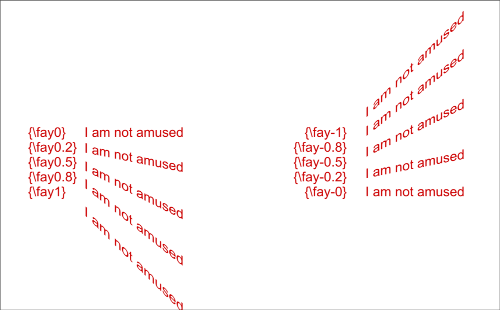

# Text Shearing

Perform a shearing (perspective distortion) on the text.

Usually shearing factor value is only useful in small range; Values outside
-2 to 2 are unlikely to have desirable results.

!!! note

    Shearing is performed after rotation, on the rotated coordinates. Rotation
    origin tag `\org` does not affect the coordinate system used for shearing.

## Shear in X direction

Perform shearing in x direction.

| Format           | Description                    |
| ---------------- | ------------------------------ |
| \\fax&lt;amount> | Shear along x axis by &lt;amount> |
| \fax0            | Disable shear along x-axis     |

<h3>Example</h3>

## Shear in Y direction

Perform shearing in y direction.

| Format           | Description                    |
| ---------------- | ------------------------------ |
| \\fay&lt;amount> | Shear along y axis by <amount> |
| \fay0            | Disable shear along y-axis     |

## Adding shearing to text

There is unfortunately no Aegisub tool that allows you to shear text. So you'll
have to add it yourself.
