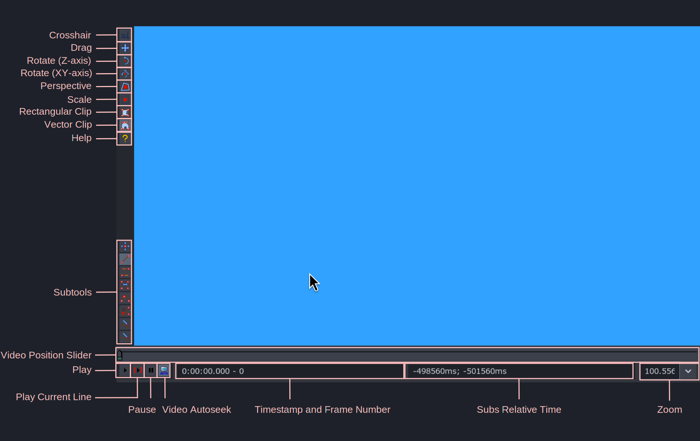
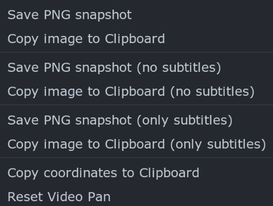
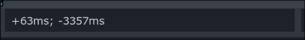
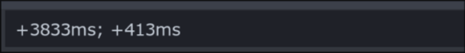

I hope you are now somewhat comfortable in Aegisub. In this guide, we will move
to `Video Box`, the most important part of Aegisub for typesetting because this
contains some of the most used visual typesetting tools.

Once we learn about `Video Box` in this page, in the next few pages, we shall
learn about exciting tasks like position and orientation of text.

## Parts of Video Box

We will discuss the visual tools such as crosshair, drag, rotate tools, perspective,
scale, clip tools later in their specific page as they are what is used to change
appearance of the text.

In this page, we will just talk about other elements of video box

| Item                       | Description                                                                                                                                                                                                                                                      |
| -------------------------- | ---------------------------------------------------------------------------------------------------------------------------------------------------------------------------------------------------------------------------------------------------------------- |
| Subtools                   | When you choose any of the visual tool like clip, perspective etc, if they have tools that are associated with them, they appear in the subtools category. If a visual tool does not have any sub tool, this region is empty when that visual tool is activated. |
| Video Position Slider      | This horizontal slider is used to seek the video. Holding ++shift++ while dragging the slider snaps it to keyframe.                                                                                                                                           |
| Play                       | Play the video starting at curently displayed frame.                                                                                                                                                                                                             |
| Play Current Line          | Play the video starting at the first frame of active line and stopping at the end of active line.                                                                                                                                                                |
| Pause                      | Pause the current video playback                                                                                                                                                                                                                                 |
| Video autoseek             | Toggles automatic seeking of the video to the first frame of a line whenever a new line is selected in subtitle grid.  _I recommend to keep this on_                                                                                                          |
| Timestamp and Frame number | Displays two numbers seperated by a dash(-). Displays the timestamp in the left and frame number in the right of dash for the currently displayed frame of video.                                                                                                |
| Subs Relative Time         | Displays the time in milliseconds relative to the start and end of the active line. _This is super important and will come handy later_                                                                                                                       |
| Zoom                       | A dropdown menu that allows you to select the zoom level of the video                                                                                                                                                                                            |

## Default Shortcuts for Video Box

| Hotkey                | Description                                                              |
| --------------------- | ------------------------------------------------------------------------ |
| ++arrow-right++       | Seek to the next frame                                                   |
| ++ctrl+arrow-right++  | Seek to the end frame of active line                                     |
| ++shift+arrow-right++ | Seek to the next keyframe                                                |
| ++arrow-left++        | Seek to the previous frame                                               |
| ++ctrl+arrow-left++   | Seek to the start frame of active line                                   |
| ++shift+arrow-left++  | Seek to the previous keyframe                                            |
| ++ctrl+1++            | Jump to the start frame of active line                                   |
| ++ctrl+2++            | Jump to the end frame of active line                                     |
| ++ctrl+3++            | Set start of selected subtitles to current frame                         |
| ++ctrl+4++            | Set end of selected subtitles to current frame                           |
| ++ctrl+5++            | Set start and end of selected subtitles to keyframe around current frame |
| ++ctrl+"p"++          | Play/Pause the video starting from currently displayed frame             |

## Video Box Context Menu

{width="300"}

| Item                                     | Description                                                                                                                                                                                                  |
| ---------------------------------------- | ------------------------------------------------------------------------------------------------------------------------------------------------------------------------------------------------------------ |
| Save PNG snapshot                        | - Saves an image of the current frame. - Image is saved to the path specified in the options. - The image will be in the real video size, and won't be affected by zooming or aspect ratio overriding. |
| Copy image to clipboard                  | - Same as above, but copies the frame to the clipboard, instead of saving as a PNG. - You can then paste it in any image editing software or chat.                                                        |
| Save PNG snapshot (no subtitles)         | Saves an image of the current frame as PNG but subtitles won’t be visible in the image.                                                                                                                      |
| Copy image to clipboard (no subtitles)   | Saves an image of the current frame without subtitles but copies it to clipboard.                                                                                                                            |
| Save PNG snapshot (only subtitles)       | - Saves an image of the subtitles only in current frame - The image will be in the real video size and the position of subtitles is preserved                                                             |
| Copy image to clipboard (only subtitles) | Same as above but copies it to clipboard                                                                                                                                                                     |
| Copy coordinates to clipboard            | Copies the current mouse coordinates to clipboard, e.g. “230,152”                                                                                                                                            |
| Reset Video Pan                          | If the video has been zoomed and panned (see below), reset the zoom and pan                                                                                                                                  |

## Zoom and Pan

Zoom and pan are extremely useful for typesetting.
Zoom simply makes the video box bigger or smaller.
This in turn makes video bigger and smaller as well.
However, there are cases when simply zooming this way is not enough.
Video panning refers to zooming in or out the video while keeping the size video
box same. Panning as the name suggest also allows us to pan across the video
surface.

| Hotkey                    | Description                                    |
| ------------------------- | ---------------------------------------------- |
| ++ctrl+num-plus++         | Zoom video in by increasing video box size     |
| ++ctrl+num-minus++        | Zoom video out by decreasing video box size    |
| ++"Scroll Up"++           | Zoom video in by increasing video box size     |
| ++"Scroll Down"++         | Zoom video out by decreasing video box size    |
| ++ctrl+"Scroll Up"++      | Zoom video in without changing video box size  |
| ++ctrl+"Scroll Down"++    | Zoom video out without changing video box size |
| ++"Middle Click"+"Drag"++ | Pan the video in the direction of mouse drag   |

### Zoom

<video width="1656" height="1338" controls>
  <source src="../assets/Video Box/zoom.mp4" type="video/mp4">
Your browser does not support the video tag.
</video>

### Pan

<video width="1282" height="1128" controls>
  <source src="../assets/Video Box/pan.mp4" type="video/mp4">
Your browser does not support the video tag.
</video>

## Understanding Subs Relative Time

I've seen many people not understand this section of video box and it is very
important that they do since this becomes useful later on. You can see there are
two numbers separated by semi-colon.

The number left of semi-colon represents the time in milliseconds from the start
frame of current line to the current frame i.e `+63ms` in image above means current
frame is 63 milliseconds behind the start frame of the line. Similarly, `-3357ms`
means current frame is 33357 milliseconds before from the last frame of the line.

Note here that `+` represents time ahead and `-` represents time behind. Therefore
it is possible to go before the start frame and after the last frame of the line.

Here, both numbers are negative. It means current frame is before the start time
of the line. i.e. current frame is 95 milliseconds before that start frame of line.

Conversely, in the image above, both the numbers are positive. It means current
frame is after the end time of the line i.e. current frame is 413 milliseconds
after the end frame of line.

I hope this much example is enough to demonstrate what subs relative time are.
This will become useful later on.

## Timing a sign

In order to typeset a sign, you need to time it first. Unlike dialogue timing,
sign timing has to be frame perfect. This is why we don't time it using `Audio
Box`. We time it using `Video Box`.

Nowadays, most of the signs already come roughly timed. If it is not, you can
roughly time it yourself.

Then you go frame by frame by hitting arrow keys (++arrow-right++ for going
forward and ++arrow-left++ for going backward) until you reach the frame where
the sign starts or ends. Then you hit ++ctrl+3++ to set the start time of the
line in current frame or ++ctrl+4++ to set the end time of the line in current
frame.

## Binding Hotkeys

It's a bit weird to learn about binding hotkeys in a page about `Video Box` but
we need to learn it somewhere anyway. Hotkeys are useful because you can run
some command with a press of a button.

1. In Aegisub, go to `View -> Options -> Interface -> Hotkeys`.
1. Click on `Subtitle Grid` or `Edit Box` or `Video` depending on where you want
   to set the hotkey in. For now, press `Video`
1. Click on the button `New` at the top.
1. Then, in the `Hotkey` column i.e. the left column, click the key in the keyboard
   that you want to bind the script to. For example, press ++escape++ key.
1. Then in the `Command` column i.e. the middle column, type the command you
   want to run. Type `video/pan_reset` as the command.
1. Click `OK` key.
1. Now whenever you press the key in ++escape++ key in the left column, the
   video panning you had will be reset.

So as long as you know the command, you can bind any action to a hotkey. As soon
as you start typing, Aegisub will show all the available commands so that helps.

<video width="2560" height="1546" controls>
    <source src="../assets/Video Box/hotkey.mp4" type="video/mp4">
Your browser does not support the video tag.
</video>
